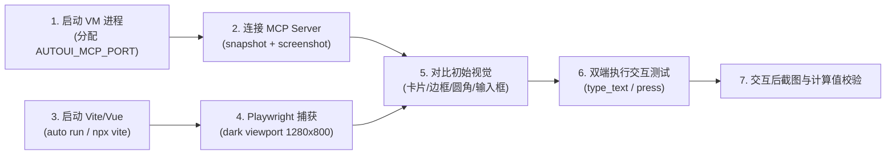

# AutoUI Dual-Backend Verifier (AutoUI 跨端验证与测试技能)

本技能为 **AutoUI 跨端应用**（Vue 模式与 VM/Iced 模式）提供标准化的功能测试、交互验证与像素级视觉一致性核对流程。

---

## 0. AutoUI 运行模式快速备忘 (Quick Reference)

| 模式 | 运行命令 | 底层引擎 | 验证与交互工具 |
|---|---|---|---|
| **Vue 模式** | `auto run` (或 `auto gen && cd src/front && npx vite`) | Web (Vite + Vue 3 + Tailwind + shadcn) | Playwright 自动化截图 / DOM 交互 |
| **VM 模式** | `auto run -r vm` | Native VM + Iced GUI (内置 MCP Server) | Python MCP 驱动 / 截图 / 事件注入 |

---

## 1. 触发场景 (When to Use)

- 用户要求“验证/测试某个 UI 示例”（例如 `examples/ui/003-converter`, `011-calculator`, `013-todo`, `022-kanban` 等）。
- 修改了 AutoUI 编译器、Aura View Builder (`aura_view_builder.rs`)、Iced 渲染器 (`renderer.rs`) 或 VM 引擎后，需要回归检查 UI。
- 需要捕获双端运行截图，排查边框、背景、圆角、内边距、字号或交互计算的差异。

---

## 2. 双轨驱动工具体系

### A. VM 模式 (`auto run -r vm`) — AutoUI MCP Server
Iced 桌面运行时内置了 HTTP JSON-RPC MCP Server（端点 `http://127.0.0.1:<PORT>/mcp`）：
- **端口控制**：运行 `AUTOUI_MCP_PORT=<PORT> auto run -r vm` 动态分配空闲端口。
- **核心工具**：
  - `autoui_snapshot`: 获取 AURA 树结构与 State，读取 `#aura_N` 或 `#vnode_N` 元素 ID。
  - `autoui_type`: 向目标输入框键入文本（自动更新 State 并触发 `oninput`/`onchange`）。
  - `autoui_press`: 点击目标按钮/可点击元素，触发 `onclick`。
  - `autoui_keyboard`: 发送全局或带修饰键的按键（如 `"Enter"`, `modifiers: ["ctrl"]`）。
  - `autoui_screenshot`: 捕获无损渲染帧（保存至 `tests/screenshots/<name>.png`）。

### B. Vue 模式 (`auto run`) — Playwright
浏览器端通过 Playwright 捕获深色主题渲染图与执行 DOM 自动化交互：
- **快速命令行截图**：
  ```bash
  npx playwright screenshot --color-scheme dark --viewport-size "1280, 800" http://localhost:5173 vue_shot.png
  ```
- **Node.js 自动化脚本**：利用 Playwright API 定位输入框、填值并截图。

---

## 3. 标准化执行工作流 (Standard Workflow)



### 步骤 1：VM 模式自动化交互与截图
编写或调用 Python MCP 驱动脚本（参考 `scripts/test_vm_mcp.py`）：
```python
client = AutoUiMcpClient(port)
client.screenshot("converter_vm_initial")
client.type_text("aura_9", "323") # 输入测试用例
time.sleep(0.5)
client.screenshot("converter_vm_decimal")
```

### 步骤 2：Vue 模式自动化交互与截图
启动 Vite 后，运行 Playwright 脚本（参考 `scripts/test_vue_playwright.mjs`）生成 `converter_vue_initial.png` 与 `converter_vue_decimal.png`。

### 步骤 3：视觉审查与状态一致性判定
对照 [`docs/design/22-base-styles-and-visual-parity.md`](file:///d:/autostack/auto-lang/docs/design/22-base-styles-and-visual-parity.md) 核对：
1. **容器**：深色底色 `zinc-950`，卡片 `bg-card`，边框 `zinc-800`，圆角 `rounded-2xl`。
2. **输入框**：14px 字号，`px-3 py-2` 内边距，`rounded-md` (6px) 圆角，`zinc-800` 细边框。
3. **计算精度**：浮点/双精度四舍五入值在两端精确一致。

---

## 4. 常见排查与排障指南 (Troubleshooting)

- **输入后 State 未更新**：
  - 检查 `crates/auto-lang/src/ui/dynamic.rs` 中的 `extract_input_state_map` 是否正确识别了 `props["value"]`（支持 `Expr::Ident` 与 `Expr::Dot`）。
- **计算值显示为 0 或 NaN**：
  - 检查 `crates/auto-lang/src/vm/engine.rs` 中的 `decode_tagged_nv` 是否支持 `is_f32` / `is_f64`。
  - 检查 `crates/auto-lang/src/vm/codegen.rs` 的 `contains_double` 是否递归处理了 `Expr::Call`。
- **截图出现端口冲突**：
  - 使用 Python `socket.bind(('127.0.0.1', 0))` 动态分配端口并传入 `AUTOUI_MCP_PORT`。

---

## 5. 跨端视觉精细核验 6 大检查项 (Visual Parity Checklist)

在对比 Vue 与 VM 截图时，必须逐项进行结构化审查，切忌仅做粗粒度概览：

1. **图片与头像裁剪 (Image & Avatar Clipping)**:
   - [ ] 圆形头像 (`rounded-full`) 是否真正裁剪了位图本身，还是只在外层包裹了边框而图片本体仍为方形？
   - [ ] 头像阴影 (`shadow-md`) 与白/灰边框 (`border-4`) 是否与背景正确叠加？
2. **方向性圆角与容器形状 (Corners & Borders)**:
   - [ ] 顶部 Banner 是否支持方向圆角（如 `rounded-t-lg` 上圆下直）？
   - [ ] 外层卡片边框颜色、宽度与圆角半径是否一致？
3. **文本盒模型与徽章背景 (Text Box-Model & Badges)**:
   - [ ] 标签/徽章（如 Role Badge）是否渲染了浅色胶囊背景、内边距与圆角？
   - [ ] 段落文本两端内边距 (`px-6`) 是否贴边？
4. **排版与行高 (Typography & Line Height)**:
   - [ ] 段落行高 (`leading-relaxed` vs 默认单倍行距) 是否一致？VM 是否因缺少行高而纵向紧凑？
   - [ ] 标题与正文字号、字重（Bold / Medium / Regular）是否准确？
5. **外边距与图层跨界 (Margins & Overlaps)**:
   - [ ] 负外边距（如 `-mt-10`）是否将元素正确向上提升并跨越边界？
   - [ ] Flex gap（如 `gap-4`）在两端各元素间的间距是否均匀？
6. **按钮默认样式、色彩令牌与悬停态 (Button Defaults, Color Tokens & Hover)**:
   - [ ] **暗色模式反转设计 (Dark Theme Primary Inversion)**: shadcn-vue 在暗色模式下默认 Button 为**浅色高光胶囊（白/浅灰底 `bg-primary` + 黑/深灰字 `text-primary-foreground`）**。核查 VM 端是否误渲染成了蓝紫底白字或硬编码纯白前景色！
   - [ ] **悬停反馈 (Hover State Feedback)**: 悬停时按钮是否具备透明度/亮度微调（如 `hover:bg-primary/90`）？VM 端是否在 `Hovered` 状态下具备对应变化？
   - [ ] **文字规格与圆角**: 按钮文字字号是否对齐 `14px`（Sm）、字重 `500`（Medium），内边距 (`px-4 py-2`) 与圆角 (`rounded-md` 6px) 是否一致？

---

## 6. AutoUI 跨端布局与状态黄金规则 (AutoUI Parity Domain Rules)

在编写或修复 AutoUI 布局与控件时，必须遵循以下经过验证的黄金实践：

1. **表单控件聚焦态 (Focus State & Ring)**:
   - 单行 `input` 与多行 `textarea` 在 Iced 中必须通过 `matches!(status, iced::widget::text_input::Status::Focused { .. })` 捕获焦点。
   - 聚焦时边框增粗至 `2.0px` 并自动调用 `resolve_semantic_rgb(&Color::Primary)` 渲染主色（对齐 Vue `focus-visible:ring-2`）。
2. **主题色与前景色映射 (Semantic Color Tokens)**:
   - 暗色模式下 `Color::Primary` 映射至 `--primary`（`210 40% 98%` 即 `rgb(248, 250, 252)`），`Color::OnPrimary` 映射至 `--primary-foreground`（`222.2 47.4% 11.2%` 即 `rgb(2, 8, 23)`）。
   - 绝不可将 `Color::OnPrimary` 硬编码为纯白 `(255, 255, 255)`，否则会导致暗色主按钮上的文字反差丢失。
3. **按钮默认 Hover 预设 (Button Hover Preset)**:
   - 默认 Button variant preset 必须包含 `hover:bg-primary/90`，使 Iced `widget::button::Status::Hovered` 能够自动计算悬停微光样式。
4. **Row 内文本排版与边距 (Row Baseline Alignment)**:
   - **禁止在 Row 内部子文本上应用垂直外边距（如 `mt-4`）**，因为 Iced 容器外边距包装会导致各子元素内边距不对等，使水平文本垂直基线错位。
   - 垂直外边距必须统一下沉到父级 `Row` 容器（如 `row { style: "justify-center items-center mt-4" }`）。
   - Row 内多个文本之间的间隙统一使用水平外边距（如 `mr-1` 或 `ml-1`），避免 HTML 尾部空白字符被浏览器渲染引擎折叠。
5. **控件外边距包装 (Margin Wrapping)**:
   - 所有基础控件（`Input`, `Textarea`, `Checkbox`, `Button`, `Text`）在 `IntoIcedElement` 与 `render_dynamic_view` 中转换为 `iced::Element` 时，必须显式调用 `wrap_with_margin(el, &iced_style)`，确保 `mt-*` / `mb-*` / `ml-*` / `mr-*` 不被静默丢失。

---

## 7. 严格像素与色彩取色核验规程 (Pixel-Level & Design-Token Verification Protocol)

在判定双端视觉对齐（Pass）之前，必须执行以下三层硬性核对，切忌“仅凭宏观轮廓感觉”：

1. **同屏并排放大审查 (Side-by-Side Zoom Audit)**:
   - 将 Vue 截图与 VM 截图并排对比。放大至局部控件（如按钮、卡片、输入框），严禁仅查看全景缩略图。
2. **色彩吸管与明暗反差校验 (Color Picker & Contrast Check)**:
   - 检查主容器背景色（暗底 vs 亮底）。
   - 检查主按钮背景色与文字色（白底黑字 vs 黑底白字 vs 彩色底）。
   - 检查边框细线是否存在 1px 渲染丢失或颜色过淡。
3. **动态状态双端捕获 (Interactive State Sampling)**:
   - 至少捕获 **初始态 (Initial)** 与 **交互/悬停态 (Hovered/Focused/Typed)** 两组截图，确认动态视觉反馈一致。
