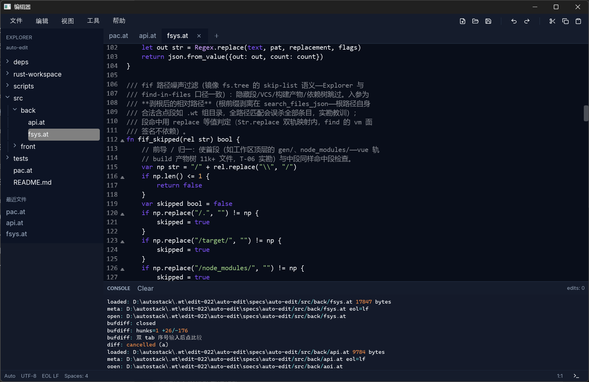
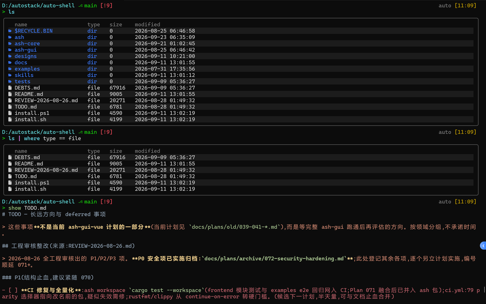

<p align="center"></p>

# Auto · AI × Lang × OS

**从即时脚本，到跨端界面、桌面和应用。**

[English](README.md) · [语言指南](docs/language/overview.cn.md) · [v0.5 发布说明](docs/releases/v0.5.md) · [网站源码](website/)

Auto 是围绕 **AutoLang** 构建的语言与应用生态。用 AutoVM 即时运行脚本，以 Rust 转译路径
构建发布程序；**AutoUI** 将同一份界面定义用于 Web 和原生桌面，**AutoOS** 组织桌面与系统应用，
**AutoAI** 提供应用共享的模型服务和 Agent 工具。

这些能力连接起编辑、命令自动化、AI 辅助开发和知识管理：AutoEdit、AutoShell、AutoMusk
与 JadeEdit 分别面向这些工作。本仓库是整个生态的入口，也维护语言实现、UI 框架与工具链。

[](website/public/desktop-showcase/02-desktop-dark.png)

*AutoOS 原生桌面，捕获于 2026-10-01。小组件来自已启动并最小化的应用。
这张原图与官网共享，点击可查看完整尺寸。*

## 生态概览

| 项目 | 职责 | 进一步了解 |
|---|---|---|
| **AutoLang** | 动静结合的语言：AutoVM 用于脚本，Rust 是主要静态发布路径，并提供 Rust、Python、C 互操作 | [语言概览](docs/language/overview.cn.md) · [编译器与运行时](crates/auto-lang/) |
| **AutoUI** | 用 Auto 声明状态、事件和视图；Vue 构建 Web，Rust/iced 构建原生桌面，配套热重载、DevTools 和 MCP 检视 | [UI 介绍](website/zh/ui/index.md) · [示例项目](examples/ui/README.md) |
| **AutoOS** | 运行于宿主系统的桌面环境，包含窗口、工作区、启动器、设置和系统应用 | [桌面介绍](website/zh/autoos/index.md) · [源码](https://github.com/auto-stack/auto-os) |
| **AutoAI** | 共享模型客户端和 `aaid` 服务，以及应用使用的 Agent 角色、技能和工具 | [AI 介绍](website/zh/ai.md) · [源码](https://github.com/auto-stack/auto-ai) |

贯穿它们的工作方式是 **脚本开发，转译发布**：用即时执行缩短迭代，再借助 Rust 生态构建原生程序。
AutoUI 将这一方式延伸到界面，AutoOS 提供应用共同使用的桌面，AutoAI 连接模型服务与 Agent 工作流程。

当前 AutoOS 运行在已有操作系统之中。**Language as OS（LaOS）**描述实现方向，
**OS over OS** 描述当前的宿主桌面形态。独立部署的系统，以及更深入的 AI 知识工作，
属于长期建设方向。详见 [OS 介绍](website/zh/os.md)。

## 应用

| 应用 | 用途 | 介绍与源码 |
|---|---|---|
| **AutoEdit** | 浏览项目、编辑代码与文本、搜索文件，比较文件、目录与编辑缓冲区 | [介绍](website/zh/apps/autoedit/index.md) · [auto-edit](https://github.com/auto-stack/auto-edit) |
| **AutoShell** | 交互命令会话、文件/JSON 结构化管道和多行 AutoScript，提供命令行与 GUI 形态 | [介绍](website/zh/apps/autoshell/index.md) · [使用指南](website/zh/apps/autoshell/guide/index.md) · [auto-shell](https://github.com/auto-stack/auto-shell) |
| **AutoMusk** | 连接项目对话、工具、Plan、Spec、执行和复审的 Coding Agent 工作台 | [介绍](website/zh/apps/automusk/index.md) · [auto-musk](https://github.com/auto-stack/auto-musk) |
| **JadeEdit** | AutoDown 文档与本地知识库：编辑、页面链接、反链、搜索和组织 | [介绍](website/zh/apps/jadeedit/index.md) · [jade-edit](https://github.com/auto-stack/jade-edit) |

**AutoDown** 提供文档格式与编辑器基础。[AutoDown 与 Jade Garden](website/zh/apps/autodown/index.md)
介绍相关的文档和知识工作台，源码位于 [auto-down](https://github.com/auto-stack/auto-down)。

系统应用与 Demo 涵盖文件管理、终端、设置、系统监控、笔记、日历、图表、媒体工具和小游戏。
可以浏览 [应用目录](website/zh/apps.md) 和 [UI 示例项目](examples/ui/README.md)。
这些项目结合 Auto 与 Rust 基础能力，各自的功能与完成度在专题中分别说明。

### AutoEdit：代码与文本

[](website/public/apps/autoedit/overview-dark.png)

*AutoEdit 原生工作区，用户于 2026-10-01 提供的截图，与官网使用同一原图。*

### AutoShell：命令与结构化数据

[](website/public/apps/autoshell/ash-01.png)

*官网 AutoShell 预览与使用指南共用的 `ash` 原生终端截图，来自 2026 年 9 月捕获集合。
完整会话同时展示结构化输出与 AutoScript。*

## v0.5 里程碑

[v0.5](docs/releases/v0.5.md) 将语言、界面、桌面与应用连接起来：

- **语言与服务**：模块加载、Actor 状态与调度、惰性生成器、流式 IO 和 HTTP API，
  以及主要的 Rust 转译发布路径。
- **生态互操作**：Rust natives 与 `dep`/`use.rs` 垫片；通过 `use.py` 接入 CPython；
  `.as` 脚本与 Python 转译，配套真实库和 PyTorch 对拍语料。
- **界面与桌面**：Vue 与 iced、主题、编辑器、图表和媒体集成；宿主桌面中的窗口、
  启动器、设置与系统应用。
- **开发工具**：LSP、浏览器 Playground、调试、F12 DevTools、MCP 树/布局/截图检视，
  以及共享构建缓存。
- **实验性自举**：Auto 编写的 VM 与转译器闭合了经过验证的 Auto → Rust → Rust 编译器环路。
  Rust 实现仍是参考工具链。

发布说明记录的是滚动里程碑，已审计历史截至 2026-09-30；发行候选冻结另有收口流程。
不同后端和应用的覆盖范围、成熟度各不相同。Web 与原生桌面是主要 UI 路径，
Android/鸿蒙处于可行性与 Demo 阶段，更完整的移动端、MCU 和独立 OS 支持仍在路线图中。

## 从一个脚本开始

已有 `auto` CLI 时，可以运行仓库中的 [Hello World](docs/tour/ch01-hello/01_hello.at)：

```sh
auto docs/tour/ch01-hello/01_hello.at
```

```auto
fn main() {
    print("Hello, World!")
}
```

查看同一份源码生成的 Rust：

```sh
auto trans --path docs/tour/ch01-hello/01_hello.at rust
```

界面开发可以从计数器项目开始，分别选择 Web 或原生桌面：

```sh
auto run examples/ui/002-counter -r vue
auto run examples/ui/002-counter -r vm
```

Vue 开发还需要项目对应的 Node.js/包管理器依赖；原生 UI 使用 iced。
媒体示例另有运行时要求，详见 [计数器指南](examples/ui/002-counter/README.md)。

**从源码构建**：当前 workspace 有相邻 `auto-down` 路径依赖。
将 [auto-lang](https://github.com/auto-stack/auto-lang) 和 [auto-down](https://github.com/auto-stack/auto-down)
克隆为同级目录，在 `auto-lang` 内运行 `cargo build -p auto --release`。
默认 CLI 包含 Python 和 AutoDown 集成，需准备匹配的 CPython 开发环境和原生编译环境。
产物为 `target/release/auto`（Windows 上为 `auto.exe`）。功能选项见 [语言指南](docs/language/overview.cn.md#运行与构建)。

## 学习与探索

| 目标 | 入口 |
|---|---|
| 了解当前语言 | [语言概览](docs/language/overview.cn.md) · [动手巡礼](docs/tour/ch01-hello.md) |
| 从脚本走向发布 | [从脚本到发布](docs/script-to-ship/README.cn.md) · [行为对拍示例](parity/README.md) |
| 构建界面 | [AutoUI](website/zh/ui/index.md) · [UI 项目](examples/ui/README.md) · [Blueprint](blueprints/README.md) |
| 探索桌面与应用 | [AutoOS](website/zh/autoos/index.md) · [应用目录](website/zh/apps.md) |
| 了解共享 AI 能力 | [AutoAI](website/zh/ai.md) · [AutoMusk](website/zh/apps/automusk/index.md) |
| 浏览器示例 | [Playground 页面](website/zh/playground.md) · [本地启动网站](website/README.md#development) |
| 阅读书籍 | [Auto 与配套书籍](https://github.com/auto-stack/books) |

这里的网站链接指向仓库中实际编写的专题页。[website](website/) 将这些介绍和共享截图
构建为中英双语文档网站。

## 仓库与贡献

- [`crates/`](crates/)：语言、AutoVM、转译器、UI、CLI、LSP、包管理/构建工具和 Playground。
- [`stdlib/`](stdlib/)、[`schema/`](schema/)、[`packages/`](packages/)、[`blueprints/`](blueprints/)：标准库、UI 契约、组件与可复用 UI 蓝图。
- [`examples/`](examples/) 与 [`parity/`](parity/)：可运行项目与行为对拍。
- [`docs/`](docs/) 与 [`website/`](website/)：学习资料、设计知识、发布说明与网站源码。
- [`auto/`](auto/)：实验性自举工具链。

参与开发请遵循 [AGENTS.md](AGENTS.md) 与 [Plan/Spec 流程](docs/specs/README.md)，
在独立 worktree 中工作，并按改动范围选择验证门禁。

[MIT 许可](LICENSE)。
