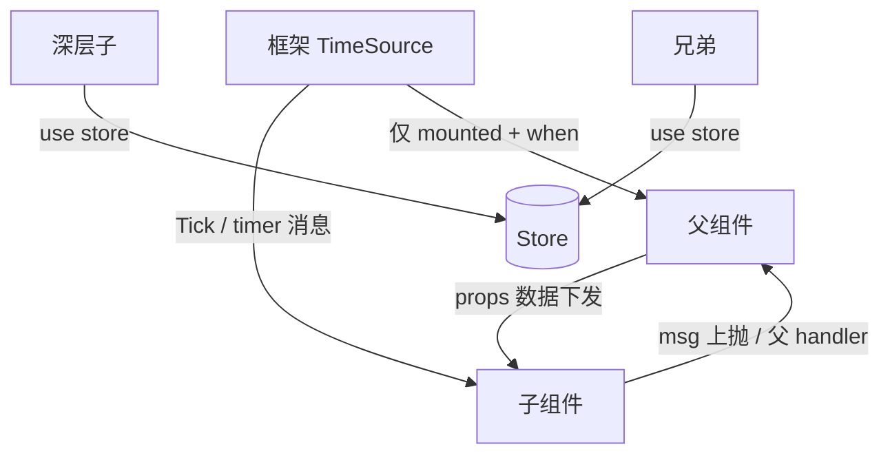

# AutoUI 组件时间源与多层交互（component-time-and-events）

> **定性**：需求级/专题设计（Plan 468：slug 不带号，归 `autoui/`）。
> **状态**：draft（2026-09-18）——嵌套组件调度与交互契约；阶段 1 由 PLAN-652 承接。
> **关联**：
> - [vm-frame-budget](vm-frame-budget.md) §5.2 D-2（挂载生命周期退订）
> - [Design 08 UI Systems](../08-ui-systems.md)、[Design 20 AutoUI 分离架构](../20-autoui-separation-architecture.md)
> - [shared-store](shared-store.md)（跨 widget 状态）
> - KNOWN-DEBT：P530-D2；gallery 内嵌 012-clock Tick 不跑（2026-09-18 实机 A/B，650 前后同现）
> - PLAN-650（E-1 timer when 订阅门，与本设计正交）
>
> **知识分层**：本文回答「嵌套组件的时间源如何调度、多层如何交互」；
> 「某次怎么改」见 PLAN-652；「当前实现」见 `docs/specs/auto-lang/ui/`。

---

## 1. 问题陈述

### 1.1 现象

ui-gallery **VM 模式**选中「012-clock」后：

- 数字停在 `--:--:--`，表盘指针停在 12 点；
- 进程日志 **0 条** `event=Tick`；
- **standalone** `examples/ui/012-clock` + 同一二进制：`w_local` 正常走秒、Tick 活跃。

PLAN-650 前后二进制在 gallery 内嵌路径 **同现冻结** → 非 650 回归。

### 1.2 根因分层

| 通道 | 现状机制 | 嵌套时行为 |
|------|----------|------------|
| UI 点击 | 视图树命中 → widget handler | **可用**（gallery `SelectDemo` 正常） |
| `timer { … when }` | 装载时从 **root + child_decls + store** 静态收集（`dynamic.rs` Plan 051 C7） | 类型级收集；**不看当前是否仍在树上**（→ D-2 泄漏） |
| `.Tick` + `model.interval` | `extract_tick_interval_from_decl` **仅 root**；`tick_interval: view.tick_interval` 单值 | **子组件 Tick 永不订阅**（时钟冻结直接原因） |
| 订阅循环 | `renderer.rs` `for app in state.apps`：只读该 App 根 `tick_interval()` / `timer_entries()` | 内嵌 demo 不是独立 App → 不进调度器 |

gallery 结构：

```text
App（gallery 根）
  └─ AppViewport（条件实例化）
       └─ Demo012Clock {}   // use.web component + if app == "012-clock"
```

### 1.3 本质（定性）

> **不是**父子 click 事件总线损坏，而是：
> **时间驱动订阅（Tick/timer）的收集与生命周期未与组件实例树对齐。**
>
> - 事件/渲染 = 树语义；
> - 定时订阅 = 「根 App 单份 + 类型静态表」语义。

多层嵌套会把该缺口放大：任意深度的子组件都无法自驱动时间逻辑，且路由切换后 timer 可能空转（P530-D2）。

---

## 2. 设计目标与非目标

### 目标

1. **G-T1 任意深度**：子/孙组件声明的 `.Tick` / `timer` 在 **挂载且 when 通过** 时会被调度。
2. **G-T2 挂载一致**：组件卸载/条件分支切走后，其时间源 **停止订阅**（清偿 D-2 方向）。
3. **G-T3 与 E-1 正交**：`when` 门继续生效（订阅层 + fire 双保险）。
4. **G-I1 交互契约可文档化**：多层「父→子 / 子→父 / 跨层 / 时间」四类路径有明确推荐机制。
5. **G-V1 可验证**：gallery 内嵌 012-clock 选中时走时、切换 demo 后停订；单测 + MCP 实机。

### 非目标（本设计不承诺一次做完）

| 项 | 说明 |
|----|------|
| 实例 path 级多频（for 多实例不同 interval） | 阶段 2；阶段 1 按 **widget 类型** 订阅（与现 `TimerEntryRuntime.widget` 一致） |
| VM 回调 props（`on_xxx: msg`） | Plan 449 既有能力缺口，不在此设计内「修好」 |
| 子组件 model 实例槽完全隔离 | 单 VM 状态布局大题；订阅修复可先行 |
| 全量 Element 帧间缓存 | vm-frame-budget **D-1**，另线 |
| 把每个嵌套组件抬成独立 App | 不采用为通用方案（见 §6 取舍） |

---

## 3. 目标架构：实例级 TimeSource + 挂载过滤

### 3.1 概念

```text
TimeSource {
  kind: Tick | Timer | Timeout,   // Timeout=set_timeout 族（已有 has_pending_timers）
  widget: String,                 // 组件/decl 名（阶段 1 身份键）
  event: String,                  // "Tick" | "AnimLnTick" | …
  every_ms: u32,
  when: Option<String>,
  // 阶段 2：path: InstancePath
}

TimeSourceTable（每个 DynamicComponent / AppSession）
  candidates: Vec<TimeSource>     // 装载期静态收集
  mounted_types: HashSet<String>  // 本帧/最近装配期实际实例化的 widget 名
```

### 3.2 收集（装载期）

对 `root_decl + all_child_decls + store-as-child`：

| 来源 | 收集规则 |
|------|----------|
| `timer { entries }` | **已有**：`dynamic.rs` `with_registry_and_imports_from_decls` 三源 push |
| `.Tick` + `interval` | **新增**：凡 decl 含 `.Tick` handler，登记 `TimeSource{kind:Tick, widget, event:"Tick", every_ms}`；`interval` 字段缺失默认 1000ms（与 `extract_tick_interval_from_decl` 一致） |
| 根 `tick_interval()` | 保留兼容字段；等价于 root 的 Tick TimeSource |
| `set_timeout` | 维持现 `has_pending_timers` / `__timer_tick` 门控，不纳入类型表亦可 |

### 3.3 订阅（调度期）

```text
for src in candidates:
  if src.kind != Tick && src.kind != Timer: continue
  if !mounted(src.widget) && src.widget not in ROOT_OR_STORE: continue
  if src.when is Some && !timer_when_allows_subscription(...): continue
  emit subscription(app, src.widget, src.event, src.every_ms)
```

- **mounted 过滤**：装配层（`AuraViewBuilder` / `render_child_widget` / gallery AppViewport 条件臂）在构建视图时写入 `mounted_types`（widget 名集合）。root 与 store-as-child **恒视为 mounted**（或：root 恒订；store 无 view 则恒订 timer）。
- **未挂载**：不订阅 → iced 无消息 → 无 view 空转（修 D-2）。
- **挂载恢复**：下一轮 `subscription(state)` 自然挂上（iced 每 update 重算）。

### 3.4 派发

- Tick 消息身份保持 `(app_id, widget, event, ms)`。
- update 侧：`widget == root` → 现路径；`widget ∈ child registry` → 在 **单 VM** 内调用该 child 的 handler（与 timer `fire_timer(widget, event)` 同型——**子 timer 派发面已存在**，Tick 缺的是订阅侧）。
- 阶段 1 不引入 path 参数；同类型多实例共用一条 Tick（与今日 timer 类型语义一致）。

### 3.5 与 PLAN-650 / D-2 / D-1 关系

| 机制 | 管什么 | 关系 |
|------|--------|------|
| 650 E-1 | `when` 假不订阅 | 正交；本设计复用 `timer_when_allows_subscription` |
| 本设计 | **谁**（挂载中的组件）被登记/订阅 | 补 Tick 收集 + mount 过滤 |
| D-2 | 卸载退订 | 本设计阶段 1 **直接承担** D-2 的类型级形态 |
| D-1 Element 缓存 | dirty=false 重建成本 | 不依赖本设计；本设计降低「不该有的消息泵」 |

---

## 4. 多层交互契约（应用作者）

### 4.1 四类路径



| 方向 | 推荐 | 禁止/避免 |
|------|------|-----------|
| 父→子 | props（标量/列表数据） | 依赖 VM 回调 props（449：整组件 fallback） |
| 子→父 | 子触发 **msg**，父 `on` 改 model；或写 store | 子直接改父私有字段（无稳定路径） |
| 跨层/兄弟 | `use store:`（shared-store 设计） | 多层 emit 链 |
| 时间 | 子组件自己声明 `.Tick` / `timer`，框架调度 | 父代跑所有子 Tick；每个时钟自建进程级泵（可用框架 Clock 服务，阶段 3） |

### 4.2 嵌套规则（可扩展性）

1. **深度**：候选表来自 decl 图递归收集，与深度无关；有效性来自 `mounted_types`。
2. **条件实例化**（gallery）：`if` 臂未命中 → 该 widget 不在 mounted → 不订阅。
3. **for 多实例**：阶段 1 类型级一条 Tick；阶段 2 用 `InstancePath`（含 index）分订阅。
4. **状态**：阶段 1 假设 child handler 已进单 VM（Plan 320/625 既有）；实例字段隔离若冲突，记债不阻塞订阅修复。

### 4.3 可选：框架墙钟服务（阶段 3）

- 桌面已有 `__wm_clock` / ServiceTick 族。
- 可提供 `Clock.now_sec()` 或 store 字段，供 012-clock / 世界时钟消费，降低「每 demo 4Hz Tick」需求。
- **兼容**：未迁移组件仍可声明 `.Tick`；框架 TimeSource 两条路并存。

---

## 5. 目标代码落点（阶段 1 勘察锚）

| 模块 | 符号/位置 | 变更方向 |
|------|-----------|----------|
| `crates/auto-lang/src/ui/handler_codegen.rs` | `extract_tick_interval_from_decl` | 保留；新增「扫 child_decls 建 Tick TimeSource 列表」helper 或在 bridge/dynamic 侧实现 |
| `crates/auto-lang/src/ui/dynamic.rs` | `tick_interval` / `timers` / `with_registry_and_imports_from_decls` | 扩展 `timesources` 或 `child_ticks`；`mounted_types` 字段；订阅查询 API |
| `crates/auto-lang/src/ui/aura_view_builder.rs` | `render_child_widget` | 构建期登记 mounted widget 名 |
| `crates/auto-lang/src/ui/iced/renderer.rs` | subscription 循环 ~18666–18688 | Tick 与 timer 统一走 mount+when 过滤 |
| `crates/auto-lang/src/ui/vm_bridge.rs` | `new_from_decls` | 派发面确认 child Tick handler 可达 |
| auto-os `ui-gallery`（验证靶） | `AppViewport.vm.at` + `demos/012-clock.at` | **不改产品语义**；仅作实机验收靶 |

vue 轨：`on`/`timer` 生成侧已有闭包 when 与组件自有 interval 语义；**本设计阶段 1 以 VM/iced 为实现面**，vue 行为不回退即可。

---

## 6. 方案取舍

| 方案 | 优点 | 缺点 | 裁定 |
|------|------|------|------|
| A. 嵌套一律抬 App | 生命周期清晰 | gallery/通用嵌套爆炸；MCP/存储/窗管成本高 | **否**（仅桌面窗语义保留） |
| B. 静态订阅全部 child tick/timer | 改动最小 | D-2 空转回潮；650 收益受损 | **否** |
| C. gallery 手写时钟泵 | 快 | 不解决多层；债继续滚 | **否** |
| D. **TimeSource + mount 过滤（类型级 v1）** | 一套机制：嵌套 Tick + D-2 + 与 E-1 叠加 | 需 mounted 记账；subscription 身份保持类型级则 for 多实例仍粗 | **是（阶段 1）** |
| E. path 级 TimeSource | 多实例正确 | 实例身份/状态槽联动大 | 阶段 2 |
| F. 全局 Clock 服务 | 时钟类零自泵 | 不覆盖业务 timer；迁移成本 | 阶段 3 可选 |

---

## 7. 分阶段路线

| 阶段 | 内容 | 计划 |
|------|------|------|
| **1** | child Tick 收集 + mounted 类型过滤 + 订阅/派发打通 + gallery 012-clock 实机 + D-2 类型级退订 + 单测 | **PLAN-652** |
| 2 | InstancePath 订阅身份、for 多实例、mounted path、MCP 可观察 TimeSource 表、ui specs 回写 | 待立项 |
| 3 | Clock 服务 / 与 desktop `__wm_clock` 对齐、示例迁移指南 | 待立项 |

---

## 8. 验收方向（供 plan 细化）

1. **单元**：child_decls 含 `.Tick` → TimeSource/candidates 含该 widget；`mounted` 不含 → 不订阅；含 → 订阅；`when` 假 → 不订阅。
2. **派发**：合成 child Tick → 对应 handler 执行且状态变更可见。
3. **实机 gallery**：选中 012-clock → `w_local` 走时；切到无 Tick 的 demo → Tick 日志不再增长。
4. **回归**：standalone 012-clock 不回归；PLAN-650 when 门测仍绿；静止 gallery rebuild 频率不劣于 650 后基线（无额外全量 child 常订）。

---

## 9. 变更记录

| 日期 | 说明 |
|------|------|
| 2026-09-18 | 首稿：根因定性、TimeSource+mount 架构、交互契约、阶段划分；关联 gallery 时钟实机与 PLAN-652 |
