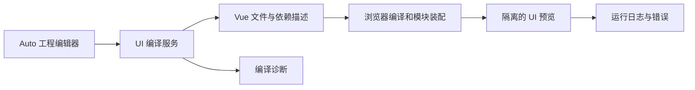

# Website 在线体验与 UI Playground 设计

> 状态：方向已确认，待分阶段实施（2026-10-01 用户确认）。
> 版本边界：v0.5 交付介绍与真实截图；Web 虚拟桌面及应用在线体验安排在 v0.5.1。UI Playground 分阶段推进，首版覆盖须经验证，不将约 28 项全部在线编辑运行作为既定发布门槛。
> 本文记录目标方案，不表示运行入口、编译 API 或演示服务已经上线。

## 1. 目标与依据

网站采用 VitePress + Vue 3。访客先了解 AutoOS 与应用，再按需求进入桌面、单应用或源码编辑体验。静态介绍能独立阅读；运行环境在用户进入体验时加载。

当前依据：

- [Website 现状](../../specs/website/project.md)、[Playground 后端现状](../../specs/auto-playground/project.md)。
- [Playground 与在线文档体验架构](playground-architecture.md)：Notes、SnippetRunner、Card、IDE 分层继续适用；本文新增 UI 轨道，不改变既有文本执行语义。
- [虚拟桌面架构](../autoui/virtual-desktop.md)：本文安排网站入口与体验边界，不代替 AutoOS 的窗口管理和宿主协议设计。
- [Plan 722](../../plans/722-website-apps-introduction.md)：四主应用介绍与系统 Demo 静态展示；其已复审范围不因本文扩展。
- 当前 `/api/run` 返回 stdout/result 等文本执行结果；`/api/trans` 无 Vue UI 目标。源码入口为 `crates/auto-playground/src/routes/{run,trans}.rs`。
- AutoLang 已有 Vue UI 生成能力，入口 `crates/auto-lang/src/ui_gen/api.rs` 的 `transpile_vue_aura`、`generate_component_from_file`；它们尚不是面向网站的完整 UI 工程编译服务。
- `auto-os/ui-gallery/src/gallery/AppViewport.vue` 已有示例装载、卸载、重置和视口选择；采用同页 Vue 挂载，不能直接作为访客修改代码的隔离环境。

网站素材来源及约 28 项候选清单见 Plan 722 分支的 `docs/reports/p722-source-baseline.json` 和 `docs/specs/website/design/application-demos.md`；722 合入前按其分支读取，不把尚未合入的路径当成 master 已有内容。

## 2. 三种体验与网站入口

| 网站位置 | 用途 | 体验方式 |
|---|---|---|
| OS → AutoOS / 虚拟桌面 | 理解桌面、Launcher、多窗口与应用组合 | 静态介绍和截图；v0.5.1 经验证后提供独立全屏 Web 桌面 |
| Apps → 系统应用与 Demo | 找到具体应用，了解典型操作 | 六类静态目录；支持的条目提供单应用体验与源码入口 |
| UI → UI Playground | 修改 Auto 界面源码并观察效果 | 文件树、Auto 编辑器、UI 预览、诊断；可查看生成的 Vue |
| Learn → 示例教程 | 从解释进入实践 | 教程深链打开 Playground 中的指定示例工程 |

不增加第七个顶层导航。Language / AI / OS / Apps / UI / Learn 的信息架构与各子入口分别落地；本文不宣称六栏导航已经实施。

建议路由（预留意图，具体路径由实施 Plan 在现有路由核查后冻结）：

- 双语介绍：继续使用 `/autoos/`、`/apps#system-apps` 及 `/zh/` 镜像；原 `/apps/demos/` 兼容跳转。
- UI Playground 介绍：`/ui/playground` 及其中文镜像；运行器按需载入。
- Web 桌面与单应用运行页：独立运行资源入口，分别承载 desktop 和 app 视图。区分 VitePress 阅读页与运行资源 URL，避免 `.html` / 目录解析冲突。
- 工程选择通过稳定 `exampleId` 和版本定位；分享链接可以指向 app 或 Playground，同一条目不依赖目录行号。

介绍页不自动启动桌面或全部应用。桌面页提供返回网站、全屏/退出和重置；单应用页提供返回目录、查看源码和在 Playground 打开。手机以单应用为默认入口，桌面入口说明适用尺寸与已验证操作。

## 3. 发布边界和当前介绍页面

| 阶段 | 页面可呈现的内容 | 开放入口条件 |
|---|---|---|
| v0.5 当前轮 | 介绍、真实截图、源码/运行条件；必要时注明 Web 体验计划于 v0.5.1 提供 | 当前轮不提供新增 Web 桌面和 app 运行按钮 |
| v0.5.1 | Web 桌面入口和已验证应用的单独体验 | 逐项通过运行、资源、服务、主题与移动适配验收 |
| UI Playground 首版 | 3–5 个代表工程的编辑与预览 | 完成 Auto→Vue 通路、依赖装配、隔离与错误恢复 |
| 后续扩展 | 更多多文件工程、数据适配、共享体验清单 | 每应用记录已验证范围，持续扩充，不以候选数量替代覆盖证据 |

可展示版本方向，但不使用不能操作的“在线体验”按钮。当前画廊可保留开发资料入口，并注明部分示例依赖服务；它的既有资源不构成 v0.5 已有完整应用 Web 版的承诺。

### 3.1 下一轮“介绍 + 截图”的页面结构

系统应用在 Apps 概览里继续介绍，采用六类：工作与生活、阅读与交流、媒体与创作、系统与数据、小游戏、应用结构示例。桌面 3 列、平板 2 列、手机 1 列；类别筛选在本地完成。

每张应用卡片：真实缩略图 → 应用名和用途 → 就地展开操作、运行条件、当前范围与源码。28 个 Demo 不另设介绍页，原链接跳转到概览的对应锚点；四个主应用保留独立详情，未来扩充流程介绍。正文配 1–3 张图，按“初始界面 → 关键操作 → 结果”递进。

截图素材记录应用、源码版本、运行形态（Vue / VM）、主题、尺寸、拍摄日期和样例数据。说明图中功能及必要服务，避免将 VM 截图描述为浏览器截图，或将演示数据描述为实时系统数据。没有素材的条目保持可读文字，不生成空框或伪截图。

四主应用沿用用户已定素材安排：AutoEdit 可采用获认可的 PixPin 主图，AutoShell 使用原生彩色 `ls` 图；AutoMusk 等同一示例工程流程准备后拍摄，JadeEdit 等 Milestone 收口后拍摄。系统 Demo 的真实图先取稳定运行的日常工具和小游戏，再扩展服务依赖应用。素材验收和网页接入另列实施 Plan，不改写 Plan 722 原有“本轮截图留空”的验收条件。

## 4. UI Playground 的界面与操作

桌面工作区：左侧工程文件树和 Auto 源码编辑器，右侧 UI 预览，底部诊断与运行日志。生成的 Vue 是次要阅读标签；默认鼓励修改 Auto 源码。手机采用源码/预览切换，不挤压为两列。

首版操作：选择示例、修改、运行、停止、重置、主题与视口切换、查看生成代码、下载工程。错误标出文件和位置；编译失败保留最后一次成功预览，并明确它对应的旧版本。停止/重置能回收预览上下文；离页释放相关监听、定时器和请求。

分享分两层：官方示例用版本化深链；小型自定义工程可评估序列化链接和本地草稿，大型工程优先下载。账号、公开发布平台、云端工程持久化不属于首版目标。

## 5. 编译与运行结构

新增服务只负责编译经约束的工程和输出资源，不将提交的程序作为服务端应用直接执行。继续复用既有文本 Playground 的编辑、工程组织和诊断能力；UI 输出由新增接口承载，不改变 `/api/run` 的返回契约。

拟议编译契约（尚未实现）：输入入口文件、虚拟文件集、固定工具链/运行库版本与运行配置；输出 Vue/JS/CSS 文件、依赖和资源描述、编译诊断、工程内容哈希，源码位置映射按生成器实际能力提供。服务使用受限临时工程，校验相对路径、数量与大小，限制编译时长和并发；输入文件与依赖解析不能访问任意宿主路径。

组件库、Auto 运行辅助模块、路由、图标和样式作为固定版本的预构建依赖发布。浏览器装配多文件导入、资源 URL 和入口；Tailwind 等样式需覆盖用户修改后的类名，不能只携带原示例的静态 CSS。新增依赖采用明确支持集合，不在每次运行或输入时安装任意 npm 包、重建整套 Vite 工程。

首版显式点击运行。后续实时编译需防抖并丢弃过期响应，预览版本与编辑版本分别显示。以内容与工具链版本缓存编译结果；缓存不混入运行会话的数据。

### 5.1 Vue REPL 的复用范围

[官方 @vue/repl](https://github.com/vuejs/repl) 可作为 Vue 文件编辑/编译/预览能力的候选，优先评估轻量编辑器接入和可配置资源路径。它不替代 Auto 编译器、组件依赖打包、样式生成或应用后台。

默认运行时和依赖应能由自有静态资源提供，不把访客可用性绑定到任意第三方 CDN。编译器与浏览器运行库版本配套冻结；具体 @vue/repl 版本和装配方案在首个技术验证 Plan 中确定。

### 5.2 预览隔离与恢复

官方固定示例可复用已验证的挂载逻辑；访客编辑的代码运行在隔离的 iframe/独立来源预览中，通过受限消息协议传输代码、状态和日志，不直接进入 VitePress 页面上下文。设计参考 [iframe sandbox](https://developer.mozilla.org/en-US/docs/Web/HTML/Reference/Elements/iframe#sandbox)。

iframe 设置本身不保证终止无限循环。验收需专门验证阻塞代码下的停止、重置和页面恢复；必要时将预览部署在独立站点来源，并核实目标浏览器的实际行为。后台、网站登录凭据和主站存储不向预览默认透传。

## 6. 约 28 个应用与后台支持

候选源码、发布应用、可在网页挂载、可修改后运行、可访问真实服务是不同状态，分别登记。28 是候选集合口径，不是首版无后台覆盖承诺。

| 应用需求 | 推荐体验 | 内容边界 |
|---|---|---|
| 浏览器本地状态即可完成 | 真正可操作的 Vue 示例，优先进入 Playground | 验证操作、资源、重置、保存范围和定时器释放 |
| 需要业务数据或远端接口 | 受限演示服务，或独立演示数据适配层 | 标明数据来源、可操作范围、重置和保存位置 |
| 文件系统、终端、系统监测等宿主能力 | 限定 Web 流程或保留静态介绍与本地运行条件 | 不把服务器文件/进程/指标描述为访客本机信息 |

计算器、待办与小游戏是优先核查对象，不因名称直接判为纯前端。聊天、天气、媒体、数据库等按实际代码逐项核查。UI 编译成功不证明后台可用。

少量演示数据版采用明确的数据适配接口，复用真实 UI 和交互；不先分叉 28 套界面。对真实接口、演示服务和 fixture 分别记录验收。修改版用户代码不直接获得生产服务权限，演示服务限制操作范围并隔离各会话。

## 7. 共用应用清单

目录、单应用运行器、桌面和 Playground 共用稳定 ID 与版本描述；不同宿主按能力筛选。清单至少记录：

- `id/name/category/summary/sourceRepo/sourcePath/sourceRevision`。
- 截图信息：路径、主题、运行形态、日期、尺寸、样例说明。
- 可用入口：介绍、源码、单应用、桌面、Playground；尚未实现的入口不输出可点击链接。
- `runtimeRequirements/dataMode/verifiedAt/verifiedRevision`，以及实际验证的操作范围。
- 构建入口、依赖/资源版本、桌面窗口参数与 Playground 编辑范围。

运行产物尽量复用，运行宿主仍各自负责路由、窗口、生命周期和数据隔离。同一个应用提供多个入口不意味着浏览器与原生功能自动一致。

## 8. 实施顺序与验收

| 阶段 | 交付 | 核心验收 |
|---|---|---|
| P0：当前网站素材 | 分类目录、用途说明、真实截图、逐项素材清单 | 双语静态可读、真实图可放大、运行条件准确；无新 Web 运行入口 |
| P1：UI Playground 技术验证 | 3–5 个代表工程（覆盖本地状态、多文件、路由或组件依赖） | 修改 Auto 确实改变预览；错误定位、重置、旧响应处理、隔离/阻塞恢复、依赖与样式有效 |
| P2：应用运行与数据适配 | 应用清单、单应用页、受限数据路径、更多示例 | 无后台与有服务场景分别验证；共享状态/路由/主题不污染宿主 |
| P3：v0.5.1 Web 桌面接入 | Launcher、窗口、应用组合、独立全屏体验 | 按实际发布集合验收启动、焦点、拖动、最小化、恢复、关闭和生命周期；介绍链接准确 |

桌面自身开发可与 Playground 技术验证独立推进；P3 不必等待 28 项全部可编辑。依赖桌面协议或某应用后台的部分按其实际前置条件排期。

每阶段另建正式 Plan、在专用 worktree 实施、按触面验证并独立复审。UI Playground 若修改 Rust 编译器/API，遵循对应 Rust 门禁；P0 只做内容/资产时不运行 Cargo 或 docs_gen。网站验证覆盖 EN/ZH、360/390/768/1024/1440 宽度、深浅主题、SSR/链接/键盘操作；运行器增加真实交互、后台缺失和错误恢复验证。

## 9. 本次决策与后续明确项

已确认：v0.5 静态介绍与截图优先；Web 桌面/app 体验在 v0.5.1；UI Playground 以 Auto 源码编辑和 Vue 预览为主；三入口分工、按需加载、共享应用清单、分批验证与有限数据适配。

实施 Plan 再冻结：具体运行路由、首批 3–5 工程、运行器资源打包方案、编译 API schema、隔离来源与阻塞恢复、每应用服务模式和 v0.5.1 的实际发布集合。本文不设置未经验证的性能数字或完整覆盖发布日期。
