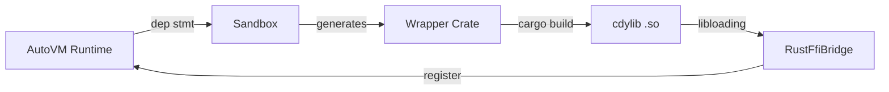
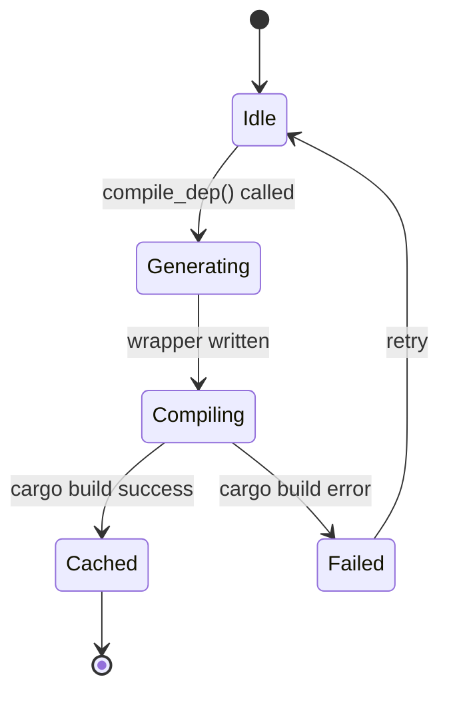

# Spec-Driven Category Design

> **Version:** 1.1  
> **Status:** Approved  
> **Applies to:** AutoForge Specs (Jades) system

---

## 1. Executive Summary

Specs are not flat documents — they form a **layered decision pyramid**. Each layer answers a distinct question, and each layer is consumed by the layer below it. This design ensures:

- **Traceability**: Every Plan can be traced back to a Goal.
- **Clarity**: Each category has exactly one job.
- **Machine-readability**: AI agents can parse, generate, and validate specs reliably.
- **Human-reviewability**: Humans only review what matters at their level.

```
                      ┌─────────────┐
         Why          │   Goals     │  ← 1 sentence, human owns
                      └──────┬──────┘
                             │ refines into
            ┌────────────────┼────────────────┐
            ▼                ▼                ▼
     ┌────────────┐   ┌────────────┐
How-high│Architecture│   │  Designs   │  ← includes interfaces, REST, schemas
     └────────────┘   └────────────┘
            │                │
            └────────────────┼────────────────┘
                             │ drives
                      ┌──────┴──────┐
     When / Who       │    Plans    │  ← phases & milestones
                      └──────┬──────┘
                             │ verify with
                      ┌──────┴──────┐
       Verify         │   Tests     │  ← how to prove correctness
                      └──────┬──────┘
                             │ feed results to
                      ┌──────┴──────┐
       Check          │   Reviews   │  ← assessment
                      └──────┬──────┘
                             │ feeds
                      ┌──────┴──────┐
       Know           │   Reports   │  ← relay execution summary
                      └─────────────┘
```

---

## 2. Universal Conventions

### 2.1 ID System

Every item in every category receives a typed, hierarchical ID:

| Category | Prefix | Example | Semantics |
|---|---|---|---|
| Goals | `G` | `G1`, `G2` | Sequential within project |
| Architecture | `A` | `A1`, `A2` | Sequential ADR / component |
| Designs | `D` | `D1`, `D2` | Sequential module design |
| Plans | `P` | `P1`, `P2` | Sequential plan phase |
| Tests | `S` | `S1.1`, `S2.1` | `S<goal>.<seq>` (S = Spec/Test) |
| Reviews | `V` | `V1`, `V2` | Sequential review cycle |
| Reports | `X` | `X2026-05`, `X2026-W20` | Date-based or run-based |

**Rules:**
- IDs are immutable. Once assigned, they never change.
- Deleting an item retires its ID (never reused).
- IDs are referenced in `depends_on` using the full prefixed form: `"G1"`, `"G1.1"`, `"A1"`.

### 2.2 Typed References (`depends_on`)

The `depends_on` field on every `SpecItem` contains a list of upstream IDs. The prefix reveals the category:

```json
{
  "id": "G1",
  "title": "cdylib compilation pipeline",
  "depends_on": []
}
```

**Valid reference rules:**
- `Goals` are root items — they may only reference other Goals.
- `Architecture` / `Designs` may depend on `Goals` or each other.
- `Plans` may depend on `Goals`, `Architecture`, `Designs`.
- `Tests` may depend on `Goals` and `Designs`.
- `Reviews` may depend on `Goals`, `Tests`, and `Plans`.
- `Reports` may depend on anything (aggregator).

### 2.3 Status Lifecycle

All categories share a common `Status` enum, but each category exposes only a relevant subset. The global status pool:

| Status | Meaning | Used By |
|---|---|---|
| `empty` | Section has no items yet | All |
| `proposed` | Idea floated, not yet analysed | Goals |
| `draft` | Content written, under internal review | Architecture, Designs, Plans |
| `under_review` | Under formal review / critique | Architecture, Designs |
| `approved` | Human has approved | Goals, Architecture, Designs, Plans |
| `in_progress` | Work has started | Goals, Plans |
| `implemented` | Code complete, not yet verified | Goals |
| `verified` | Verified against acceptance criteria | Goals, Plans |
| `done` | Fully complete | Goals, Plans |
| `published` | Report/review published | Reviews, Reports |
| `superseded` | Replaced by newer design | Architecture, Designs |
| `outdated` | No longer reflects reality | Architecture, Designs |
| `rejected` | Explicitly rejected | Goals |
| `archived` | Retired, kept for history | Goals |
| `obsolete` | Plan no longer relevant | Plans |

**Transition rules** are enforced per-category by `SectionConfig`.

---

## 3. Per-Category Design


### 3.1 Goals 🎯

**Question:** *Why are we doing this?*  
**Purpose:** Define the north-star objectives of the project. Goals are the anchor for all downstream specs.

**Unit:** Goal statement — a single, testable sentence.

**Format:** Markdown table. The entire Goals section is **one table**.

```markdown
## Goals

| ID | Goal | Priority | Status | Stakeholder |
|---|---|---|---|---|
| G1 | AutoVM can dynamically load and call external Rust crates via cdylib | P0 | Done | Runtime Team |
| G2 | Auto compiler frontend is self-hosted in Auto language (a2r target) | P0 | InProgress | Compiler Team |
| G3 | AutoForge provides a spec-driven serial agent UI | P1 | Approved | Tooling Team |
```

**Rules:**
- One row = one Goal. No multi-row descriptions inside the table.
- The `Goal` column must be a **single sentence** (≤140 characters).
- If a Goal needs explanation, put it in a footnote or linked sub-goal — never inline.
- Maximum 10 Goals per project. If you need more, some are not Goals — they are sub-goals.

**Status Lifecycle:**
```
Empty → Proposed → Analysed → Approved → InProgress → Implemented → Done → Archived
```

**Ownership:** Human creates and approves. AI may propose (`Proposed`) but never approves.

**Downstream:** Each Goal may have sub-goals (R&lt;G&gt;.*).

---

### 3.2 Architecture 🏗️

**Question:** *What does the system skeleton look like?*  
**Purpose:** Document high-level structure, component boundaries, data flow, and key architectural decisions (ADRs).

**Unit:** Architecture Decision Record (ADR) or Component specification.

**Format:** Each item is a self-contained ADR with a Mermaid diagram.

```markdown
## Architecture

### A1 FFI Bridge Architecture
**Status:** Approved  
**Scope:** G1  
**Decision:** Use cdylib + libloading instead of static linking or WASM.

**Rationale:**
Static linking requires recompiling AutoVM for every new crate, which
violates the "dynamic" requirement in G1. WASM adds a runtime dependency
and complicates memory sharing. cdylib offers the best balance: compile
once, load at runtime, zero overhead for cached crates.

**Components:**


**Trade-offs:**
| Approach | Pros | Cons |
|---|---|---|
| cdylib | Dynamic, cached, standard | Platform-specific ABI |
| static | Simple, fast | Not dynamic |
| WASM | Portable, sandboxed | Extra runtime, slower |

**Consequences:**
- Positive: Enables hot-swapping of Rust dependencies without restarting AutoVM.
- Negative: Requires platform-specific test matrices (Linux/macOS/Windows).

**Depends on:** G1
```

**Rules:**
- Every Architecture item must include a Mermaid diagram or structural diagram.
- Include an explicit `Decision` section — what was chosen and why.
- Include `Trade-offs` — at least 2 alternatives considered.
- `Scope` links back to the Goal(s) this architecture serves.
- ADRs are immutable once `Approved`. If the decision changes, create a new ADR (`A2`) and mark `A1` as `Superseded`.

**Status Lifecycle:**
```
Empty → Draft → UnderReview → Approved → Superseded / Outdated
                      ↓
                   Rejected
```

**Ownership:** Human architects write and approve. AI may draft `Draft` proposals.

**Downstream:** Architecture guides `Designs`.

---

### 3.3 Designs 🎨

**Question:** *How does each module work internally?*  
**Purpose:** Specify module interfaces (including REST endpoints, request/response schemas, and function signatures), state machines, algorithms, and data models at the implementation level. 

> **Note:** Interface contracts that were previously in a separate `APIs` category now live here, co-located with the module design. A REST endpoint spec is part of the design for the module that serves it.

**Unit:** Module design document.

**Format:** Structured spec with interface definition, state machine, and pseudocode.

```markdown
## Designs

### D1 Sandbox.compile_dep() Design
**Status:** Approved  
**Module:** `auto-cache/src/sandbox.rs`  
**Scope:** A1

**Interface:**
```rust
impl Sandbox {
    /// Compile a Rust crate dependency as a cdylib.
    /// Returns the path to the compiled `.so`/`.dll`.
    pub fn compile_dep(&self, dep: &DepStmt) -> Result<PathBuf, CompileError>;
}
```

**State Machine:**


**Data Model:**
| Field | Type | Description |
|---|---|---|
| `crate_name` | `String` | Sanitized crate name from dep stmt |
| `version` | `Option<String>` | Semver constraint |
| `shims` | `Vec<FunctionShim>` | Generated wrapper signatures |
| `cache_key` | `u64` | Hash of (name, version, shims) |

**Algorithm (pseudocode):**
```
fn compile_dep(dep):
    cache_key = hash(dep)
    if cache.contains(cache_key):
        return cache.get(cache_key)
    wrapper = generate_wrapper(dep)
    write_cargo_toml(wrapper.dir, dep)
    run_cargo_build(wrapper.dir)
    artifact = find_artifact(wrapper.dir)
    cache.insert(cache_key, artifact)
    return artifact
```

**Depends on:** A1
```

**Rules:**
- Every Design must reference its parent Architecture item in `Scope`.
- Include a concrete **Interface** (function signatures, REST endpoints, types, error variants).
- Include a **State Machine** if the module has non-trivial lifecycle.
- Include a **Data Model** table for key structs.
- Pseudocode is preferred over prose for algorithms.
- If the module exposes public REST endpoints, document them in the `Interface` section
  using the same structured format (Method, Path, Request, Response, Errors, Schema).

**Status Lifecycle:**
```
Empty → Draft → UnderReview → Approved → Superseded / Outdated
                      ↓
                   Rejected
```

**Ownership:** Senior engineer or human architect approves. AI drafts during Gate 2.

**Downstream:** Designs inform `Plans` and `Tests`.

---

### 3.4 Plans 📅

**Question:** *When and by whom will this be done?*  
**Purpose:** Translate Goals and Designs into a phased implementation roadmap with milestones, time estimates, and dependencies.

**Unit:** Phase or Milestone.

**Format:** Timeline-style Markdown with Gantt semantics.

```markdown
## Plans

### P1 FFI Pipeline Implementation
**Status:** Done  
**Objective:** Implement G1, G1.1, G1.2  
**Estimated Duration:** 3 weeks  
**Owner:** Runtime Team

**Phase Breakdown:**

| Phase | Task | Owner | Duration | Dependencies | Status |
|---|---|---|---|---|---|
| P1.1 | Sandbox wrapper generation | Alice | 3 days | D1 | Done |
| P1.2 | cargo build integration | Alice | 2 days | P1.1 | Done |
| P1.3 | RustFfiBridge registration | Bob | 3 days | P1.2 | Done |
| P1.4 | Cache layer | Bob | 2 days | P1.3 | Done |
| P1.5 | E2E test (serde_json) | Alice | 2 days | P1.4 | Done |

**Risk:** cargo build may exceed 30s on first compile for large crates.
**Mitigation:** Pre-compile popular crates in CI; use sccache.

**Depends on:** G1, G1.1, G1.2, D1
```

**Rules:**
- Every Plan must reference the Goals it satisfies in `Objective`.
- Use a table for phase breakdown — this is machine-parseable.
- Each phase row includes: ID, Task, Owner, Duration, Dependencies, Status.
- `Risk` and `Mitigation` are mandatory — every plan has unknowns.
- A Plan is `Approved` before execution begins. During execution, phase rows are updated.

**Status Lifecycle:**
```
Empty → Draft → Approved → InProgress → Done → Obsolete
```

**Ownership:** Human PM / tech lead approves. AI drafts the plan during Gate 2.

**Downstream:** Plans drive `Tests` and are tracked in `Reports`.

---

### 3.5 Reviews 📝

**Question:** *Did we build the right thing, and did we build it right?*  
**Purpose:** Systematic verification that implementation matches Goals. Reviews are quality gates.

**Unit:** Review finding.

**Format:** Structured report with criterion-by-criterion assessment.

```markdown
## Reviews

### V1 Post-Implementation Review — G1 (cdylib pipeline)
**Status:** Published  
**Review Date:** 2026-05-12  
**Reviewer:** Alice + AutoForge AI

**Summary:** 4/4 acceptance criteria passed. 1 minor drift detected in error handling.

| Criterion | Goal | Result | Evidence | Issue |
|---|---|---|---|---|
| C1 | Wrapper crate generated | ✅ Pass | `test_wrapper_generation` passes | — |
| C2 | cdylib compiled | ✅ Pass | `test_cdylib_compile` passes | — |
| C3 | Cache hit on rerun | ✅ Pass | 2nd call completes in 45ms | — |
| C4 | Cross-platform | ⚠️ Partial | Linux/macOS tested; Windows pending | V1-I1 |

**Issues:**

#### V1-I1 Windows path separator drift
**Severity:** Low  
**Description:** `compile_dep()` uses `/` in `Cargo.toml` path strings, which fails on Windows.
**Recommendation:** Use `PathBuf` everywhere; no hardcoded `/`.
**Assigned to:** Bob

**Overall Verdict:** Approved with minor fixes.
```

**Rules:**
- Every Review must reference the Goal(s) being reviewed.
- Use a table for criterion assessment — machine-parseable.
- Each Issue gets an ID: `V<review>-I<seq>`.
- Issues link back to `Plans` (fix tasks) and `Reports` (status updates).
- Reviews are `Published` once complete; they are never `Draft` indefinitely.

**Status Lifecycle:**
```
Empty → Draft → Published
```

**Ownership:** AI generates draft during Gate 4 (Verification). Human reviewer approves and publishes.

**Downstream:** Reviews feed `Reports` and spawn new `Plans` for fixes.

---

### 3.6 Reports 📊

**Question:** *What happened in this relay run?*  
**Purpose:** Summarize the execution of a relay run for the boss. Reports are generated automatically after a Reviewer completes its work. They aggregate what was built, what changed, test results, drift findings, cost, and confidence.

> **Note:** Reports are **relay execution summaries**, not periodic status updates. Each Report corresponds to a completed relay run (or a batch of runs) and is presented to the boss as the primary deliverable.

**Unit:** Status snapshot.

**Format:** Executive summary with metrics, cost, and confidence.

```markdown
## Reports

### X42 — OAuth2 Implementation Relay
**Run ID:** 42  
**Status:** Published

**Executive Summary:**
G1 (OAuth2 login) is Done. All 4 plan phases completed. 14/14 tests pass.
1 minor drift detected in refresh token expiry (hardcoded 3600s).

**Metrics:**
| Metric | Value |
|---|---|
| Goals Met | 1/1 |
| Tests Pass | 14/14 |
| Drift Detected | 1 (Low) |
| Code Files Changed | 4 |

**Cost:**
| Profession | Tokens | Cost |
|---|---|---|
| Advisor | 3,240 | $0.08 |
| Architect | 8,100 | $0.24 |
| Planner | 2,500 | $0.07 |
| Coder | 42,500 | $1.27 |
| Tester | 23,400 | $0.70 |
| Reviewer | 5,200 | $0.15 |
| **Total** | **84,940** | **$2.51** |

**Confidence:** High (Reviewer verdict: approved with minor fix)

**Deliverables:**
- `crates/auth/src/token.rs`
- `crates/auth/src/middleware.rs`
- `crates/auth/src/routes.rs`
- `crates/auth/src/errors.rs`

**Drift:**
- Refresh token rotation deferred to Phase 2. Token expiry hardcoded.
  Assigned to: future sprint.

**Blockers:** None.
```

**Rules:**
- Reports are **aggregators** — they reference items from all other categories, never introduce new specs.
- Generated automatically at the end of a relay run (by the Documenter profession).
- `Metrics` table is mandatory — quantifiable progress (goals met, tests passed, drift detected).
- `Blockers` must link to specific `Plans`.
- `Risks` must link to specific `Plans` or `Goals`.
- `Cost` section is mandatory — tokens spent, time elapsed.
- `Confidence` score is mandatory — Reviewer's verdict (High / Medium / Low).

**Status Lifecycle:**
```
Empty → Draft → Published
```

**Ownership:** AI generates draft automatically at schedule boundaries. Human PM reviews and publishes.

**Downstream:** None. Reports are terminal nodes.

---


---

### 3.8 Tests 🧪

**Question:** *How do we prove this is correct?*  
**Purpose:** Define concrete, executable verification methods for Goals. Tests are the bridge between "what we want" and "how we know it works." Without Tests, AI cannot form a closed loop during execution.

**Unit:** Test case — a single verifiable assertion with input, expected output, and execution context.

**Format:** Structured spec with test type, fixture, steps, and expected outcome.

```markdown
## Tests

### S1.1 [G1] cdylib compilation pipeline — happy path
**Status:** Passing  
**Type:** Integration  
**Scope:** G1

**Fixture:**
```rust
let sandbox = Sandbox::new(temp_dir());
let dep = DepStmt::parse("dep serde_json").unwrap();
```

**Steps:**
1. Call `sandbox.compile_dep(&dep)`
2. Assert result is `Ok(path)`
3. Assert `path.exists()`
4. Assert `path.extension()` is `"so"` or `"dll"`
5. Call `sandbox.compile_dep(&dep)` again
6. Assert completion time < 100ms (cache hit)

**Expected Outcome:**
- First call: compiles in <30s, returns valid artifact path.
- Second call: returns cached path in <100ms.

**Test File:** `crates/auto-cache/tests/sandbox_compile_dep.rs`

**Depends on:** G1, D1

---

### S1.2 [G1] cdylib compilation — unknown crate fails gracefully
**Status:** Passing  
**Type:** Integration  
**Scope:** G1

**Steps:**
1. Call `sandbox.compile_dep(&DepStmt::parse("dep nonexistent_crate_12345").unwrap())`

**Expected Outcome:**
- Returns `Err(CompileError::CrateNotFound { name: "nonexistent_crate_12345" })`
- No panic, no partial artifacts left in sandbox.

**Test File:** `crates/auto-cache/tests/sandbox_compile_dep.rs`
```

**Rules:**
- Every Goal must have **at least one** associated Test.
- Every Test must reference its parent Goal in the header: `### S1.1 [G1]`.
- `Type` is one of: `Unit`, `Integration`, `E2E`, `Contract`, `Performance`, `Fuzz`.
- `Fixture` sets up the preconditions (data, mocks, environment).
- `Steps` are numbered, imperative, and deterministic.
- `Expected Outcome` is unambiguous — a human or AI can verify it without interpretation.
- `Test File` is the actual file path where the test code lives. This is critical for AI execution.
- Tests are `Draft` when the spec is drafted, `Implemented` when test code is written, and `Passing` / `Failing` when run.

**Status Lifecycle:**
```
Empty → Draft → Implemented → Passing
                          ↓
                       Failing → Fixed → Passing
                          ↓
                       Skipped (temporarily)
```

**Ownership:** AI drafts Tests during Gate 2 (alongside Goals). AI implements test code during Gate 4 (TDD mode: write failing test first, then implement). AI updates status after each run.

**Downstream:** Tests feed into `Reviews` (as objective evidence) and `Reports` (as health metrics).

---

## 4. Inter-Category Relationship Map

```mermaid
graph TB
    subgraph Why
        G[Goals]
    end
    subgraph HowHigh
        A[Architecture]
    end
    subgraph HowLow
        D[Designs]
    end
    subgraph Execute
        P[Plans]
    end
    subgraph Verify
        S[Tests]
        V[Reviews]
    end
    subgraph Know
        X[Reports]
    end

    G -->|informs| A
    G -->|drives| P
    G -->|verified by| S
    A -->|guides| D
    D -->|informs| P
    D -->|informs| S
    S -->|feeds| V
    P -->|feeds| V
    S -->|feeds| X
    V -->|feeds| X
    P -->|feeds| X
    G -->|feeds| X

**Reference Table:**

| From | To | Relation | Cardinality |
|---|---|---|---|
| Goals | Architecture | informs | N:G → 1:A |
| Goals | Plans | drives | N:G → 1:P |
| Goals | Tests | verified by | N:G → N:S |
| Architecture | Designs | guides | 1:A → N:D |
| Designs | Plans | informs | N:D → 1:P |
| Designs | Tests | informs | N:D → N:S |
| Tests | Reviews | feeds results | N:S → 1:V |
| Goals | Reviews | verified by | N:G → 1:V |
| Plans | Reviews | feeds | 1:P → 1:V |
| Tests | Reports | feeds | N:S → 1:X |
| Reviews | Reports | feeds | 1:V → 1:X |
| Plans | Reports | feeds | 1:P → 1:X |
| Goals | Reports | feeds | N:G → 1:X |

---

## 5. Status Lifecycle Reference

| Category | Allowed Statuses | Key Transitions |
|---|---|---|
| Goals | Empty, Proposed, Draft, UnderReview, Approved, InProgress, Implemented, Verified, Done, Archived, Rejected | Draft→UnderReview→Approved→InProgress→Implemented→Verified→Done→Archived |
| Architecture | Empty, Draft, UnderReview, Approved, Superseded, Outdated | Draft→UnderReview→Approved→Superseded/Outdated |
| Designs | Empty, Draft, UnderReview, Approved, Superseded, Outdated | Draft→UnderReview→Approved→Superseded/Outdated |
| Plans | Empty, Draft, Approved, InProgress, Done, Obsolete | Draft→Approved→InProgress→Done→Obsolete |
| Tests | Empty, Draft, Implemented, Passing, Failing, Skipped | Draft→Implemented→Passing; Failing→Fixed→Passing |
| Reviews | Empty, Draft, Published | Draft→Published |
| Reports | Empty, Draft, Published | Draft→Published |

---

## 6. AI / Human Ownership Matrix

| Category | AI Can Create | AI Can Modify | Human Must Approve | Typical Author |
|---|---|---|---|---|
| Goals | Draft sub-goals (`Draft`) | During rework | Yes (to `Approved`) | Product Owner / Tech Lead |
| Architecture | Draft (`Draft`) | During rework | Yes (to `Approved`) | Staff Engineer / Architect |
| Designs | Draft (`Draft`) | During rework | Yes (to `Approved`) | Senior Engineer |
| Plans | Draft (`Draft`) | During execution | Yes (to `Approved`) | Tech Lead / PM |
| Tests | Draft from Goals | Implement + run + update status | May override | AI Agent (TDD) |
| Reviews | Draft findings | No | Yes (to `Published`) | Human reviewer + AI |
| Reports | Draft snapshot | No | Yes (to `Published`) | PM (review) / AI (draft) |

**Gate Mapping:**
- **Gate 2 (SpecDraft):** AI drafts sub-goals, Tests, Architecture, Designs, Plans.
- **Gate 3 (Approve):** Human reviews and approves.
- **Gate 4 (Execute):** AI executes approved Plans (TDD: write Test first, implement, verify Test passes), updates Test and Plan statuses.
- **Gate 4 (Verify):** AI drafts Reviews using Test results as evidence; human publishes.

---

## 7. Markdown Templates (Quick Reference)

### Goals
```markdown
## Goals

| ID | Goal | Priority | Status | Stakeholder |
|---|---|---|---|---|
| G1 | <one sentence> | P0 | Approved | <team> |
```

### Goal (Leaf)
```markdown
### G1.1 <title>
**Status:** Draft
**Acceptance Criteria:**
- [ ] <testable item>
- [ ] <testable item>

**Details:**
<≤500 words>

**Depends on:** G1
```

### Architecture
```markdown
### A1 <title>
**Status:** Draft
**Scope:** G1
**Decision:** <what was chosen>

**Rationale:**
<why>

**Components:**
```mermaid
<diagram>
```

**Trade-offs:**
| Approach | Pros | Cons |
|---|---|---|
| A | ... | ... |
| B | ... | ... |

**Depends on:** G1
```

### Design
```markdown
### D1 <title>
**Status:** Draft
**Module:** `<file>`
**Scope:** A1

**Interface:**
```<lang>
<signatures>
```

**State Machine:**
```mermaid
<diagram>
```

**Data Model:**
| Field | Type | Description |
|---|---|---|
| ... | ... | ... |

**Depends on:** A1
```

### Plan
```markdown
### P1 <title>
**Status:** Draft
**Objective:** G1, G1.1
**Estimated Duration:** N weeks
**Owner:** <team>

| Phase | Task | Owner | Duration | Dependencies | Status |
|---|---|---|---|---|---|
| P1.1 | ... | ... | ... | ... | ... |

**Risk:** ...
**Mitigation:** ...

**Depends on:** G1, D1
```


### Test
```markdown
### S1.1 [G1] <title>
**Status:** Draft
**Type:** Unit / Integration / E2E / Contract / Performance / Fuzz
**Scope:** G1

**Fixture:**
```<lang>
<setup code>
```

**Steps:**
1. <action>
2. <action>

**Expected Outcome:**
<unambiguous result>

**Test File:** `<path>`
```

### Review
```markdown
### V1 <title>
**Status:** Draft
**Review Date:** <date>
**Reviewer:** <name>

| Criterion | Goal | Result | Evidence | Issue |
|---|---|---|---|---|
| C1 | ... | ✅/⚠️/❌ | ... | ... |

**Issues:**
#### V1-I1 <title>
**Severity:** Low/Med/High
**Description:** ...
**Recommendation:** ...
```

### Report
```markdown
### XYYYY-WNN <title>
**Period:** <date range>
**Status:** Draft

**Executive Summary:**
<paragraph>

**Metrics:**
| Metric | Value | Trend |
|---|---|---|
| ... | ... | ... |

**Blockers:**
- **B1** [Blocked] T<x> — ...

**Risks:**
- **R1** ...

**Next Week Focus:**
- ...
```

### API
```markdown

```

---

## 8. Migration from Current Flat Model

### 8.1 What Changes

| Aspect | Current | New |
|---|---|---|
| Goals format | Free text or card items | Single Markdown table |
| Goal detail | Mixed in `content` field | Structured: summary + criteria + details |
| ID system | Ad-hoc (`G-plan-212`) | Typed, hierarchical (`G1`, `G1.1`, `A1`, `D1`) |
| References | `depends_on: ["G-plan-212"]` | `depends_on: ["G1"]` |
| Architecture | Plain text | ADR with Mermaid + trade-off table |
| Plans | Free text phases | Table with Gantt semantics |

| Tests | Not formalized | Structured test spec with fixture + steps + expected outcome |
| Reviews | Not formalized | Structured criterion table + issue IDs |
| Reports | Not formalized | Relay execution summary with metrics + cost + confidence |

### 8.2 Migration Steps

1. **Re-ID existing items**: Map old IDs to new typed IDs. Example: `G-plan-212` → `G1`.
2. **Restructure Goals**: Convert current Goal items into a single Markdown table.
3. **Restructure Leaf Goals**: Split `content` into `Acceptance Criteria` (checklist) + `Details` (≤500 words).
4. **Add Mermaid to Architecture**: Convert prose descriptions into diagrams + ADR format.
5. **Restructure Plans**: Convert free-text phases into machine-parseable tables.

7. **Create Tests from Goals**: For each Goal, draft at least one Test with fixture, steps, and expected outcome.
8. **Create initial Reviews/Reports:** These may be empty (`Empty` status) until the project reaches the verification phase.

### 8.3 Backward Compatibility

- The backend `SpecItem` struct remains compatible — `content` field holds the Markdown body.
- Frontend renderers should detect the new format (e.g., presence of `## Goals` table) and render accordingly.
- Old free-text content in `content` is still valid; the new format is opt-in per project.

---

## 9. Extension Points

Projects may add **custom sections** beyond the 10 core categories. Custom sections:
- Must use a `SectionType` prefix not in the core set.
- Should follow the same `SpecItem` + `Status` model.
- Are rendered by the frontend's generic fallback (Markdown editor/viewer).

Examples of valid extensions:
- `Decisions` — a lightweight ADR log for teams that don't need full Architecture specs.
- `Glossary` — domain term definitions.
- `Runbooks` — operational playbooks.

---

## 10. Checklist: Is My Spec Well-Formed?

Use this checklist before approving any spec:

- [ ] Every Goal is a single sentence (≤140 chars).
- [ ] Every Goal (leaf) has ≥1 acceptance criterion (checkbox).
- [ ] Every Goal (leaf)'s `Details` is ≤500 words.
- [ ] Every Architecture item has a diagram.
- [ ] Every Design has an interface definition.
- [ ] Every Plan has a risk + mitigation.
- [ ] Every Plan has a risk + mitigation.
- [ ] Every Review uses the criterion table format.
- [ ] Every Report has metrics and blockers.
- [ ] Every Design with public interfaces includes request, response, error, and schema.
- [ ] Every Goal has at least one associated Test.
- [ ] Every Test has a `Test File` path hint.
- [ ] All IDs follow the typed prefix convention.
- [ ] All `depends_on` references are valid (target exists).
