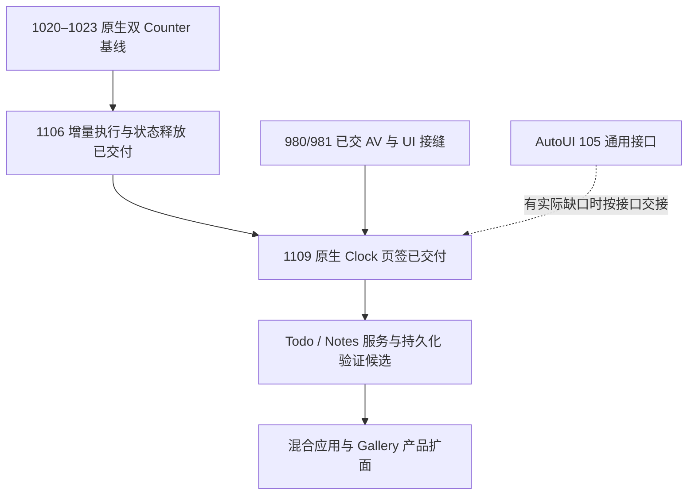

# ASE M0：AutoScape 最小原型实施路线

> 2026-11-20 · r5 · 1020–1023 已归档，[PLAN-1106](../../plans/archive/1106-ase-incremental-event-sessions-and-replay-audit-repair.md) 已修复历史重放并闭合 M0 的增量会话与释放子门。M0 后继为 [PLAN-1109 原生 Clock 页签生命周期](../../plans/archive/1109-ase-clock-tab-lifecycle.md)，已完成原生窗口和生命周期验收。
> 上位：[Design31](../31-autoscape-autoweb.md)、[原生 Gallery 设计](autoscape-native-gallery.md)。各 Plan §5–8 为任务/验收权威，本路线只组织依赖与完成边界。

## 1. 命名与范围

用户确定框架总名为 **Auto Scape Engine（ASE）**，涵盖应用解析与装载、前台会话/导航/嵌入、后台服务绑定及其运行生命周期。**AutoScape** 保留为浏览器产品名。ACE、AGE、ASE 可作为三条引擎线并称，但不表示三者具有相同成熟度或必须同时签章。

| 名称 | 归属 |
|---|---|
| ACE | 受检语言编译、执行、制品与公共宿主基础 |
| AGE / AutoUI | UI/2D/3D 呈现、布局输入与设备资源；实际能力按各 owner 合同 |
| ASE | 复用 ACE/AGE/通信/安装能力，组织应用身份、Provider、Realm/Session、AutoFrame、前后台绑定与生命周期 |
| AutoScape | 消费 ASE 的浏览器产品；Gallery 是首个应用访问场景 |
| AutoWeb | Design31 的网络应用体系/协议语境；其分发、安全与部署合同保留 |
| auto-web | 现有服务框架仓，提供 ASE 可消费的服务/HTTP 能力；不更名，不被 ASE 重新实现 |

原文 AutoWeb Runtime 对应 ASE 内的共享应用运行时职责，本文新增总称而非全仓机械重命名。ASE 不成为另一套编译器、UI 引擎、RPC 框架或包管理器。本轮不创建独立 ASE 仓；M0 用语言仓独立实验 workspace 与 UI owner 的薄适配器验证，未来仓界单独决定。

## 2. M0 的三个递进成果

| 切片 | 回答的问题 | 可以宣称 | 不能宣称 |
|---|---|---|---|
| M0-H 无窗口加载实验 | 稳定 app 身份能否选择独立源码并走当前 ACE 公共执行链 | Resolver＋真实 AV 一次执行；错误/编辑/重新执行有记录 | 可视浏览器、持久 AppSession、UI/服务/GPU 接线完成 |
| M0-T 两页文字浏览器 | 两份独立 AutoUI 源能否经 ACE 显示到可切换的公共视口 | 原生验证宿主内，A/B文字、重新打开/关闭、失败与导航代次成立 | 按钮业务状态、保留会话、全 Gallery、AGE 混合图形完成 |
| M0-I 交互会话原型 | 业务状态、视口与执行实例能否独立管理 | 双 Counter 的真实输入、保留/关闭重开、同 app 双会话隔离与资源回收 | 后端本地绑定、持久化/休眠恢复、网络沙箱、全产品发行完成 |

**M0 最终完成以 M0-I 为终点，包含已验 M0-H/M0-T 与现状基线，不能仅凭 Resolver 或文字首窗签 M0。** 首平台为 Windows x64，可信本地应用、一个原生窗口、至多两个存活应用会话；生命周期控制预算是实验 profile，不是未来产品上限。暂不承诺零尺寸、DPI/IME/弹层全能力；实际使用的文字与按钮输入、有效 resize、焦点转移和销毁后旧事件必须验证。

当前可视/交互原型已经存在；1023原收据曾记M0完成，但其观察口没有排除同owner内部的历史重放（2026-11-19更正）。**2026-11-20：1106已交付修复**——引擎重接AV增量事件会话（一次编译/独立状态根/每事件恰一次handler派发/读取零派发/卸载释放），执行层oracle与同owner重放/重建/getter负控闭合M0-SESSION无重放子门（`D-ASE-1023-REPLAY` closed，合同见[组件事件会话](../../specs/ace-migration/component-event-sessions.md)）；1023行为/窗口证据保留。

M0 不切换现有 Gallery 默认入口，不启动专用 HTTP 服务，不修改旧演示业务以制造可比收益。单原生验证宿主可由 Rust/Iced 提供控制按钮，但子应用文字/计数业务必须来自普通 Auto 源与 ACE，不能由 Rust 或旧 VM 代算。这里是验证工具，尚非完整 AutoUI 编写的浏览器产品。

## 3. M0 与首个后继 Plan

| Plan | 独立交付 | 现在可进入的范围 | 进入实施的真实前置 |
|---|---|---|---|
| [1020：基线与接口就绪调查](../../plans/archive/1020-ase-m0-baseline-and-interface-readiness.md) | 历史 Gallery 路径/实测与接口调查 | 已归档8/8，不重开 | 旧版本基线只证明当时结果；未来性能对照另测适用版本 |
| [1021：Resolver 与无窗口 AV](../../plans/archive/1021-ase-m0-resolver-and-headless-av.md) | 两身份解析、真实AV冷执行、拒绝与编辑恢复 | 已归档9/9，不重做 | 后续在专属树消费当前ACE时，定向复验现有完整`cargo t ase-m0`；由1022/T-01负责，不回写1021完成记录 |
| [1022：文字浏览器与公共嵌入](../../plans/archive/1022-ase-m0-text-browser-and-embedding.md) | Node A/B文字、同宿主frame切换/关闭，1021当前兼容复验 | 已归档9/9，保持交付身份 | 实际消费Spec与收据可复用，未承诺页内业务增量执行 |
| [1023：交互会话与M0验收](../../plans/archive/1023-ase-m0-interactive-sessions-and-acceptance.md) | 双应用对象、3/7行为、同app隔离、代次/限额/关闭与UI差量 | 已归档10/10，原收据及更正保留 | 增量执行与状态根释放子门以1106证据为准 |
| [1106：真实增量事件与验收修复](../../plans/archive/1106-ase-incremental-event-sessions-and-replay-audit-repair.md) | 保留受检程序/模型、仅执行新handler、执行层反例与闭合收据 | 已交付（2026-11-20 归档） | 交付、冻结组与预存红详见归档 §9；1023 子门按证据恢复 |
| [1109：原生 Clock 页签生命周期](../../plans/archive/1109-ase-clock-tab-lifecycle.md) | 原生同窗 Clock＋Counter，隐藏停更、切回校时、关闭撤销 | 已交付 | [可见页签定时规范](../../specs/ase/visible-tab-timers.md)记录单槽唤醒、真实 AV 派发及关闭释放 |

ASE 原型计划正文由语言仓持有，UI 宿主实现归 AutoUI，实验样例在语言仓实验 workspace。AutoOS 桌面、安装与原 Gallery 产品接线由后续产品计划在主责仓登记。

1020–1023 既有独审、落地和清理收据保留。1023 的 archived/r2/10-of-10 与追加更正记录分别追溯，1106 承载修复证据。实施、独审和清理遵同组专属工作树流程。

## 4. 与 ACE / AGE M2 的实施顺序

当前依据为 [M2-A认证](../../specs/ace-migration/m2-certification.md)、[UI已交规范](../../specs/ace-migration/m2-autoui.md)、[会话规范](../../specs/ace-migration/m2-sessions.md)、[执行前门](../../specs/ace-migration/m2-facade.md)及原owner交付收据。M2A-08已成立；967/968/969/970/978/979已归档，980已交HELLO、STATE与MIN-A-UI，完整UI/Widgets/产品及AC/A2R余量仍按B波关闭。原r1关于它们尚为草案的观察只作历史，不再用于排程。

### 4.1 已交接口与不能代替的事实

| 正式来源 | 已交可复用面 | ASE仍须验证/边界 |
|---|---|---|
| 1021、960 | `compile_package_product`→`PackageAvTarget::cold/run_value`无窗口冷执行 | 1022已在其交付树定向复验；后续真实输入/依赖变化才补验，不重做历史调查 |
| 967/F0、969/E0、978/B0及归档扩面 | 受检FFI、`run_ace`/显式授权与结果分态、最小宿主闭包 | 只消费适用profile；E0一次执行不代持久UI模型，不要求完成所有发行/退役 |
| 979/H0与Schema、980/HELLO、1022 | Node文本/真实AV窗口及ASE单宿主frame | 复用已交路径，widget只为显式兼容，不另做文字浏览器 |
| 980/MIN-A-UI、1023、1106 | `NodeDesktopBridge`、`ui_open/ui_apply_*/ui_poll_event/ui_close`、typed 队列、选中车道和真实 AV 增量会话 | 1109 验显式定时事件、可见代次和撤销；沿用选中车道与执行层观察 |
| 968、970 | 公共调度/取消、`ace_session_create/op`与单owner、变量携带/关闭 | 970参考宿主限scalar int/bool、携带与恢复有具体机制，不证明任意Node对象图或UI会话已接入 |
| 981/980 当前事件消费 | 无参与已交载荷支持以正式 Spec 和源码为准 | M0 Counter 用 Inc/Dec/Reset；1109 的整数 Tick 走真实 typed 派发，接线已在原生窗和 AV 审计验证 |

### 4.2 现在的实施排序

| 上游前沿 | ASE 排程 | 不新增的等待 |
|---|---|---|
| 1020–1023 和 1106 已交 | 双 Counter 原型与执行层审计作为后继基线 | 原 M0 验收收据按适用版本复用 |
| 1109，M0 后首个 Gallery 切片 | T-01 先证定时样本→真实 AV handler→frame；再做可见代次、取消、切回校时、资源与真窗验证 | 可基于当前 ACE/AGE AV 开始；完整 M2、AC/A2R、混合图形及 AutoUI PLAN-105 全部完成均非前置 |
| AutoUI PLAN-105 在途 | 保持 012 原应用与通用语言/计时接缝的主责。1109 若需要其特定接口，认领消费并固定实际落地版本 | 仅有缺口的任务等待该接口 |
| Clock 之后 | 按 Gallery 路线接 Todo/Notes 的绑定和持久化，再验混合应用嵌入与完整产品扩面 | 各应用按实际用到的 AV、服务、图形或产品证明另立 Plan |

图示只标关键交接，不省略上游原有依赖：

```mermaid
flowchart TD
    H[1020–1023 原生双 Counter 基线] --> D[1106 增量执行与状态释放 已交付]
    D --> C[1109 原生 Clock 页签已交付]
    U[980/981 已交 AV 与 UI 接缝] --> C
    B[AutoUI 105 通用接口] -. 有实际缺口时按接口交接 .-> C
    C --> T[Todo / Notes 服务与持久化 验证候选]
    T --> A[混合应用与 Gallery 产品扩面]
```

没有“ASE 全部完成→ACE/AGE 才验收”的反向依赖。需要的最小公共能力在原967–981中交付，本批只实现消费适配和验证工具；发现需要扩展上游语义时修订原owner合同，不能在ASE复制实现。冻结已审分支仅在原合同允许时供准备，正式验收仍取已落地来源，不能借新集成分支跳过门。

## 5. 接口准入与研究截止点

每个接口进入实施前记录：主责仓/Plan/切片、版本/ABI/profile、落地SHA、实际验证入口和覆盖范围、关闭/取消语义、ASE消费点。以原Plan为权威，不在路线维护第二套完成勾选。frontmatter `depends_on` 表示涉及的Plan并集，局部消费前置由各Plan §5任务明确，不把切片描述误成整包已完成。

1022/1023已消费`NodeDesktopBridge`/公共宿主并形成原型；保留实际UI-FFI与frame证据，不把原HELLO字节事实等同UI效果。1106在同一公共owner上修底层执行接缝，不复制浏览器。Schema/profile/ABI变化仍使旧proof/缓存按规则MISS或拒绝，旧PASS不自动适用新闭包。

1021允许在孤立实验中直接消费已公开的 `PackageAvTarget` 等有限入口，只证明一次执行；不冒充未来969正式产品门面，也不承诺磁盘缓存命中零编译。迁入文字宿主后统一走E0及UI owner接口，不向产品输出永久低层依赖。

1022同窗frame已交，不重复比较；沿原架构继续禁止合并子应用源码/伪造旧VmBridge/另写renderer。上游Hello、frame嵌入与业务增量分别验，不能相互代替。

1023 的行为与窗口证据覆盖 3/7 隔离、关开归零、迟到拒绝和资源上界。1106 替换了原在线场景重放链。受检程序和每实例状态根保留在线，仅执行新事件的 handler，读回同一模型并通过 `ui_apply_*` 提交显示。运行时合同与执行次数以[组件事件会话规范](../../specs/ace-migration/component-event-sessions.md)为准。

1109 已交付前台定时事件。验收同时对账时间唤醒、可见代次、真实 AV handler、frame 差量和资源释放。切回产生一条新的校时事件，隐藏时的旧工作没有业务或显示效果。采用 012 的数字时钟行为作为样例来源，原项目的完整 AV/A2Vue 迁移继续由 AutoUI PLAN-105 负责。标准为 [1109 §5–8](../../plans/archive/1109-ase-clock-tab-lifecycle.md)。

## 6. M0 的完成与后续边界

| 门 | 最低实际结果 | 现值与关闭责任 |
|---|---|---|
| M0-BASE | 历史Gallery真实路径与版本化基线 | 1020历史交付保留，不冒当前性能 |
| M0-LOAD | 11/22/12、严格解析/拒绝/修复 | 1021及1022兼容复验保留 |
| M0-TEXT | 独立Node中英文本、同窗frame、改源/错态/迟到拒绝 | 1022正式交付保留 |
| M0-SESSION | 3/7隔离、归零/限额/迟到，并且热事件只运行新handler、读取/切回不重编/初始化/重放 | 1023外部行为保留；无重放与真实模型子门**1106已闭**（执行层oracle+负控，2026-11-20） |
| M0-CLOSE | 原型有效resize/焦点及原owner关闭证据，未来增量状态根/任务最后owner释放也需实证 | 原车道/对象证据保留；增量状态根释放（会话close/Drop+20轮对账）与修复独审/正式交付**1106已闭**（2026-11-20） |

1106 已关闭以上待修子门并落地相关规范。真人鼠标/键盘、完整 IME/DPI 等仍以原收据的待验证与排除范围为准。

Clock 计时恢复进入 M0 后的 PLAN-1109，只覆盖 Gallery ASG-09 的 Clock 子项。Todo/Notes 服务与持久化、AutoDown 教程、全量 Gallery、2D/3D 混合、Native/RQ 发行、网络代码与沙箱继续按上位设计及实际接口排程。

M0测量报告分阶段编译/初始化/首交互、进程/线程/listener、资源与关闭走势，不预设无依据的速度倍数。新样例与复杂旧demo不可直接作总体提速对照；只比较相同业务的有效格。自动注入和人工原生输入分别记录，未执行/缺环境/pending不算PASS。

## 7. 本轮交付与下一动作

2026-11-12 r1 建路线，11-17 r2 刷新 M2-A 接口，11-19 的 1022/1023 形成可视交互原型；r3 增加 1106 修复计划，保留 1023 归档及验收更正。2026-11-20 r4 记录 1106 落地并登记 1109。r5 记录 1109 的实际交付和独立复审。ASG-09 的其余子项按上位 Gallery 合同验收。
