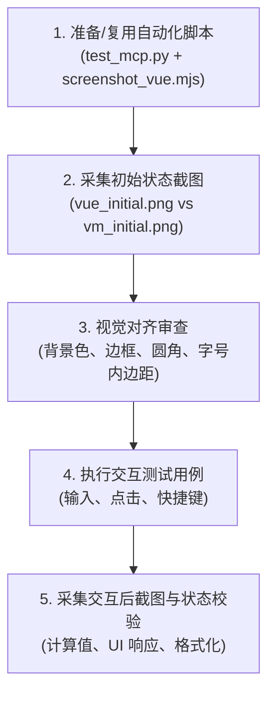

# AutoUI 双轨功能与视觉一致性验证指南 (AutoUI Dual-Backend Verification & MCP Guide)

本指南系统性总结了如何使用 **AutoUI MCP Server**（VM / Iced 模式）与 **Playwright**（Vue 模式）对 AutoLang UI 示例进行自动化交互测试、状态核对与像素级视觉对齐验证。

---

## 1. 双轨测试体系概览

AutoUI 采用统一的 `.at` DSL 描述界面与逻辑，支持两种运行模式：

| 维度 | Vue 模式 (`auto run`) | VM 模式 (`auto run -r vm`) |
| :--- | :--- | :--- |
| **底层运行时** | Web 浏览器 (Vite + Vue 3 + Tailwind/shadcn) | 原生桌面窗口 (Iced + AutoVM 字节码引擎) |
| **自动化操纵通道** | Playwright CLI / Node.js 脚本 / Browser Tools | **内置 AutoUI MCP Server** (HTTP JSON-RPC 2.0) |
| **状态与 DOM 获取** | 浏览器 DOM 树、Page evaluation | `autoui_snapshot`、`autoui_inspect` |
| **操作注入方式** | `page.fill()`, `page.click()`, `page.keyboard` | `autoui_type`, `autoui_press`, `autoui_keyboard` |
| **截图捕获通道** | `page.screenshot()`, `playwright screenshot` | `autoui_screenshot` (Iced 渲染帧无损抓取) |

---

## 2. VM 模式：AutoUI MCP Server 自动化指南

### 2.1 启动与端口配置

运行 `auto run -r vm` 时，Iced 运行时会在后台自动启动一个 HTTP JSON-RPC MCP Server：
- 默认端口：`9247`（端点：`http://127.0.0.1:9247/mcp`）
- 自定义端口：可通过环境变量 `AUTOUI_MCP_PORT=9248 auto run -r vm` 显式指定端口，避免端口冲突。

### 2.2 核心 MCP 工具清单

| Tool 名称 | 参数 Schema | 说明与典型用途 |
| :--- | :--- | :--- |
| `autoui_snapshot` | `{ mode?: "rendered" \| "source" \| "tree", max_depth?: int }` | 捕获当前界面的层次树（包含 `#aura_N` 与 `#vnode_N` 元素 ID）与组件 State |
| `autoui_inspect` | `{ element_id: "aura_N" \| "vnode_N" }` | 查看指定元素的标签名、属性、绑定的 actions/handlers 及布局边界盒 |
| `autoui_type` | `{ element_id: str, text: str, clear_first?: bool }` | 向文本框输入内容。底层会自动更新绑定的 Model State 并触发 `oninput`/`onchange` 事件 |
| `autoui_press` | `{ element_id: str }` | 模拟点击按钮或可点击元素，触发 `onclick` 事件 |
| `autoui_toggle` | `{ element_id: str }` | 切换 Switch / Checkbox 等开关状态 |
| `autoui_keyboard` | `{ key: str, modifiers?: list[str] }` | 模拟全局或目标元素按键（如 `"Enter"`, `"ArrowDown"`, `modifiers: ["ctrl"]`） |
| `autoui_action` | `{ element_id: str, action: str, value?: any }` | 通用交互接口（支持 `type_text`, `press`, `submit`, `clear` 等） |
| `autoui_screenshot` | `{ name: str, baseline?: bool, save_path?: str }` | 截取当前 Iced 渲染帧并保存为 PNG 图片（保存至 `tests/screenshots/<name>.png`） |

### 2.3 Python MCP 客户端标准模板

在任何示例的 `tests/` 目录下创建 `test_mcp.py`，可以直接使用以下轻量级客户端模板：

```python
import subprocess
import time
import socket
import json
import urllib.request
import urllib.error
import os

def pick_free_port() -> int:
    with socket.socket(socket.AF_INET, socket.SOCK_STREAM) as s:
        s.bind(('127.0.0.1', 0))
        return s.getsockname()[1]

class AutoUiMcpClient:
    def __init__(self, port: int):
        self.url = f"http://127.0.0.1:{port}/mcp"
        self._req_id = 1

    def call(self, tool_name: str, args: dict = None) -> dict:
        req = {
            "jsonrpc": "2.0",
            "id": self._req_id,
            "method": "tools/call",
            "params": {"name": tool_name, "arguments": args or {}}
        }
        self._req_id += 1
        data = json.dumps(req).encode('utf-8')
        http_req = urllib.request.Request(self.url, data=data, headers={'Content-Type': 'application/json'})
        with urllib.request.urlopen(http_req, timeout=5) as response:
            res = json.loads(response.read().decode('utf-8'))
            if "error" in res:
                raise RuntimeError(f"MCP Tool error: {res['error']}")
            return res.get("result", {})

    def snapshot(self, mode="rendered") -> str:
        res = self.call("autoui_snapshot", {"mode": mode})
        return res.get("content", [{}])[0].get("text", "")

    def type_text(self, element_id: str, text: str, clear_first: bool = True) -> str:
        res = self.call("autoui_type", {"element_id": element_id, "text": text, "clear_first": clear_first})
        return res.get("content", [{}])[0].get("text", "")

    def press(self, element_id: str) -> str:
        res = self.call("autoui_press", {"element_id": element_id})
        return res.get("content", [{}])[0].get("text", "")

    def screenshot(self, name: str, baseline: bool = True) -> str:
        res = self.call("autoui_screenshot", {"name": name, "baseline": baseline})
        return res.get("content", [{}])[0].get("text", "")

def run_vm_test(example_dir: str):
    port = pick_free_port()
    env = dict(**os.environ, AUTOUI_MCP_PORT=str(port))
    proc = subprocess.Popen(["auto", "run", "-r", "vm"], cwd=example_dir, env=env)
    try:
        # 等待 MCP Server 就绪
        client = AutoUiMcpClient(port)
        for _ in range(30):
            try:
                snap = client.snapshot()
                if snap:
                    break
            except Exception:
                time.sleep(0.2)

        # 1. 抓取初始截图
        client.screenshot("vm_initial")

        # 2. 查找目标元素并执行交互 (例如给 #aura_9 输入 323)
        client.type_text("aura_9", "323")
        time.sleep(0.5)

        # 3. 抓取交互后截图
        client.screenshot("vm_after_action")
    finally:
        proc.terminate()
        proc.wait()
```

---

## 3. Vue 模式：Playwright 自动化与截图指南

### 3.1 启动 Vue 开发服务
在示例目录下直接执行 `auto run`，或进入生成的 Vue 工程 `gen/front/vue` 运行：
```bash
npx vite --port 5173
```

### 3.2 命令行单步无头截图 (Playwright CLI)
```bash
npx playwright screenshot --color-scheme dark --viewport-size "1280, 800" http://localhost:5173 tests/screenshots/vue_initial.png
```

### 3.3 Node.js Playwright 自动化脚本标准模板 (`screenshot_vue.mjs`)
```javascript
import { chromium } from '../../022-kanban/tests/node_modules/playwright/index.mjs';
import fs from 'fs';
import path from 'path';

async function main() {
  const outDir = './tests/screenshots';
  fs.mkdirSync(outDir, { recursive: true });

  const browser = await chromium.launch({ headless: true });
  const context = await browser.newContext({
    viewport: { width: 1280, height: 800 },
    colorScheme: 'dark'
  });
  const page = await context.newPage();

  // 导航至本地服务
  await page.goto('http://localhost:5173', { waitUntil: 'networkidle' });

  // 1. 抓取初始截图
  await page.screenshot({ path: path.join(outDir, 'vue_initial.png') });

  // 2. 定位并执行操作 (例如输入 323)
  const inputs = await page.locator('input').all();
  if (inputs.length >= 2) {
    await inputs[1].fill('323');
    await page.waitForTimeout(500);
  }

  // 3. 抓取交互后截图
  await page.screenshot({ path: path.join(outDir, 'vue_after_action.png') });

  await browser.close();
}

main().catch(console.error);
```

---

## 4. 双轨对比与对齐标准验证流程

在验证任何 AutoUI 示例（或排查界面不一致/功能 bug）时，遵循以下 5 步闭环：



### 视觉一致性审查核对表 (Visual Parity Checklist)
1. **背景底色**：Vue 端 `dark:bg-zinc-950` 与 VM 端 `(9, 9, 11)` 背景一致。
2. **卡片容器**：
   - 边框色：`zinc-800` (`(39, 39, 42)`)。
   - 圆角：`rounded-2xl` (16px) 或 `rounded-lg` (8px)。
3. **输入组件 (Input / Textarea)**：
   - 默认高度与字号：14px (`text-sm`)。
   - 内边距：`px-3 py-2` (水平 12px, 垂直 8px)。
   - 圆角：`rounded-md` (6px)。
   - 边框：1px `zinc-800` (暗色) / `zinc-200` (亮色)。
4. **交互状态计算**：
   - 浮点数/双精度计算结果两端完全一致（如 `math.round` 四舍五入保留位数）。
   - 双向数据绑定在键盘输入后两端实时同步。

---

## 5. 在新会话中复用本方案

在后续任意会话中，当需要验证其他 UI 示例（例如 `001-hello`, `011-calculator`, `013-todo`, `022-kanban` 等）时：

1. **查阅本文档**：获取 Python MCP 客户端和 Playwright 脚本的现成模板。
2. **快速运行对比**：
   - 为该示例启动 VM 模式并调用 MCP 获取 `vm_initial.png` 与 `vm_action.png`。
   - 启动 Vue 模式捕获 `vue_initial.png` 与 `vue_action.png`。
3. **精准定位差异**：
   - 若布局/样式有细微差异，参考 `docs/design/22-base-styles-and-visual-parity.md` 修改 `aura_view_builder.rs` / `renderer.rs`。
   - 若事件/计算有差异，通过 MCP `autoui_snapshot` 检查 State 与 VM Bytecode 分派。
