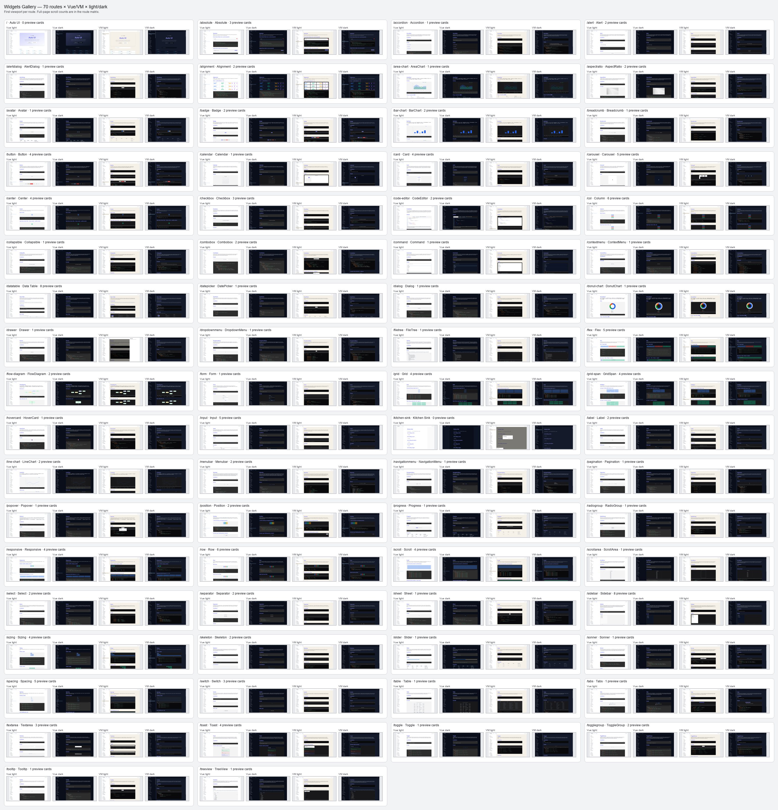
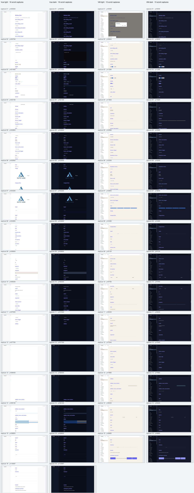
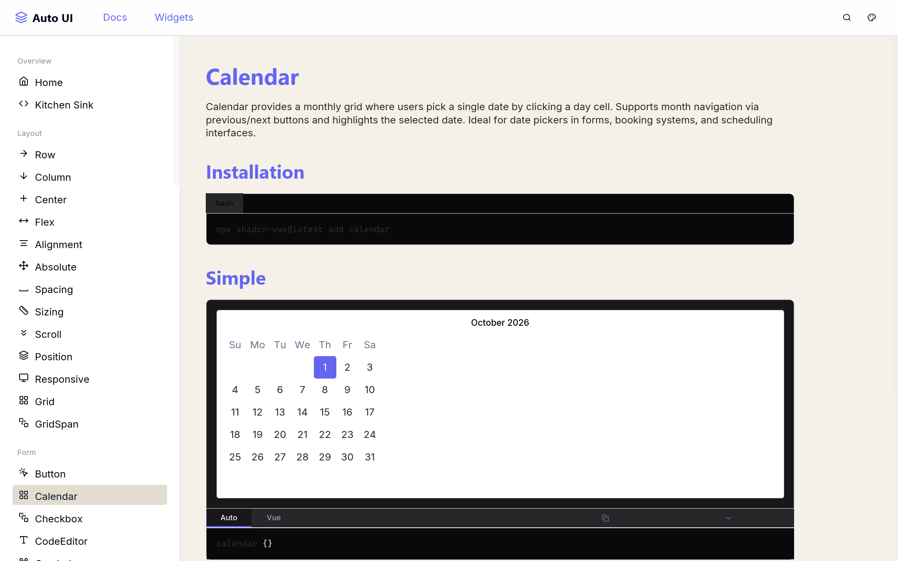
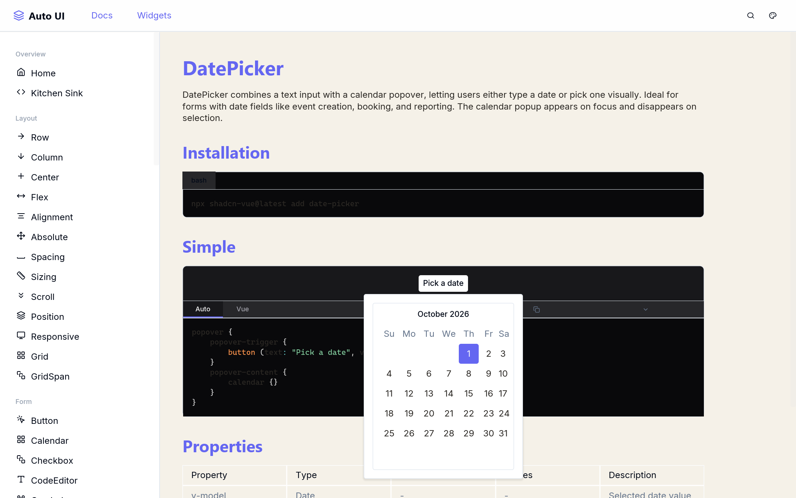
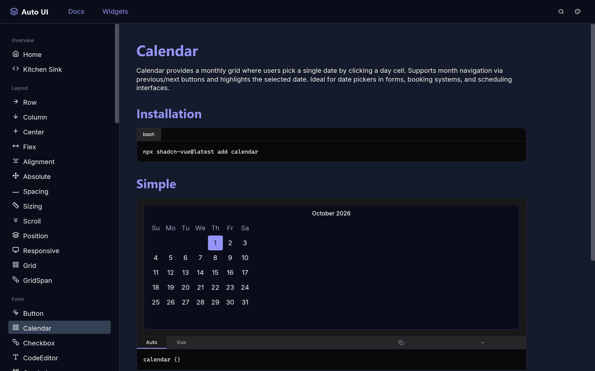
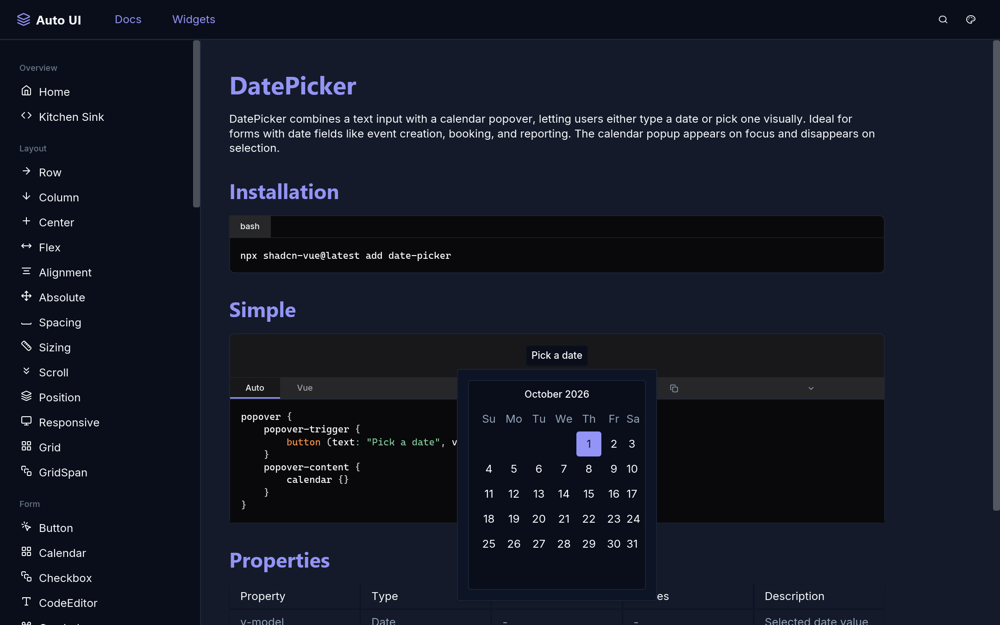

# PLAN-717 widgets-gallery dual-backend matrix

Run date: 2026-10-01. Source of truth: 70 route/page records parsed from the gallery worktree, then checked in Vue and VM in light and dark themes.

## Result

- **70/70 routes** pair with page files. Home has 69 component cards and the sidebar has 70 entries; `/kitchen-sink` is linked from both.
- **159 preview cards** are present in the gallery route set. Kitchen Sink has **53 public schema examples**, and all 53 were counted visible in Vue and VM in both themes.
- Route checks: Vue light **70/70**, Vue dark **70/70**, VM light **70/70**, VM dark **70/70**.
- All Vue route runs had 0 page errors and 0 bad HTTP responses. The only browser console errors were 2 missing favicon requests; 46 Vue wrapper attribute warnings were recorded. Neither affected page rendering.
- VM full-route checks were rerun after the Calendar fix. The first dark screenshot pass had a transient HoverCard capture error while scrolling; the dedicated retry passed **1/1** and saved the route screenshots.

The earlier 54-example count included `scroll_test_content`, a non-public test fixture with a 10,000,000px default extent. The generated gallery page now excludes that helper and contains 53 public examples; the current schema generator and all four backend/theme checks agree on 53.

## Visual evidence

VM Calendar and DatePicker after opening the date selector:

| Theme | Calendar | DatePicker open |
|---|---|---|
| Light |  |  |
| Dark |  |  |

Machine-readable route and screenshot-count matrix: [widgets-gallery-route-matrix.json](assets/717/widgets-gallery-route-matrix.json).

## Route matrix

Screenshot columns list scroll captures in this order: Vue light / Vue dark / VM light / VM dark. Each check status is route-level; screenshot chunks cover the full page scroll, and Kitchen Sink visibility is separately counted above.

| Route | Page file | Title | Preview cards | Home | Sidebar | Vue L / Vue D / VM L / VM D | Captures LVue / DVue / LVM / DVM |
|---|---|---|---:|:---:|:---:|---|---:|
| `/` | `index.at` | Auto UI | 0 | — | ✓ | pass / pass / pass / pass | 5 / 5 / 6 / 6 |
| `/absolute` | `absolute.at` | Absolute | 3 | ✓ | ✓ | pass / pass / pass / pass | 2 / 2 / 2 / 2 |
| `/accordion` | `accordion.at` | Accordion | 1 | ✓ | ✓ | pass / pass / pass / pass | 2 / 2 / 2 / 2 |
| `/alert` | `alert.at` | Alert | 2 | ✓ | ✓ | pass / pass / pass / pass | 2 / 2 / 2 / 2 |
| `/alertdialog` | `alertdialog.at` | AlertDialog | 1 | ✓ | ✓ | pass / pass / pass / pass | 3 / 3 / 2 / 2 |
| `/alignment` | `alignment.at` | Alignment | 2 | ✓ | ✓ | pass / pass / pass / pass | 6 / 6 / 5 / 5 |
| `/area-chart` | `area-chart.at` | AreaChart | 1 | ✓ | ✓ | pass / pass / pass / pass | 2 / 2 / 2 / 2 |
| `/aspectratio` | `aspectratio.at` | AspectRatio | 2 | ✓ | ✓ | pass / pass / pass / pass | 4 / 4 / 5 / 5 |
| `/avatar` | `avatar.at` | Avatar | 1 | ✓ | ✓ | pass / pass / pass / pass | 2 / 2 / 3 / 2 |
| `/badge` | `badge.at` | Badge | 2 | ✓ | ✓ | pass / pass / pass / pass | 2 / 2 / 2 / 2 |
| `/bar-chart` | `bar-chart.at` | BarChart | 2 | ✓ | ✓ | pass / pass / pass / pass | 3 / 3 / 3 / 3 |
| `/breadcrumb` | `breadcrumb.at` | Breadcrumb | 1 | ✓ | ✓ | pass / pass / pass / pass | 2 / 2 / 2 / 2 |
| `/button` | `button.at` | Button | 4 | ✓ | ✓ | pass / pass / pass / pass | 3 / 3 / 3 / 3 |
| `/calendar` | `calendar.at` | Calendar | 1 | ✓ | ✓ | pass / pass / pass / pass | 2 / 2 / 2 / 2 |
| `/card` | `card.at` | Card | 4 | ✓ | ✓ | pass / pass / pass / pass | 9 / 9 / 7 / 7 |
| `/carousel` | `carousel.at` | Carousel | 5 | ✓ | ✓ | pass / pass / pass / pass | 10 / 10 / 10 / 10 |
| `/center` | `center.at` | Center | 4 | ✓ | ✓ | pass / pass / pass / pass | 3 / 3 / 3 / 3 |
| `/checkbox` | `checkbox.at` | Checkbox | 3 | ✓ | ✓ | pass / pass / pass / pass | 3 / 3 / 3 / 3 |
| `/code-editor` | `code-editor.at` | CodeEditor | 2 | ✓ | ✓ | pass / pass / pass / pass | 4 / 4 / 4 / 4 |
| `/col` | `col.at` | Column | 6 | ✓ | ✓ | pass / pass / pass / pass | 6 / 6 / 6 / 6 |
| `/collapsible` | `collapsible.at` | Collapsible | 1 | ✓ | ✓ | pass / pass / pass / pass | 2 / 2 / 2 / 2 |
| `/combobox` | `combobox.at` | Combobox | 2 | ✓ | ✓ | pass / pass / pass / pass | 3 / 3 / 3 / 3 |
| `/command` | `command.at` | Command | 1 | ✓ | ✓ | pass / pass / pass / pass | 3 / 3 / 3 / 3 |
| `/contextmenu` | `contextmenu.at` | ContextMenu | 1 | ✓ | ✓ | pass / pass / pass / pass | 3 / 3 / 2 / 2 |
| `/datatable` | `datatable.at` | Data Table | 8 | ✓ | ✓ | pass / pass / pass / pass | 29 / 29 / 25 / 25 |
| `/datepicker` | `datepicker.at` | DatePicker | 1 | ✓ | ✓ | pass / pass / pass / pass | 2 / 2 / 2 / 2 |
| `/dialog` | `dialog.at` | Dialog | 1 | ✓ | ✓ | pass / pass / pass / pass | 2 / 2 / 2 / 2 |
| `/donut-chart` | `donut-chart.at` | DonutChart | 1 | ✓ | ✓ | pass / pass / pass / pass | 2 / 2 / 2 / 2 |
| `/drawer` | `drawer.at` | Drawer | 1 | ✓ | ✓ | pass / pass / pass / pass | 2 / 2 / 2 / 2 |
| `/dropdownmenu` | `dropdownmenu.at` | DropdownMenu | 1 | ✓ | ✓ | pass / pass / pass / pass | 2 / 2 / 2 / 2 |
| `/filetree` | `filetree.at` | FileTree | 1 | ✓ | ✓ | pass / pass / pass / pass | 2 / 2 / 2 / 2 |
| `/flex` | `flex.at` | Flex | 5 | ✓ | ✓ | pass / pass / pass / pass | 5 / 5 / 5 / 5 |
| `/flow-diagram` | `flow-diagram.at` | FlowDiagram | 2 | ✓ | ✓ | pass / pass / pass / pass | 4 / 4 / 3 / 3 |
| `/form` | `form.at` | Form | 1 | ✓ | ✓ | pass / pass / pass / pass | 2 / 2 / 2 / 2 |
| `/grid` | `grid.at` | Grid | 4 | ✓ | ✓ | pass / pass / pass / pass | 4 / 4 / 4 / 4 |
| `/grid-span` | `grid-span.at` | GridSpan | 4 | ✓ | ✓ | pass / pass / pass / pass | 4 / 4 / 4 / 4 |
| `/hovercard` | `hovercard.at` | HoverCard | 1 | ✓ | ✓ | pass / pass / pass / pass | 2 / 2 / 2 / 2 |
| `/input` | `input.at` | Input | 5 | ✓ | ✓ | pass / pass / pass / pass | 4 / 4 / 4 / 4 |
| `/kitchen-sink` | `kitchen-sink.at` | Kitchen Sink | 0 | ✓ | ✓ | pass / pass / pass / pass | 16 / 16 / 15 / 15 |
| `/label` | `label.at` | Label | 2 | ✓ | ✓ | pass / pass / pass / pass | 2 / 2 / 2 / 2 |
| `/line-chart` | `line-chart.at` | LineChart | 2 | ✓ | ✓ | pass / pass / pass / pass | 3 / 3 / 3 / 3 |
| `/menubar` | `menubar.at` | Menubar | 2 | ✓ | ✓ | pass / pass / pass / pass | 7 / 7 / 7 / 7 |
| `/navigationmenu` | `navigationmenu.at` | NavigationMenu | 1 | ✓ | ✓ | pass / pass / pass / pass | 2 / 2 / 2 / 2 |
| `/pagination` | `pagination.at` | Pagination | 1 | ✓ | ✓ | pass / pass / pass / pass | 2 / 2 / 2 / 2 |
| `/popover` | `popover.at` | Popover | 1 | ✓ | ✓ | pass / pass / pass / pass | 2 / 2 / 2 / 2 |
| `/position` | `position.at` | Position | 2 | ✓ | ✓ | pass / pass / pass / pass | 3 / 3 / 3 / 3 |
| `/progress` | `progress.at` | Progress | 1 | ✓ | ✓ | pass / pass / pass / pass | 2 / 2 / 2 / 2 |
| `/radiogroup` | `radiogroup.at` | RadioGroup | 1 | ✓ | ✓ | pass / pass / pass / pass | 2 / 2 / 2 / 2 |
| `/responsive` | `responsive.at` | Responsive | 4 | ✓ | ✓ | pass / pass / pass / pass | 3 / 3 / 3 / 3 |
| `/row` | `row.at` | Row | 6 | ✓ | ✓ | pass / pass / pass / pass | 7 / 7 / 6 / 6 |
| `/scroll` | `scroll.at` | Scroll | 4 | ✓ | ✓ | pass / pass / pass / pass | 5 / 5 / 5 / 5 |
| `/scrollarea` | `scrollarea.at` | ScrollArea | 1 | ✓ | ✓ | pass / pass / pass / pass | 2 / 2 / 2 / 2 |
| `/select` | `select.at` | Select | 2 | ✓ | ✓ | pass / pass / pass / pass | 3 / 3 / 3 / 3 |
| `/separator` | `separator.at` | Separator | 2 | ✓ | ✓ | pass / pass / pass / pass | 2 / 2 / 2 / 2 |
| `/sheet` | `sheet.at` | Sheet | 1 | ✓ | ✓ | pass / pass / pass / pass | 2 / 2 / 2 / 2 |
| `/sidebar` | `sidebar.at` | Sidebar | 8 | ✓ | ✓ | pass / pass / pass / pass | 16 / 16 / 16 / 16 |
| `/sizing` | `sizing.at` | Sizing | 4 | ✓ | ✓ | pass / pass / pass / pass | 4 / 4 / 4 / 4 |
| `/skeleton` | `skeleton.at` | Skeleton | 2 | ✓ | ✓ | pass / pass / pass / pass | 2 / 2 / 2 / 2 |
| `/slider` | `slider.at` | Slider | 1 | ✓ | ✓ | pass / pass / pass / pass | 2 / 2 / 2 / 2 |
| `/sonner` | `sonner.at` | Sonner | 1 | ✓ | ✓ | pass / pass / pass / pass | 2 / 2 / 2 / 2 |
| `/spacing` | `spacing.at` | Spacing | 5 | ✓ | ✓ | pass / pass / pass / pass | 5 / 5 / 5 / 5 |
| `/switch` | `switch.at` | Switch | 3 | ✓ | ✓ | pass / pass / pass / pass | 2 / 2 / 2 / 2 |
| `/table` | `table.at` | Table | 1 | ✓ | ✓ | pass / pass / pass / pass | 4 / 4 / 4 / 4 |
| `/tabs` | `tabs.at` | Tabs | 1 | ✓ | ✓ | pass / pass / pass / pass | 2 / 2 / 2 / 2 |
| `/textarea` | `textarea.at` | Textarea | 3 | ✓ | ✓ | pass / pass / pass / pass | 3 / 3 / 3 / 3 |
| `/toast` | `toast.at` | Toast | 4 | ✓ | ✓ | pass / pass / pass / pass | 7 / 7 / 7 / 7 |
| `/toggle` | `toggle.at` | Toggle | 1 | ✓ | ✓ | pass / pass / pass / pass | 2 / 2 / 2 / 2 |
| `/togglegroup` | `togglegroup.at` | ToggleGroup | 2 | ✓ | ✓ | pass / pass / pass / pass | 3 / 3 / 3 / 3 |
| `/tooltip` | `tooltip.at` | Tooltip | 1 | ✓ | ✓ | pass / pass / pass / pass | 2 / 2 / 2 / 2 |
| `/treeview` | `treeview.at` | TreeView | 1 | ✓ | ✓ | pass / pass / pass / pass | 3 / 3 / 3 / 3 |

## Fix summary

| Area | Visible defect | Correction |
|---|---|---|
| Vue generation and registry | Callback props and snake_case overlay tags were not emitted as the registered shadcn components. | Emit callback props consistently, resolve kebab-case component names, register schema aliases, and suppress synthetic Vue-only overlay toggle props. |
| VM component conversion | Calendar, DatePicker content, Command and Carousel examples could collapse or render without meaningful children. | Add native VM month-grid rendering, including DatePicker popovers, and preserve visible child layouts for the affected component families. |
| VM inspection/rendering | Overlay content could be lost on one conversion path; calendar rows stretched to fill the window and showed an invalid leading zero. | Preserve overlay children in VNode conversion, use compact calendar tracks, and correct month offset calculation. |
| Gallery source | Kitchen Sink lacked Home/sidebar links; Carousel slot children, Command values, NavigationMenu content, Pagination composition, FlowDiagram names and Badge sizing were incomplete or malformed. | Repair the page samples and regenerate the Kitchen Sink page from current public schema. |
| Editor dependency | Kitchen Sink raised a Vue runtime error while the editor parent DOM was not mounted. | Defer the CodeBlock menu DOM lookup until the component is mounted and tolerate an unavailable host element. |
| Coverage tooling | Route checks did not give one shared full-page evidence set for both backends. | Add source-derived Vue and VM route runners with scrolling, interaction checks and JSON output. |

## Verification record

| Gate | Result |
|---|---|
| Vue full route matrix | 70/70 light; 70/70 dark |
| VM full route matrix after Calendar fix | 70/70 light; 70/70 dark |
| Kitchen Sink schema visibility | 53/53 visible in Vue light, Vue dark, VM light and VM dark |
| Vue representative interactions | 15/15 pass |
| VM representative interactions | 9/9 pass; Tabs page is route/screenshot checked, while the VM tree omits the nested tab labels needed by the generic click probe |
| `cargo check -p auto-lang` | Pass; no diagnostics point to the newly added Calendar, Command, Carousel, overlay or Vue callback code |
| `cargo build -p auto --bin auto` | Pass |
| `cargo tv` | 162/162 pass on final retry; one earlier full run transiently failed `cb_web_mime`, then the isolated case and full tier both passed |
| `cargo test -p auto-lang --test docs_gen` | 4/4 pass after Carousel schema-family coverage was added |
| `cargo tu` | 858 pass, 1 fail, 2 ignored; the single desktop golden mismatch reproduces on the clean base. Removed obsolete callback detector helpers after review caught new dead-code warnings. |
| `cargo t` | 1,447 passed before fail-fast stopped at 3 failures; each failure reproduces on the clean base |

Clean-base failures:

- `widget_computed_store_arg_helper_chain`
- `widget_computed_passthrough_survives_reeval`
- `merged_mode_api_call_emits_warn_opcode`
- UI-generator baseline golden: `test_a2vue_desktop_surface_asset`

These four failures were reproduced with the implementation changes stashed and the worktree at its original base commit. The screenshots and route checks are all green; the remaining test reds are present without this plan's changes. Final `cargo tv` and docs/schema reruns pass, and no warning remains for the removed callback detector helpers.
