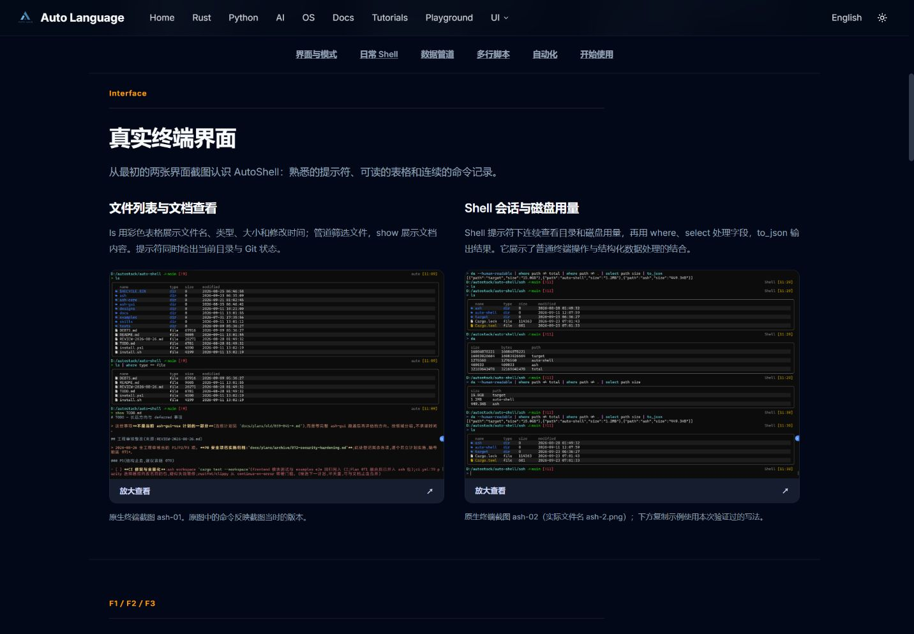
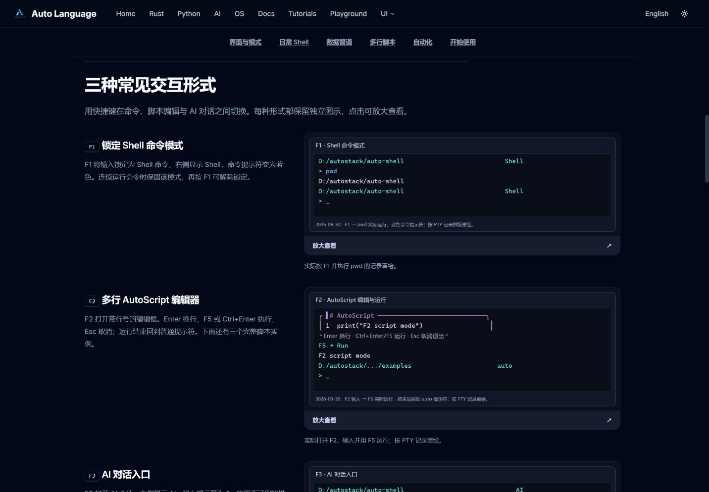

# AutoShell 常见形式图示补充（PLAN-713 r2）

用户纠正：原页面筛选过度。两个原生截图和 F1/F2/F3 的常见形式应同时展示。

## 资源与事实

- `ash-01.png`：用户原生终端截图，展示 `ls` 表格、文件类型筛选、`show TODO.md` 文档查看；提示符包含目录、Git 分支和状态。
- `ash-2.png`：用户所称 ash-02 的实际文件名，展示 Shell 提示符、`du` 用量、`where`/`select` 字段处理、`to_json` 导出。原图保留当时语法，当前复制示例仍使用已验证写法。
- `21_f1-command-mode.png`：2026-09-30 实际向 ash 发送 F1 (`ESC OP`)，命令提示符转蓝、右侧标签为 Shell；执行 `pwd` 返回目录，Shell 标签继续保留。
- `22_f2-editor-mode.png`：发送 F2 (`ESC OQ`)，显示 AutoScript 编辑框与 Enter/Ctrl+Enter/F5/Esc 提示；输入 `print("F2 script mode")`，F5 (`ESC [15~`) 实际输出 `F2 script mode` 后返回 auto 提示符。
- `23_f3-ai-entry.png`：发送 F3 (`ESC OR`) 后实际进入 AI `?` 提示符；只展示输入区，历史回放内容不纳入网页证据。不提交问题，不触发模型回复；Esc 返回 auto，随后退出 ash。原有会话文件退出前后 SHA256 一致（A2CE56BCD3E332CF1F0A1EBFFA3C7D34723F254881265478A211E6D3C5327EF0）。

后三张由实际 PTY 输出排版重绘，不宣称系统原生像素截图。记录中的 `_` 表示光标位置，F5 → Run 是运行步骤注释。F3 图片是入口展示，不是模型回答样例。

## 页面调整

中英文共用组件中新增“真实终端界面”和“F1 / F2 / F3 常见形式”两个始终可见区域，原有编辑/历史、管道和三个脚本实跑图保留；全部支持放大。图片来源分别说明。此补充只涉及网页、资源和 Spec，不修改 Shell 运行时。

## 网页验证

- 全站 VitePress 构建退出码 0，75.79s；构建复用了既有文档/书籍快照和发布页图片。第一次构建缺少预览工作区的 v05 图片，恢复这些已有资源后通过；未修改对应页面或把其他会话资源纳入本次提交。
- EN/ZH 均显示两个原生截图和三个模式图，正文解释与图片一致；默认页有 8 个可见 figure，另两张完整脚本图仍可通过标签切换查看（共 10 个图片资源）。
- 桌面 1440px、手机 390px/360px、深浅色检查通过；手机两组画廊均为单列，scrollWidth 382/352，不超过视口。
- 两个原图与三张模式图加载成功；原图和 F3 放大弹窗可打开，Esc 关闭。原有汇总和 JSON 脚本标签仍显示对应截图；无新增浏览器控制台错误。

