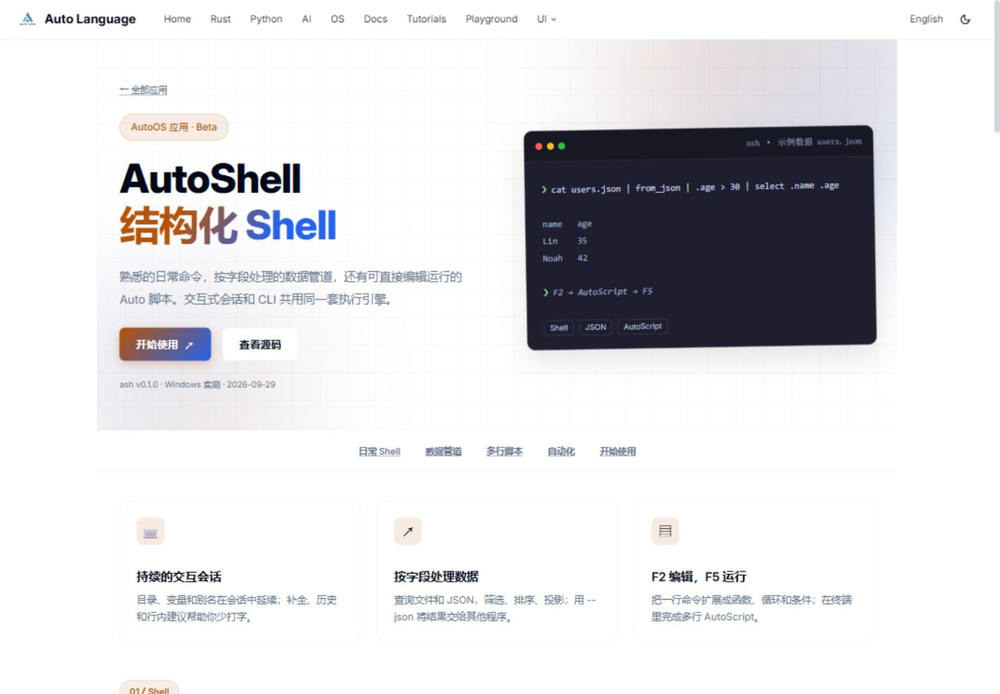
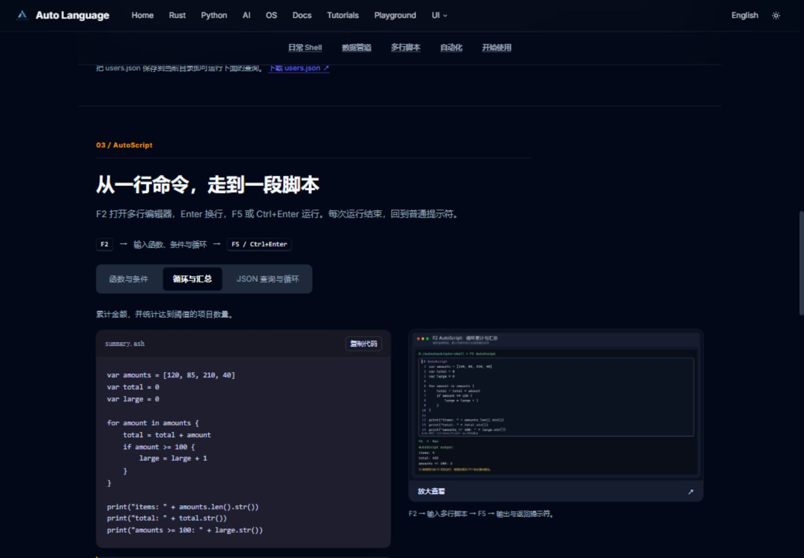
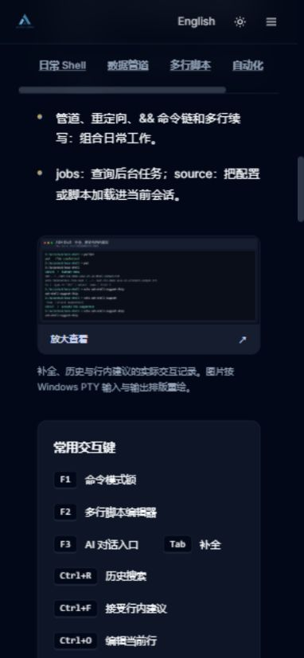

# AutoShell 页面评审与优化 · 2026-09-30

来源：PLAN-713，revision 1。范围为 AutoShell 中英文页、首页/应用目录中的对应入口，以及影响这些页面的共享样式。全站建议来自当前代码和本地浏览器观察，未做全站逐页可用性审计。

## 判断

原页的卡片、圆角、渐变与深浅色变量已符合全站视觉语言，适合继续使用。主要缺口是内容可信度与可操作性：更像功能宣传摘要，读者难以理解交互式 Shell 如何使用，也无法从页面复现脚本。应先修正能力描述，再把用例、证据和开始使用串起来。

## 原页问题及处理

| 问题 | 依据 | 本次处理 |
|---|---|---|
| “79 Agent 工具”与 `ash agent describe-tools/check/run` 被描述为已有能力 | auto-shell 的 `ash/ash/src/main.rs` 没有这组 CLI 子命令 | 改为已存在的 `-c`、`--json` 和执行策略，说明旧 Agent 文档尚未实现 |
| F1–F4 四模式和 F3 说明过时 | 前端按键路由与 `frontend/editor_overlay/mod.rs` | 展示 F2 编辑/F5 或 Ctrl+Enter 运行；F3 需要模型服务；F4 已退役 |
| `filter .size > 10.mb` 等例子与实现不符 | 2026-09-29 CLI 实跑和语法检查 | 使用 `.type == "dir"`、字段查询、`select`、`first N` |
| 跨平台一致、Rust 功能完整/Auto 完全可用缺乏证据 | 实测只覆盖 Windows 源码构建 | 标注 Beta、程序版本、实测日期/平台，移除入口的完整性断言 |
| 资源目录虽有截图，页面没有接入 | 原 EN/ZH 页面源码 | 接入交互编辑、结构化管道、三个 F2 脚本的图并支持放大 |
| CLI 参数与持续会话能力混在一起 | CLI/REPL 实际运行方式 | 改为日常 Shell → 数据管道 → 多行脚本 → 自动化 → 开始使用 |

原始证据：`D:/autostack/auto-shell/ash-cli-demo-2026-09-29/` 中的 `shell-analysis.md`、`shell-runs.json`、`f2-script-run-session.txt`。终端图按真实 PTY 输入/输出排版重绘，并非系统终端窗口的原生像素截图；页面已说明来源。本文附图是实际浏览器截图。

## 已实施调整

- 中英文共用 `AutoShellLanding.vue`，避免布局和能力描述分叉。
- 首屏用可运行 JSON 查询说明能力，主按钮跳到快速开始；五个段落锚点串起用例。
- 三个脚本标签支持方向键、Home/End，提供代码复制、实际输出和下载；JSON 样例使用同目录 `users.json`，原图演示路径另作说明。
- 原生 dialog 放大图片，关闭按钮获得焦点；Esc 关闭，焦点返回原按钮。
- 保留全站组件、配色变量、渐变、卡片和圆角。修正共享 `.title` 选择器对卡片标题的影响，提高代码元信息/输出可读性；网格适配窄屏，补充键盘焦点和减少动态效果支持。
- 同步首页与应用目录文案；“100% Auto 编写”改为 Rust/Auto/AutoUI 生态集成。
- 明确路径策略覆盖 ash 管理的文件操作，外部程序自身访问需要 OS 隔离；说明已观察到的 CSV 数值缺失与未确认的 `.ashrc` 自动加载。

## 全站后续建议

| 优先级 | 建议 | 方向 |
|---|---|---|
| P1 | 完善语言和导航位置反馈 | 中文页主导航仍显示英文词且许多入口跳英文路径；增加“应用”入口、当前项状态，保持语言前缀 |
| P1 | 补齐公共导航可访问性 | 主题/手机菜单图标按钮缺少可访问名称；补充 aria-label、aria-expanded、焦点与关闭后焦点返回 |
| P1 | 给功能声明建立证据规则 | 统一 Beta/实验/已实测含义，标注产品版本、日期、平台，避免用网站版本替代应用版本或宣传未核验工具数 |
| P2 | 统一应用页骨架 | 简介 → 核心用例 → 示例/截图 → 开始使用 → 限制/来源；保留各应用强调色，共享截图与样例组件 |
| P2 | 统一排版与密度 | 用变量管理内容宽度、行高、标题与段落间距；缩短重复的大首屏/统计卡，明确主按钮 |
| P2 | 提供易发现的搜索 | 自定义导航没有展示搜索入口；语言文档与书籍增多，应提供统一搜索及快捷键入口 |
| P2 | 处理构建与加载提示 | 当前大量 Auto 围栏缺少高亮，部分 bundle 超过 500kB；补充高亮、测量加载性能后让 playground/重组件按需加载 |

这些全站改造超出本次范围，尚未实施。

## 验证与边界

- 全站 VitePress 构建通过；复用主检出的生成文档/书籍快照，没有运行 Rust 文档生成器。最终构建退出码 0，耗时 161.46 秒；结果亦记录在 PLAN-713 复审记录。
- 浏览器检查 EN/ZH、1440×1000 桌面、390×844 和 360×800 手机、深浅色。代码/标签局部滚动，整页无横向溢出：scrollWidth 分别为 1432、382、352，均不超过视口。
- 确认标签点击、方向键/Home/End、复制实际进入剪贴板及“已复制”反馈；图片加载、放大、Esc、焦点返回和语言切换。
- 首页主标题仍为 64px；卡片标题为 17.6px，没有被 hero 样式扩大。
- 三个下载脚本用既有 `ash.exe` 在样例目录运行成功：分类 `95:high / 82:high / 61:low`；汇总 `4 / 455 / 2`；JSON `Lin (35) / Noah (42) / matching users: 2`。
- 检查源码与本地静态资源路径。未验证外部模型、其他平台、GUI/TUI 或线上部署。高亮/大包提示来自现有全站内容，单独记录。
- 复审在实现会话中依据实际代码、构建和浏览器记录进行，未宣称独立代理复审。

## 页面截图

## 用户反馈后的截图补充

原图筛选过度已在 PLAN-713 r2 修正，两个原生总览图和 F1/F2/F3 图示均已加入。参见 [补充记录](./autoshell-modes-2026-09-30.md)。
