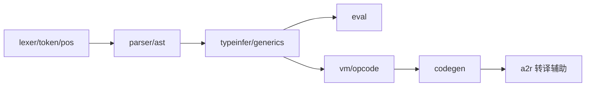

# aavm

> **Status**: experimental
> 路径：`auto/`  | 技术栈：Auto 语言（.at），经 `auto build` 转译为 Rust（pac.at）

自举编译器实验（AAVM）：用 Auto 语言写的 lexer/parser/vm/codegen，验证 Auto 的自举能力。

## 目标与范围

- 用 Auto 实现一个 Auto 子集编译器：lexer → parser → 类型推导 → eval/vm/codegen。
- 经 pac.at（backend: rust）用主编译器转译为 Rust，构成自举回路。
- 不做：不追求与主编译器（crates/auto-lang）特性对齐；实验性质，不作为生产编译路径。

## 模块架构

## 模块清单

| 模块 | 职责 | 状态 |
|---|---|---|
| lib/lexer.at / token.at / pos.at | 词法分析与位置跟踪 | experimental |
| lib/parser.at / ast.at | 语法分析与 AST | experimental |
| lib/typeinfer.at / generics.at | 类型推导与泛型 | experimental |
| lib/eval.at | 树遍历求值 | experimental |
| lib/vm.at / opcode.at | 字节码 VM 与指令集 | experimental |
| lib/codegen.at / a2r.at | 代码生成与 Rust 转译辅助 | experimental |
| lib/error.at | 错误类型 | experimental |
| pac.at / greet_mod.at | 包定义与示例模块 | experimental |
