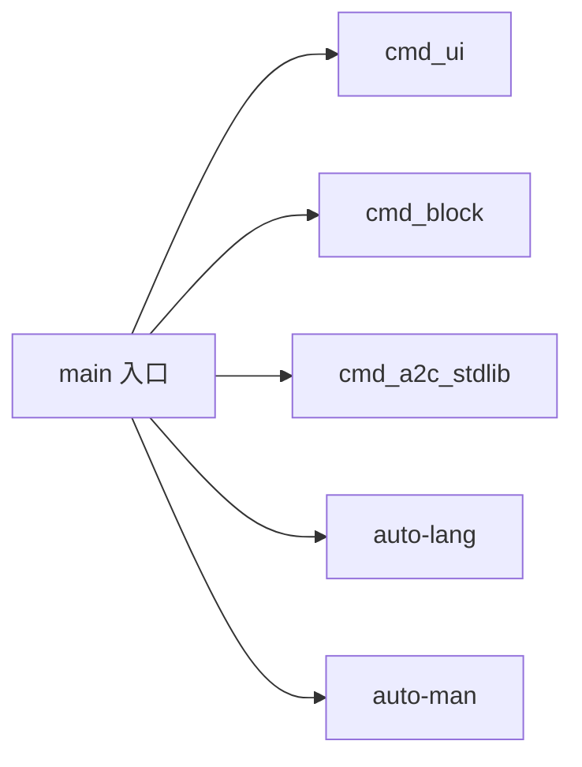

# auto-cli

> **Status**: active
> 路径：`crates/auto`  | 技术栈：Rust（clap / auto-lang / auto-man / miette）

主 CLI `auto`：脚本执行（AutoVM）/REPL/`auto build|run|fetch` 等命令的统一入口。

## 目标与范围

- 提供 `auto` 二进制：无子命令时进入 BigVM REPL，`auto <file.at>` 直接以 AutoVM 执行脚本。
- 工程命令（new/init/build/run/test/clean/add/fetch/deps/export）主要委托 auto-man 完成。
- 转译子命令（ts/c/rust/python/js/gd/tscn/godot）委托 auto-lang 的 transpiler。
- 支持 `--format json` 的机器可读输出（面向 AI 消费）。
- 不做：不实现编译/求值逻辑本身（在 auto-lang）；不实现构建/包管理逻辑本身（在 auto-man）。

## 模块架构

## 模块清单

| 模块 | 职责 | 状态 |
|---|---|---|
| main | clap 子命令定义、脚本执行/REPL 分发、JSON 错误格式化、转译子命令 | active |
| cmd_ui | `auto ui` 系列（list/select/install 等 UI 工程命令） | active |
| cmd_block | `auto block list/show/add/check`：blocks 目录浏览、参考实现拷贝、校验 | active |
| cmd_a2c_stdlib | `auto a2c-stdlib`：生成 a2c 标准库 | active |
| cmd_vue / cmd_tauri | Vue/Tauri 工程脚手架源码 | orphan（文件存在但未被 main.rs 挂接） |
