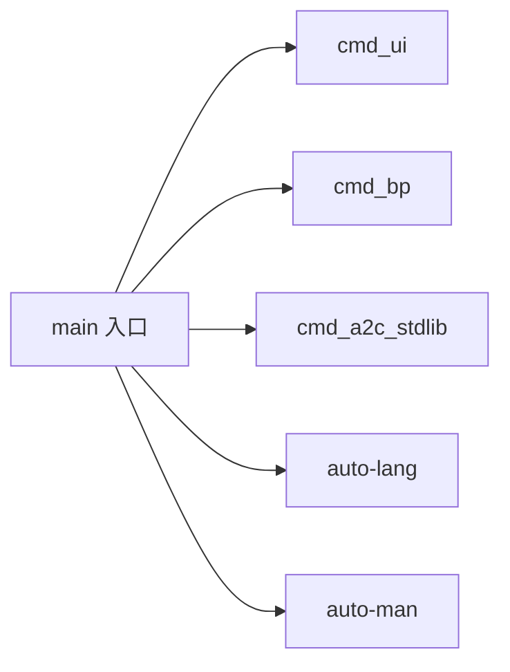

# auto-cli

> **Status**: active
> 路径：`crates/auto`  | 技术栈：Rust（clap / auto-lang / auto-man / miette）

主 CLI `auto`：脚本执行（AutoVM）/REPL/`auto build|run|fetch` 等命令的统一入口。

## 目标与范围

- 提供 `auto` 二进制：无子命令时进入 BigVM REPL，`auto <file.at>` 直接以 AutoVM 执行脚本。
- **直跑透传（Plan 524）**：`auto <file> [args...]`——file 之后的位置参数整段透传
  给脚本，脚本内 `process.args()` 返回 `[程序路径, args...]` 字符串列表；
  clap 形态 = index=2 `trailing_var_arg` + `allow_hyphen_values`（裸值撞
  子命令名以 `--` 消歧；已知全局旗标后置于 file 会被旗标吞，此类值放 `--`
  之后）。单测 `cli_passthrough_tests`（`cargo test -p auto --bin auto`）。
- 工程命令（new/init/build/run/test/clean/add/fetch/deps/export）主要委托 auto-man 完成。
- **独立服务入口（PLAN-736）**：`auto service <project> --server vm|rust
  [--http-config|--http-config-inline <json>] [-B <port>]`——只启动服务端（无
  Vue/Vite/桌面），配置严格解析（坏配置/端口冲突/未知 server 指名非零退出，
  无假 ready、无静默回退）；`port=0` 仅独立 serve/test，ready 上报真实 bound 地址。
  命名注记：`auto serve` 为 Plan 269 AutoVM daemon，`auto service` 不杀占端口进程
  （legacy kill 语义留在 run 链）。配置来源优先级：显式 http-config 定义完整
  listen（CLI 显式 `-B` 可覆盖其 port，未显式的 pac.at 端口不再覆盖）；无配置时
  legacy 链原样（CLI `-B` > pac.at back_port > `AUTO_HTTP_PORT` > 8080）。
  正常关闭退出码 0；bind/config/generation 错误非零。合同见
  [stdlib/design/http-service-deployment.md](../stdlib/design/http-service-deployment.md)。
- 转译子命令（ts/c/rust/python/js/gd/tscn/godot）委托 auto-lang 的 transpiler。
- 支持 `--format json` 的机器可读输出（面向 AI 消费）。
- 不做：不实现编译/求值逻辑本身（在 auto-lang）；不实现构建/包管理逻辑本身（在 auto-man）。

## 模块架构

```mermaid
graph LR
  main[main 入口] --> ui[cmd_ui]
  main --> bp[cmd_bp]
  main --> a2c[cmd_a2c_stdlib]
  main --> lang[auto-lang]
  main --> man[auto-man]
  click main "./main/" "main"
  click ui "./cmd-ui/" "cmd_ui"
  click bp "./cmd-bp/" "cmd_bp"
  click a2c "./cmd-a2c-stdlib/" "cmd_a2c_stdlib"
```

## 模块清单

| 模块 | 职责 | 状态 |
|---|---|---|
| main | clap 子命令定义、脚本执行/REPL 分发、JSON 错误格式化、转译子命令；`.as` 直跑（plan-560 起=lower→compile 真管线）、`trans auto` s2s 子命令与 `--dump-lowered` 全局 flag（W2 真产物+模式头） | active |
| cmd_ui | `auto ui` 系列（list/select/install 等 UI 工程命令） | active |
| cmd_bp | `auto bp list/show/add/check`：blueprints 目录浏览、参考实现拷贝、`--bind` L1 绑定工件、校验（`auto block` 为弃用别名） | active |
| cmd_a2c_stdlib | `auto a2c-stdlib`：生成 a2c 标准库 | active |
| cmd_service | `auto service`：server-only 服务入口（配置解析 + auto-man 进程托管；PLAN-736） | active |
| cmd_vue / cmd_tauri | Vue/Tauri 工程脚手架源码 | orphan（文件存在但未被 main.rs 挂接） |

## 版本消费规则补强（PLAN-095，2026-10-01）

- 生成/构建收据必须绑定**实际采用的 CLI 文件 hash**（如
  89c22af15c048019），不以提交号或"已构建"表述替代——主二进制被运行中
  进程锁定时，worktree 独立构建的产物与共享主二进制是两个事实源。
- 主二进制替换（部署）是显式步骤：exe 锁定不强杀共享实例，保留部署
  观察项。
