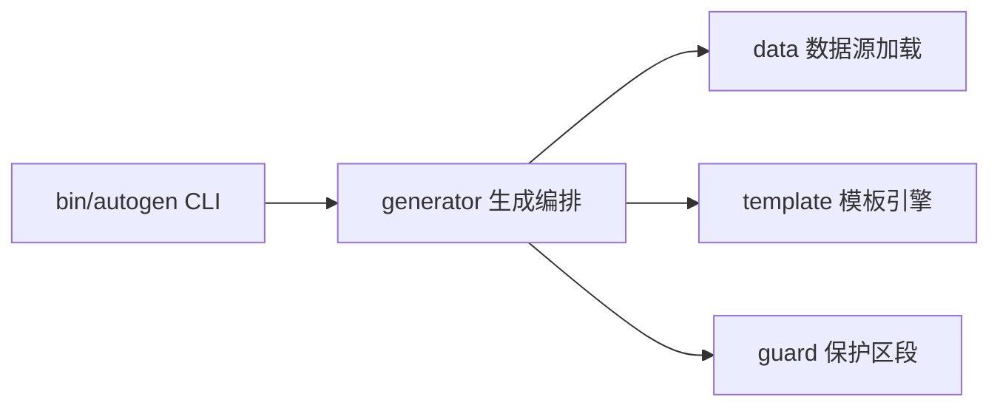

# auto-gen

> **Status**: active
> 路径：`crates/auto-gen`  | 技术栈：Rust（clap / regex / auto-val）

AutoGen 代码生成器（bin 名 `autogen`）：从 Auto 格式数据源 + 模板生成 JSON/C/Rust 等代码。

## 目标与范围

- 加载 Auto 格式数据源（DataLoader），经模板引擎渲染输出目标代码。
- 支持"保护区段"（guard）：重新生成时保留手工修改的代码区域。
- 提供配置文件驱动的批量生成（GenerationSpec / GeneratorConfig）。
- 不做：不做语言级编译；模板语法保持简单文本替换级，不做完整 DSL。

## 模块架构

## 模块清单

| 模块 | 职责 | 状态 |
|---|---|---|
| bin/autogen | CLI 入口：generate 等子命令、配置文件加载 | active |
| data | Auto 格式数据源加载（DataSource/LoadedData） | active |
| template | 模板解析与渲染（Template/TemplateEngine） | active |
| generator | 生成编排（CodeGenerator/GenReport/GenerationSpec） | active |
| guard | 保护区段冲突检测与保留（GuardProcessor） | active |
| test_framework | 测试辅助 | test-only |
