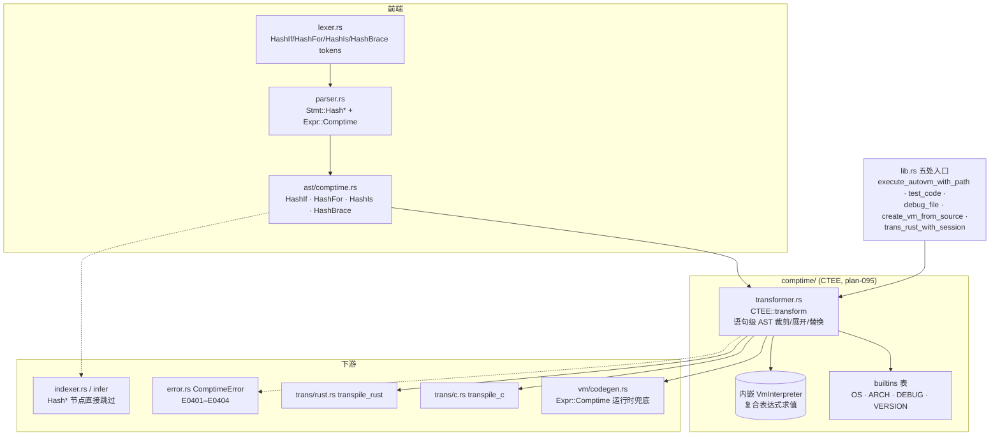

# comptime 架构

## 结构图

要点：

- **单 Pass、语句级**：`CTEE::transform` 只重写 `Code.stmts` 顶层及 comptime 分支体内的语句；
  普通语句原样保留，`Hash*` 语句被裁剪（`#if`/`#is`）、展开（`#for`）或替换为字面量语句（`#{}`）。
- **求值双路径**：字面量与裸标识符在 `eval_expr` 内直接求值；复合表达式 `format!` 成源码字符串交内嵌
  `VmInterpreter` 执行——因此 comptime 自动获得全语言特性，但也继承了 VM 环境未注入 builtins 的边界。
- **下游假设 AST 已净化**：indexer、infer 对 `Hash*` 节点一律跳过（indexer.rs:166、infer/stmt.rs:128），
  依赖"CTEE 先于一切语义处理运行"这一管线顺序。

## ADR 日志

### ADR-01: 以 `#` 前缀做显式元编程，而非宏或隐式 comptime
- 日期 / 来源：2026-04-20 / docs/design/raw/compile-time-execution.md §1、§4
- 决策：`#if`/`#for`/`#is`/`#{}` 四种 `#` 前缀构造，编译期与运行时代码一眼可辨。
- 备选：
  - C 预处理器式文本替换（pros：实现简单；cons：无类型安全、宏地狱）
  - Zig 隐式 `comptime`（pros：表达力强、无需标记；cons：编译期/运行时边界需推导，嵌入式场景不友好）
  - D `static if`（pros：同为 AST 结构化操作；cons：关键字冗长）
- 后果：正面——类型安全 + 显式边界，契合"Intent IR"定位；负面——`#` 与 `#[...]` 注解共享前缀，
  lexer 需前瞻消歧（lexer.rs:1006 附近）。
- 状态：active

### ADR-02: 两阶段编译——Stage 1 Meta-Eval 先于一切语义处理
- 日期 / 来源：2026-04-20 / docs/design/raw/compile-time-execution.md §1.2、§3.1
- 决策：parse 之后先由 CTEE 执行全部 `#` 构造、产出纯净 AST，再进入 type-check/codegen。
- 备选：
  - 语义分析期部分求值（Zig 式）（pros：可做类型感知求值；cons：实现复杂度极高，耦合类型系统）
  - 独立预处理 Pass（本决策）（pros：后端零改动、各管线统一接入；cons：comptime 代码无法引用类型信息）
- 后果：正面——七处管线入口以同一行 `ctee.transform(&mut ast)` 接入，a2c/a2r/AutoVM 行为一致；
  负面——indexer/infer 必须容忍（跳过）未变换的 `Hash*` 节点；comptime 无法做类型反射
  （09-compiler.md Open Questions 仍挂起跨编译目标模拟问题）。
- 状态：active

### ADR-03: 复用 VmInterpreter 求值，不造独立编译期解释器
- 日期 / 来源：2026-03-19（代码首提交）/ plan-095 Phase 4、docs/design/09-compiler.md "Comptime" 节
- 决策：`CTEE` 内嵌 `VmInterpreter`，复合表达式转为源码字符串执行。
- 备选：
  - 独立 tree-walk 解释器（pros：可精确模拟目标平台数据宽度，如 x64 主机上 arm32 的 `usize`；
    cons：重复实现、与语言演进漂移）
  - 复用 VM（pros：全部语言特性自动可用、维护面小；cons：求值经字符串往返，丢失 span；
    主机语义即编译期语义，交叉编译有偏差）
- 后果：正面——plan-095 六个 Phase 即完成落地；负面——表达式求值走 `format!` + 重 parse 的慢路径，
  且 builtins 未注入 VM 全局（见 overview 已知坑）。
- 状态：active

### ADR-04: 语句级提升——`#` 作用于整个控制流结构
- 日期 / 来源：2026-04-20 / docs/design/raw/compile-time-execution.md §1.3、§2.1
- 决策：`#if` 的 `elif`/`else` 分支自动继承编译期属性，无需重复加 `#`；块内代码默认"发射"到运行时 AST。
- 备选：
  - 逐 Token/逐分支标注（pros：粒度细；cons：噪音大、易漏标导致语义分裂）
- 后果：正面——条件编译块可读性接近普通 if；负面——`HashIfElse::ElseIf` 嵌套结构使变换需递归处理
  （transformer.rs `transform_hash_if`）。
- 状态：active

### ADR-05: 确定性沙箱与资源限额（设计已定，未实现）
- 日期 / 来源：2026-04-21 / plan-095 Part A "Deterministic Execution" / "Resource Limits"
- 决策：编译期执行须确定性——禁 `Time.now`/`Random`/文件 I/O/`Process.spawn`/环境变量；
  默认限额 5s / 100MB / 256 帧递归 / 1 万次 native 调用（`CTEELimits`）；`VmInterpreter` 增加
  `comptime_mode` 标志承载这些限制。
- 备选：
  - 不限制、信任编译期代码（pros：实现为零；cons：无限循环/内存耗尽直接拖死编译，构建不可复现）
- 后果：目前只有错误类型就位（`ComptimeError::NonDeterministic` E0402、`ResourceLimit` E0403），
  执行侧无强制——`comptime_mode` 字段从未加入 `VmInterpreter`，`mod.rs` 文档注释与代码不符。
- 状态：accepted（未落地）
