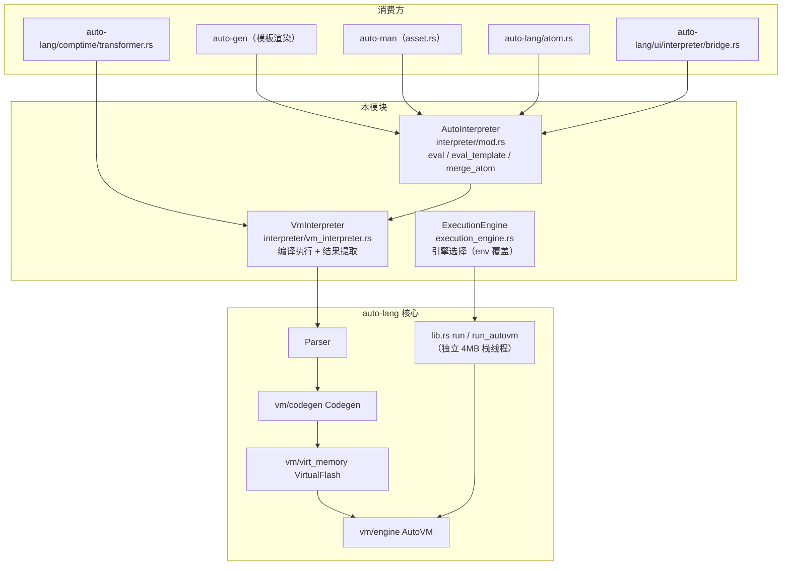

# interpreter 架构

## 结构图

要点：

- `VmInterpreter` 自带一条迷你管线（parse → codegen → 重定位 → flash → 单任务执行），
  每次 `eval` 全量重来，与 `lib.rs::run_autovm` 路径独立（不共享 4MB 栈线程方案）。
- `ExecutionEngine` 只服务于 `lib.rs` 高层 API（`run` / `run_with_capture`），
  与 `interpreter/` 无调用关系；ADR-02 后实质单引擎。

## ADR 日志

### ADR-01: AutoVM 取代 TreeWalker Evaluator 成为默认执行引擎

- 日期 / 来源：2026-02-06 / plan-081、plan-073、docs/execution-engine-selection.md
- 决策：`ExecutionEngine::default_engine()` 固定返回 AutoVM；`run()` 等高层 API 透明切换到 AutoVM。
- 备选：
  - A 保留 Evaluator 默认（pros：AST 直走实现直观、调试方便；cons：平均慢 23.77x，内存占用高）
  - B 编译期 feature flag 双引擎并存（pros：切换灵活；cons：两条执行路径长期维护、行为易分叉）
- 后果：正面——基准 13–55x 提速、1254/1288 测试通过（97.4%）；负面——Evaluator 调试路径逐步荒废，为 ADR-02 埋下伏笔。
- 状态：active

### ADR-02: 物理删除 TreeWalker（eval.rs / interp.rs），interpreter/ 重建为 AutoVM 薄封装

- 日期 / 来源：2026（plan-091 未标注具体日期，commit `6862bb4`）/ plan-091
- 决策：删除旧 `eval.rs` / `interp.rs`（约 7,167 行）；`ExecutionEngine::Evaluator` 变体标记
  `#[deprecated]` 并重定向到 AutoVM；`AUTO_EXECUTION_ENGINE=evaluator` 只打印警告。
  `interpreter/` 目录重建为 `AutoInterpreter`（VM 薄封装）。
- 备选：
  - A 保留 eval.rs 作 fallback（pros：AutoVM 边缘 case 有退路、AST 调试直观；cons：7k+ 行陈旧代码双实现、行为分叉）
  - B 保留但标记 deprecated（pros：调用方不炸；cons：仍须参与编译维护）
- 后果：正面——单一执行语义、维护面收窄；负面——AutoVM bug 无 fallback，
  `docs/execution-engine-selection.md` 与 `docs/design/01-architecture.md` 中 Evaluator 相关描述过时。
- 状态：active

### ADR-03: 模式感知（SCRIPT/CONFIG/TEMPLATE）放编译器，VM 保持 mode-agnostic

- 日期 / 来源：2026-02-05 ~ 2026-02-06 / plan-075
- 决策：执行模式差异全部由独立 Codegen 策略吸收（ConfigCodegen / TemplateCodegen），
  VM 指令集与引擎不感知模式。
- 备选：
  - A VM 内加模式标志（pros：单点实现；cons：污染指令集与执行循环）
  - B 每模式独立 Codegen（pros：VM 干净；cons：多个 codegen 需保持一致性）
- 后果：`interpreter/` 的 `eval_template` 沿用同一思路——先做源码级 Flip 变换
  （模板 → f-string 拼接代码），再走普通 VM 执行，VM 侧零改动。
- 状态：active

### ADR-04: 脚本主任务用 RESERVE_STACK 预留局部变量槽位

- 日期 / 来源：2026-02（plan-080 文件内记 2025-02-06，与 plan-073 同期）/ plan-080、vm_interpreter.rs 步骤 2b
- 决策：编译脚本时在字节码头部插入 `RESERVE_STACK n_locals`，防止临时栈压栈覆盖
  BP 之后的局部变量槽位（plan-080 根因：主任务 bp=0 时栈与局部变量共享内存区，
  REPL 变量值会累积错乱）。
- 备选：
  - A 函数入口压 dummy CONST_0（plan-080 当时的修复；pros：不加指令；cons：栈被垃圾值污染）
  - B 头部插 RESERVE_STACK（pros：语义清晰；cons：需把 exports / relocs / jump placeholders 全部平移 2 字节）
- 后果：`VmInterpreter::run` 在 codegen 后执行插入 + 全量地址平移（vm_interpreter.rs:53-75）。
- 状态：active

### ADR-05: 运行期引擎选择通道：环境变量 AUTO_EXECUTION_ENGINE

- 日期 / 来源：2026-02-06 / docs/execution-engine-selection.md、execution_engine.rs
- 决策：编译期默认之外，允许 `AUTO_EXECUTION_ENGINE=autovm|vm|evaluator|eval` 运行期覆盖。
- 备选：仅编译期 feature flag（pros：零运行期分支；cons：切换需重编译）。
- 后果：选择层代码保留至今；ADR-02 后所有取值都落到 AutoVM（evaluator 系仅告警），
  该层已退化为兼容外壳。
- 状态：active（功能退化，实质单引擎）
