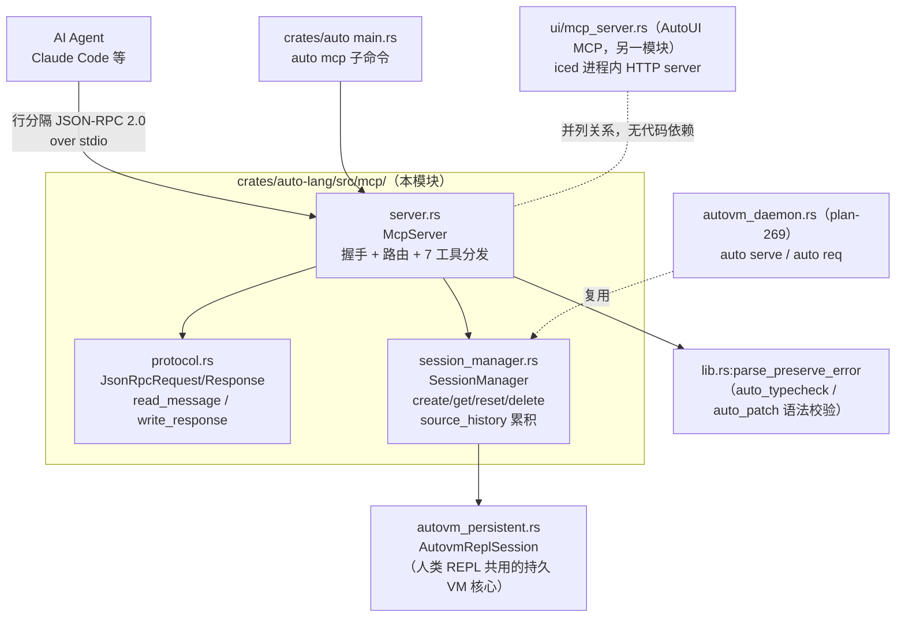

# mcp 架构

## 结构图

外部依赖仅 `serde`/`serde_json`；协议为手写最小实现，不依赖 rmcp 等框架
（ADR-01）。与 AutoUI MCP 是并列的两个 server：本模块操作源代码与 VM 会话，
对方操作运行中的渲染 UI（见 `design/dual-mcp-servers.md`）。

## ADR 日志

### ADR-01: 手写最小 JSON-RPC over stdio，不引入 rmcp crate

- 日期 / 来源：2026-05-25 / plan-265（Key Design Decisions §1）
- 决策：MCP server 从零实现（`protocol.rs` 约 170 行），只覆盖
  initialize / tools/list / tools/call / notifications 子集。
- 备选：
  - A 引入 `rmcp` crate（pros：协议完整、跟规范演进；cons：重依赖、
    版本耦合、初期只需 8 个工具的极小面）
  - B 手写（pros：零新增重依赖、错误处理与会话生命周期完全可控；
    cons：协议演进需手动跟进）
- 后果：正面——`mcp/` 仅依赖 serde/serde_json；负面——仅支持行分隔
  stdio，不支持 MCP 规范的 Content-Length 帧与 HTTP/SSE 传输；单条消息
  解析失败即退出进程（容错弱）。
- 状态：active

### ADR-02: session-per-agent 隔离，不共享会话

- 日期 / 来源：2026-05-25 / plan-265（Key Design Decisions §2）
- 决策：每个 `auto_session_create` 生成独立 `AutovmReplSession`，
  会话间状态零共享。
- 备选：
  - A 共享单会话（pros：省内存；cons：并发 agent 互相污染状态、
    AutoVM 字节码执行本身单线程非线程安全）
  - B 会话隔离（pros：一个 agent 的 bug 不扩散；cons：多会话内存叠加，
    需 GC——当前仅 daemon 路径实现了 GC）
- 后果：正面——Claude Code 并发子 agent 安全；负面——`McpServer`
  无 `cleanup_expired` 调用，长时间运行的 stdio server 会话只增不减。
- 状态：active

### ADR-03: auto_patch 走"累积源码文本替换 + 全量重建"，不做字节码补丁

- 日期 / 来源：2026-05-25 / plan-265（Key Design Decisions §3；实现见
  `server.rs:patch_replace_definition` + `session_manager.rs:rebuild_with_source`）
- 决策：patch = 在 `source_history` 拼接文本中找到旧定义块（行首
  `fn|type|enum|spec|ext <name>` 匹配 + 花括号计数定界），替换后新建
  `AutovmReplSession` 重跑全部源码。
- 备选：
  - A 字节码原位补丁（pros：快；cons：偏移级联，极脆弱——plan 明确否决）
  - B 文本重建（pros：实现简单可靠、单次重编译 <1ms 量级；
    cons：文本匹配不解析 AST，注释/字符串中的花括号会误判；
    会话运行时状态（变量值）在重建中丢失，只剩源码级状态）
- 后果：正面——patch 与 snapshot 共用同一份 `source_history`，语义一致；
  负面——patch 后会话变量不保留（plan 设想的"preserve session state"
  只到源码层）。
- 状态：active

### ADR-04: SessionManager 抽成独立模块，同时服务 MCP 与 daemon

- 日期 / 来源：2026-05 末 / plan-269（`autovm_daemon.rs` 头注
  "Reuses SessionManager from MCP module for session lifecycle"）
- 决策：`auto serve`（命名管道 daemon）不复刻会话管理，直接
  `use crate::mcp::session_manager::SessionManager`。
- 备选：
  - A daemon 自写会话表（pros：解耦；cons：两套生命周期逻辑漂移）
  - B 复用（pros：GC/ID 生成/源码累积单点维护；cons：mcp 模块成为
    daemon 的事实依赖，改动需双侧回归）
- 后果：正面——`cleanup_expired` 在 daemon 侧真正被调用；
  负面——见 ADR-02，MCP 路径反而没有 GC。
- 状态：active

### ADR-05: AutoUI 另起第二个 MCP server，嵌入 iced 进程走 HTTP

- 日期 / 来源：2026-06-02 / plan-278、docs/design/14-developer-tools.md
  （AutoUI MCP Server 节）
- 决策：不扩展本模块去感知 UI，而是在 iced 桌面进程内嵌一个 HTTP
  MCP server（`localhost:9247`，`ui/mcp_server.rs:McpUiServer`），
  工具前缀 `autoui_`。
- 备选：
  - A 单一 server 同时暴露 VM 与 UI 工具（pros：接入简单；
    cons：VM server 跑在 agent 的机器上，UI 状态在被测进程内，
      进程边界无法跨越）
  - B 双 server 分工（pros：各自贴近数据源——源代码 vs 活体 VTree；
    cons：两套协议实现、两套工具命名空间）
- 后果：正面——plan-299/314 得以在 SharedState 上独立演进；
  负面——`docs/design/14` 的 MCP 节同时描述两者，易混淆归属。
- 状态：active

### ADR-06: AutoUI 主感知信道用运行时 VTree + Atom，取代 build-time 模板快照

- 日期 / 来源：2026-06-16 / plan-314
- 决策：新增 `autoui_vtree`——每个渲染 VNode 1:1 映射为一个 Atom 节点，
  携带完整盒模型/computed style/events/source；旧 `autoui_snapshot`
  （AURA 模板 + 简单 rect）保留仅作向后兼容。数据通道复用 F12 的
  `live_vtree`/`live_cache`，并把捕获门控从"F12 开"解耦为
  "F12 开或 MCP 连接"。
- 备选：
  - A 继续增强 `autoui_snapshot`（pros：不动数据层；cons：模板是
    build-time 视图，for 循环不展开、无盒模型、id 是组件级 `aura_N`）
  - B 运行时 VTree（pros：渲染后真相，agent 无需截图即可推理布局；
    cons：需每帧往 SharedState 拷快照，rust 模式 bounds 暂缺
    ——plan-311 P2-B-3，schema 降级省略）
- 后果：正面——结构/布局/样式主信道确立，截图降为像素级次信道；
  不变量"未测量字段即省略、永不报错"写进工具契约。
- 状态：active
