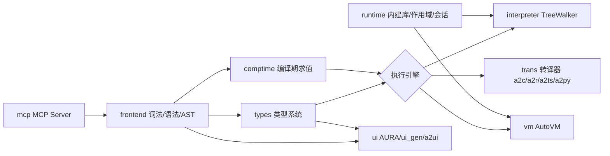

# auto-lang（语言核心）

> **Status**: active
> 路径：`crates/auto-lang`  | 技术栈：Rust 库（巨型，全 workspace 的依赖中心）

Auto 语言的核心实现：lexer/parser/AST、类型系统、解释器、AutoVM、多目标转译器、UI 引擎全部在此 crate。
所有应用层 crate（auto-cli、auto-lsp、auto-vm、auto-gen、auto-man、auto-playground）都依赖它。

## 目标与范围

- 负责：Auto 语言从源码到执行/转译的全部语义；AURA/UI 代码生成；内建标准库绑定。
- 不负责：构建/包管理（auto-man）、LSP 协议层（auto-lsp）、CLI 命令分发（auto-cli）、独立运行时标准库（a2r-std）。
- 重后端由 features 控制：`python`（PyO3 FFI）、`ui-gpui`、`ui-iced`、`ui-interpreter` 等，default 仅 `with-file-history`。
- 路线图：见 [docs/roadmap.md](../../roadmap.md)。

## 模块架构

## 模块清单

| 模块 | 职责 | 状态 |
|---|---|---|
| [frontend](frontend/) | lexer/token/parser/AST/dialect/resolver/宏 | partial |
| [types](types/) | 类型推断 infer/、typeck、ownership（borrow/lifetime/cfa）、trait_checker | partial |
| [comptime](comptime/) | 编译期求值 | partial |
| [interpreter](interpreter/) | TreeWalker 解释器 | partial |
| [vm](vm/) | AutoVM：abt/codegen/engine/debugger/ffi/generic | partial |
| [trans](trans/) | 转译后端：C/Rust/JavaScript/TypeScript/Python/GDScript/r2a | partial |
| [runtime](runtime/) | runtime/scope/session、libs/ 内建标准库绑定、ffi | partial |
| [ui](ui/) | ui/（app/component/gpui/headless）、ui_gen/（ark/jet/block/ts）、a2ui/、aura/ | partial |
| [mcp](mcp/) | MCP server 集成 | partial |

> 模块层文档为 Phase 0 骨架（overview 占位），内容将在 Phase 1 从
> `docs/design/01–09` 章与 `docs/plan-reports/` 蒸馏填充。
