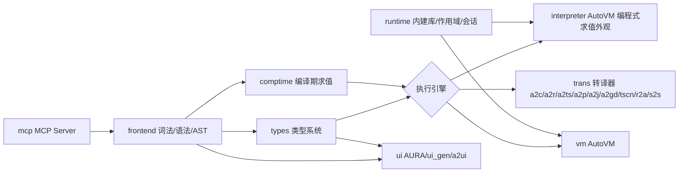

# auto-lang（语言核心）

> **Status**: active
> 路径：`crates/auto-lang`  | 技术栈：Rust 库（巨型，全 workspace 的依赖中心）

Auto 语言的核心实现：lexer/parser/AST、类型系统、解释器、AutoVM、多目标转译器、UI 引擎全部在此 crate。
所有应用层 crate（auto-cli、auto-lsp、auto-vm、auto-gen、auto-man、auto-playground）都依赖它。

## 目标与范围

- 负责：Auto 语言从源码到执行/转译的全部语义；AURA/UI 代码生成；内建标准库绑定。
- 不负责：构建/包管理（auto-man）、LSP 协议层（auto-lsp）、CLI 命令分发（auto-cli）、独立运行时标准库（a2r-std）。
- 重后端由 features 控制：`python`（PyO3 FFI）、`ui-iced`、`ui-interpreter` 等，default 为 `with-file-history` + `ui-iced`（2026-09-22 全档统一裁定）；`ui-gpui`（Zed GPUI 宿主后端）已随 PLAN-691 移除（全仓零启用者）。
- 路线图：见 [docs/roadmap.md](../../roadmap.md)。

## 模块架构

```mermaid
graph LR
  FE[frontend 词法/语法/AST] --> TY[types 类型系统]
  FE --> CT[comptime 编译期求值]
  TY --> EX{执行引擎}
  CT --> EX
  EX --> INT[interpreter AutoVM 编程式求值外观]
  EX --> VM[vm AutoVM]
  EX --> TR[trans 转译器 a2c/a2r/a2ts/a2p/a2j/a2gd/tscn/r2a/s2s]
  RT[runtime 内建库/作用域/会话] --> INT
  RT --> VM
  FE --> UI[ui AURA/ui_gen/a2ui]
  TY --> UI
  MCP[mcp MCP Server] --> FE
  click FE "./frontend/" "frontend"
  click TY "./types/" "types"
  click CT "./comptime/" "comptime"
  click INT "./interpreter/" "interpreter"
  click VM "./vm/" "vm"
  click TR "./trans/" "trans"
  click RT "./runtime/" "runtime"
  click UI "./ui/" "ui"
  click MCP "./mcp/" "mcp"
```

## 模块清单

| 模块 | 职责 | 状态 |
|---|---|---|
| [frontend](frontend/) | lexer/token/parser/AST/dialect/resolver/宏 | implemented（核心管线完整；符号属性/位操作/Auto Flow 未实现） |
| [types](types/) | 类型推断 infer/、typeck、ownership（borrow/lifetime/cfa）、trait_checker | implemented（核心可用；借检查、参数检查集成仍 partial） |
| [comptime](comptime/) | 编译期求值 | partial（语句级 `#if/#for/#is/#{}` 已实现；表达式级编译期替换/沙箱/限额未落地） |
| [interpreter](interpreter/) | AutoVM 编程式求值外观（旧 TreeWalker 已删，plan-091） | partial（`call()` 未实现、结果提取不完整） |
| [vm](vm/) | AutoVM：abt/codegen/engine/debugger/ffi/generic | implemented |
| [trans](trans/) | 转译后端：C/Rust/TypeScript/Python/JavaScript/GDScript/tscn/r2a/s2s | implemented |
| [runtime](runtime/) | runtime/scope/session、libs/ 内建标准库绑定、ffi、database、sse、route | partial（Plan 064 分层迁移未收尾，`Scope` 遗留） |
| [ui](ui/) | aura/、ui/（iced/headless 渲染 + code_editor/autodown 内建 + style 主题）、桌面运行时（session/wm/VirtualWindow）、ui_gen/（vue 主力/rust/ts/widget 契约/block）、a2ui/ | active（桌面线主战场；Plan 515：desktop_protocol DrawOp v1.5——Scissor 裁剪栈+TextStyled 字重/斜体差分（追加式 tag 3/4/5，TS 渲染器同步）、queue 臂投影保真（scroll 裁剪/typography 差分/layout_block 垂直高度修正）、native HICON 真图标链（win32 提取+native_icon 缓存）、e2e_exe 陈旧防护+queue-coverage 覆盖率 bin；Plan 656：scroll-pane 通用滚动架构——ui/scroll 语义层（State/Intent/Viewport 三通道）+axis/scrollbar/controller/on-scroll 双端 + managed bridge）；Plan 664：menubar 快照可见性与开合持久性契约（design/menubar-snapshot.md——TimeSource 泵事件不参与关菜单判据，041 矩阵六失败根修）+ use 导入 P-15/P-16 静默死面编译期告警化（[AUTO-USE-DIAG]） |
| [mcp](mcp/) | MCP server 集成 | implemented（7 工具；sandbox/会话 GC/诊断为半完成） |

> 模块层文档已完成 Phase 1 蒸馏与 PLAN-546 代码证据 rebaseline（2026-09-07，
> 报告 [docs/reports/module-spec-rebaseline-2026-09-04.md](../../reports/module-spec-rebaseline-2026-09-04.md)）；
> 状态列以各模块 overview 的 Status 行为准。
