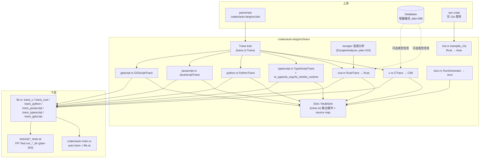

# trans 架构

## 结构图

要点：

- 所有正向后端实现同一 `Trans::trans(ast: Code, sink: &mut Sink)`，差异全部封装在各后端内部。
- `Sink` 同时承担字节缓冲与 source map 记录（`set_source_line` / `record` / `prepend_body`），
  `MultiSink` 支撑多文件项目级转译（plan-167/168 代码注释、plan-219）。
- 逃逸分析只服务 a2r：`transpile_rust` 在 CTEE 之后、`trans` 之前运行 `EscapeAnalyzer`，
  结果按"函数名 → EscapeMap"缓存进 `RustTrans.escape_results`，代码生成期查询。
- r2a 方向相反：不走 AST，直接用 `syn` 解析 Rust 源码字符串生成 Auto 源码（plan-173）。
- a2j 与 a2ts 并存是历史产物（plan-100 决定默认生成 TS，JS 后端保留未删）。

## ADR 日志

### ADR-01: 统一 Trans trait + Sink 输出抽象
- 日期 / 来源：docs/design/06-code-generation.md；代码 `crates/auto-lang/src/trans.rs:Trans`
- 决策：所有后端实现同一 `Trans` trait，输出统一写入 `Sink`（body/header/source 三段 + source map）。
- 备选：每后端自定义输出 API（pros：更自由；cons：source map、多文件、CLI 接线无法复用）。
- 后果：正面——新增后端只需实现一个 trait，测试与 CLI 一次接线；负面——`Sink` 的 C 风格
  header/body 分段对部分后端（TS/Python）是多余概念。
- 状态：active

### ADR-02: a2js → a2ts，默认生成 TypeScript
- 日期 / 来源：plan-100（Phase 2 完成于 2026-03-01）
- 决策：JS 方向默认生成 TypeScript（可再编译为 JS），ArkTS 视为 TS 变体；`javascript.rs` 保留。
- 备选：继续维护纯 JS 生成器（pros：实现简单；cons：无类型注解，无法支撑 ArkTS/生态需求）。
- 后果：正面——a2ts 成为 JS 方向主力；负面——a2j/a2ts 双后端并存，a2j 文档与实现逐渐脱节。
- 状态：active

### ADR-03: a2ts 按职责拆分为四个子模块
- 日期 / 来源：plan-152（2026-04）；代码 `typescript.rs` 头注释
- 决策：`typescript.rs` 保留 `TypeScriptTrans` 与块结构控制，类型映射、表达式、语句、stdlib runtime
  分别拆到 `ts_types.rs` / `ts_expr.rs` / `ts_stmt.rs` / `ts_runtime.rs`，用 `#[path]` 挂为子模块。
- 备选：单文件膨胀（pros：跳转直接；cons：与其他后端一样难维护，rust.rs 13842 行即是反例）。
- 后果：正面——a2ts 是转译器中唯一按职责拆分的后端；负面——`#[path]` 子模块是非常规写法。
- 状态：active

### ADR-04: 转译器接入 Database，Universe 并存过渡
- 日期 / 来源：plan-066（2025-02-01 完成）；代码 `rust.rs:RustTrans::with_database`、`c.rs:CTrans::with_database`
- 决策：a2c/a2r 增加 `db: Option<Arc<RwLock<Database>>>`，类型信息改从增量编译 Database 读取；
  旧 Universe 路径保留（`new()` 构造函数仍可用）。
- 备选：一次性删 Universe（pros：无双轨；cons：破坏所有存量调用点与测试）。
- 后果：正面——支撑增量转译 `trans_incremental`；负面——双轨并存至今，`new()` 与 `with_database()` 语义分叉。
- 状态：active（迁移未完成）

### ADR-05: 约定式转译测试发现
- 日期 / 来源：plan-263（old/263-transpiler-tests.md，DONE）
- 决策：废弃每用例一个 `#[test]` 的样板，改为 `tests/a2{r,c,ts}_tests.at` 声明 `#[test]` 函数，
  经 FFI `Test.run_*_dir(path)` 目录扫描 `.at` ↔ `.expected.*` 对。
- 备选：保留 Rust 侧逐用例注册（pros：cargo test 粒度细；cons：~420 个样板函数，加用例要改代码）。
- 后果：正面——加测试只需放文件；负面——失败定位依赖 runner 输出而非测试名。
- 状态：active

### ADR-06: 逃逸分析 own-by-default + 保守回退分层
- 日期 / 来源：plan-310（2026-06-16，Phase 0–4 全部交付）
- 决策：struct 字段/返回值默认 owned；借用仅作函数体内局部优化；分析不确定时按
  `&` → clone（Copy/小类型）→ `Rc<RefCell<T>>`（Send 边界升 `Arc<Mutex<T>>`）回退，每次回退发 warning（W0007）
  且绝不写入输出字节（避免破坏 .expected.rs 逐字节比对）。
- 备选：精确复刻 rustc NLL（pros：少回退；cons：无底洞）；不分析直接全 Rc（pros：简单；cons：性能与生成代码可读性差）。
- 后果：正面——生成的 Rust 必过借用检查（false negative 为 bug，false positive 仅损性能）；
  负面——`RustTrans` 增加 escape_results/current_fn_name/current_scope_depth 等状态，复杂度上升。
- 状态：active

### ADR-07: a2r 字符串三函数映射 + 生成后启发式清理
- 日期 / 来源：docs/design/06-code-generation.md §Rust Transpiler；plan-232、plan-241
- 决策：按语境分 `rust_type_name()`（存储：全 String）/ `rust_param_type_name()`（参数：全 &str）/
  `rust_return_type_name()`（返回：全 String）；`.to_string()` 在 13+ 注入点按需插入，
  再由 `RustTrans::post_process()` 的 20+ 正则 pass 清理冗余转换。
- 备选：在类型系统层彻底解决（pros：根除启发式；cons：改动面大，逐字节测试全部要重生成）。
- 后果：正面——存量测试基线不动即可持续修 bug；负面——已知误注入/误映射坑（见 overview 已知坑）。
- 状态：active

### ADR-08: r2a 逆翻译基于 syn 而非自建 Rust 解析器
- 日期 / 来源：plan-173（Phase 1 合并于 2025-04-15）
- 决策：r2a 用 `syn` crate 解析 Rust 源码，直接映射 syn AST → Auto 源码文本，不经过 Auto AST。
- 备选：自建 Rust parser（pros：无外部依赖；cons：工作量不可接受）。
- 后果：正面——四个 phase 快速交付（116 测试）；负面——r2a 与正向转译器无任何代码复用。
- 状态：active
