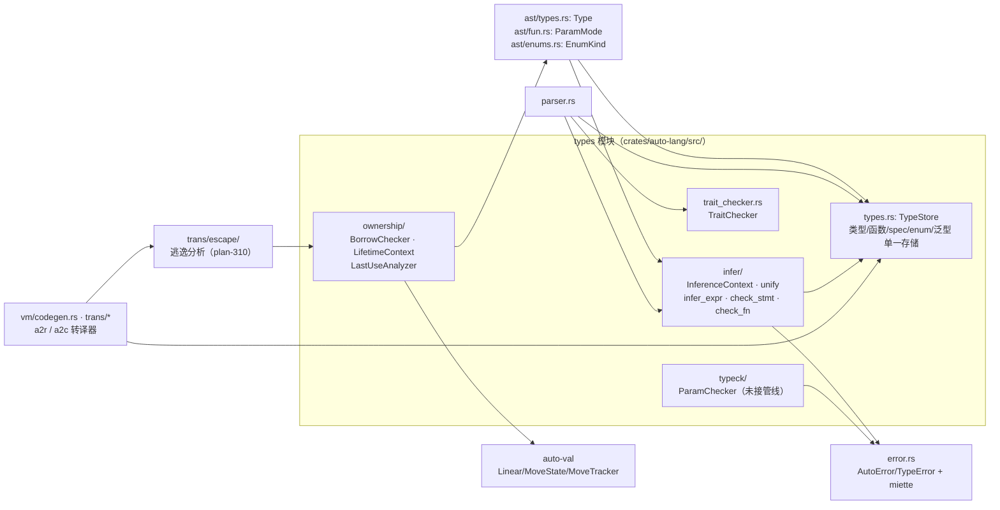

# types 架构

## 内部结构与外部依赖

要点：

- `TypeStore` 是所有类型信息的单一数据源；parser/codegen 共享 `Arc<RwLock<TypeStore>>`
  （infer/context.rs:73）。`infer/registry.rs:TypeRegistry` 已 DEPRECATED 但仍被
  `type_registry.rs`、`parser.rs`、`vm/codegen.rs` 引用，迁移未收尾。
- `infer/` 是推断与检查主体；`typeck/` 目前只有 `ParamChecker` 且未接入任何调用方。
- `ownership/` 提供编译期借用/生命周期分析；`trans/escape/`（plan-310）在 a2r 转译期
  做逃逸分析并决定借用 vs 智能指针回退，与 `ownership/` 是互补而非替代关系
  （plan-310 §5.3 明确"不复用 ownership/ 模块"）。

## 文档与代码分歧记录

1. design/02 称推断引擎"未接入 parser"——已过时，`parser.rs:6598-6654` 调用 `infer_expr`，
   `parser.rs:8246` 起调用 `TraitChecker::check_conformance`。
2. design/02 设想 `#[with(...)]` 泛型约束注解——实际 plan-061 实现为内联 `<T: Spec>`
   （ast/types.rs:372 `TypeParam.constraint`，Display 输出 `: {constraint}`）。见 ADR-08。
3. design/03 错误码表称 TypeError 为 E0101-E0105——实际 error.rs 中 TypeError 到 E0106，
   并占用 E0201-E0204（`auto_type_E0201`..`E0204`，与 `auto_name_E020x` 前缀不同故不冲突）。
4. types.rs 头注释架构图写 `Arc<TypeStore>`，实际 InferenceContext 持有
   `Arc<RwLock<TypeStore>>`（design/02 描述正确，代码注释略旧）。
5. design/04 正名为 view/mut/move，但 `ownership/` 模块头注释与 `BorrowKind` 仍用
   `take`（`BorrowKind::Take`）；`ParamMode::Take` 是 `Move` 的 deprecated 别名。

## ADR 日志

### ADR-01: 后缀类型修饰符记法
- 日期 / 来源：docs/design/02 §Type Modifiers
- 决策：所有类型修饰符置于基类型之后（`T[]`、`T[N]`、`T*`、`T&`、`T?`），多维数组左到右、外到内。
- 备选：C 式前缀指针（pros：C 程序员熟悉；cons：声明顺序与阅读顺序不一致，嵌套时方向反转）。
- 后果：正面——修饰符自然复合（`int*[3]` 指针数组 vs `int[]*` 数组指针）；负面——与 C 头文件直译需转换。
- 状态：active

### ADR-02: TypeStore 统一类型存储
- 日期 / 来源：2026-02-13 / plan-084（后续 plan-089、plan-090）
- 决策：合并原先分散的四处注册表（types.rs TypeStore、type_registry.rs、infer/registry.rs、
  Database.type_info_store）为单一 `TypeStore`，声明以 `Rc<T>` 共享，经 `Arc<RwLock<TypeStore>>` 访问。
- 备选：四注册表并存（pros：各阶段自治；cons：数据重复、同步困难、职责不清）。
- 后果：正面——单一数据源、import/merge 有统一入口（plan-085）；负面——`infer/registry.rs`
  迁移未收尾，DEPRECATED 代码仍在被引用（缓解：逐步迁移调用方）。
- 状态：active

### ADR-03: Option/Result 分离取代 May 三态类型
- 日期 / 来源：plan-120 / docs/design/03
- 决策：`?T` 映射 `Option(T)`（L1 温和缺失）、`!T` 映射 `Result(T)`（L2 严格错误），
  panic 为 L3；从 AST 移除 `Type::May`（ast/types.rs:51 注释保留 stdlib `tag May<T>` 的可能性）。
- 备选：`May<T>` 三态合并（pros：一套操作符统一处理；cons：无法区分"无数据"与"失败"，心智负担高）。
- 后果：正面——层级语义清晰、错误必须显式处理；负面——`.?`/`.!`/`.!!` 传播操作符与
  `#[nopanic]`、fallible main、Auto Mode 仍停留在设计阶段（plan-120 Phase 5 deferred）。
- 状态：active

### ADR-04: view/mut/move 三位一体，废弃 take/copy
- 日期 / 来源：2025-01-15 / plan-026（后缀化）、docs/design/04
- 决策：一切内存访问归约为 view（只读借，默认）/ mut（可写借）/ move（所有权转移）三种 O(1) 模式；
  `clone()` 显式且带括号作视觉警告。`take` 留作 deprecated 别名，`copy` 整体移除。
- 备选：`take`（cons：与集合方法 `take(n)` 撞名）；`copy`（cons：隐藏深拷贝违背"透明成本"原则）。
- 后果：正面——调用点成本可见、定义点与调用点必须一致；负面——ownership/ 模块内
  术语仍以 `take` 命名（`BorrowKind::Take`），造成阅读漂移。
- 状态：active

### ADR-05: 参数传递"语义 view、实现 copy"（ABO-01）
- 日期 / 来源：2025-02-10 / plan-088
- 决策：默认参数语义为 view（不可变引用）；转译器对平凡类型（int/float/bool/char/byte）
  自动生成寄存器值传递，对重类型生成引用传递。前端类型检查始终按不可变引用执法。
- 备选：一律引用传递（cons：小类型无谓间接）；一律值传递（cons：大类型拷贝昂贵）。
- 后果：正面——零认知开销的性能优化；负面——copy-vs-reference 成为 ABI 层隐式决策；
  `ParamChecker`（view 参数不可变检查）至今未接入编译管线。
- 状态：active

### ADR-06: 统一 enum 三形态取代 tag 关键字
- 日期 / 来源：docs/design/02 §Unified Enum（ast/enums.rs:EnumKind）
- 决策：单一 `enum` 关键字按载荷判别三形态——Scalar（C 式，可选 repr 与值）、
  Homogeneous（全体变体共享一个载荷类型，可 O(1) 直访字段）、Heterogeneous（ADT/和类型）。
  `tag` 关键字废弃；所有 enum 内建 `.tag()` / `.name()`。
- 备选：enum 与 tag 分立（pros：概念单纯；cons：两套关键字、两套匹配语义）。
- 后果：正面——同质 enum 免模式匹配直访字段；负面——raw `union`（C 式内存重叠）仍并存，
  与统一 enum 在类型检查器中的交互是 design/02 的 Open Question。
- 状态：active

### ADR-07: 用户不写生命周期——逃逸分析 + 智能指针回退
- 日期 / 来源：2026-06-16 / plan-310
- 决策：Own-by-default；编译器做同步逃逸分析，能证明安全就用借用（零成本），
  不能证明就回退 `Rc<RefCell<T>>`（Send 边界升 `Arc`）并发 warning（W0007）；
  view/mut/move 是 hint 可被分析覆盖；小类型自动 clone。落地于 `trans/escape/`，
  显式不复用 `ownership/`（plan-310 §5.3：ownership/ 面向编译期执法，escape/ 面向代码生成决策）。
- 备选：显式生命周期标注（pros：精确；cons：违背"用户从不写生命周期"目标、Rust 式学习曲线）；
  全 GC/ARC（cons：违背零开销与透明成本原则）。
- 后果：正面——生成合法 Rust 代码且无需标注；负面——回退路径有运行时成本，
  依赖 warning 通道透明告知；async/Arc 完整改写（任务 4.3）推迟到独立 plan。
- 状态：active

### ADR-08: 泛型约束内联 `<T: Spec>` 取代 `#[with(...)]` 注解
- 日期 / 来源：plan-061（日期未标注）
- 决策：类型参数约束写作内联 `<T: Spec>`（ast/types.rs:372 `TypeParam.constraint`）。
- 备选：`#[with(I as Iter<T>)]` 注解（design/02 设想：避免 `:`、签名干净；cons：多一个注解
  体系、约束与参数声明分离）。实现选择了内联冒号，与 design/02 的"避免冒号"理由相反。
- 后果：正面——约束紧邻参数、已落地并在内置类型上做校验（Plan 061 Phase 2）；
  负面——design/02 的 `#[with]` 章节成为未实现的历史设想；多约束（`T as A + B`）仍未支持。
- 状态：active（supersedes design/02 §Generic Constraints 的 `#[with]` 设想）
