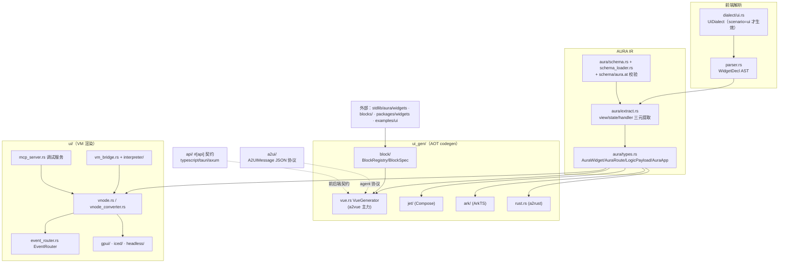

# ui 架构

## 结构图

## ADR 日志

### ADR-01: AURA 作为唯一官方 UI-IR，结构与逻辑绝对解耦
- 日期 / 来源：docs/design/08-ui-systems.md §AURA（raw/aura.md）
- 决策：从 widget 声明提取三个纯元素——视图树（无逻辑）、状态定义（带类型的响应式签名）、事件处理器——组成 AURA IR，所有后端只消费 AURA。
- 备选：A. 每个后端各自解析 AST（pros：无中间层损耗；cons：N 后端 × M 语言特性，行为漂移）；B. AURA 统一 IR（pros：单一对齐点、schema 可校验；cons：IR 表达力成为天花板）。
- 后果：正面——vue/jet/ark/rust 共用 `AuraWidget`；负面——新语法须先扩展 IR。
- 状态：active（`aura/types.rs:AuraWidget` 在役）

### ADR-02: handler 保留为 LogicPayload 而非提取期转译
- 日期 / 来源：docs/design/08-ui-systems.md §Extraction pipeline；`aura/types.rs:LogicPayload`
- 决策：事件逻辑以 `AstBlock`（AOT 后端用）或 `Bytecode`（VM 动态执行用）原样保留在 IR 中。
- 备选：A. 提取期直接生成目标代码（pros：后端简单；cons：IR 与目标耦合，失去多后端）；B. 双形态载荷（pros：codegen 与 VM 渲染共用同一 IR；cons：两种载荷需保持一致）。
- 后果：正面——同一 widget 既能 `auto vue` 生成 SFC 也能 VM 直渲（plan-327/333 验证）。
- 状态：active

### ADR-03: scenario/dialect 条件关键字，UI 关键字不污染核心语言
- 日期 / 来源：docs/design/08-ui-systems.md §Scenario-Based Programming；docs/design/dialect-extension-diagnosis.md §6.1（`dialect/ui.rs` 头注引用）
- 决策：`widget`/`msg`/`model`/`view`/`on` 默认是普通标识符；`pac.at` 的 `scenario: "ui"` 激活 `UiDialect` 后才按关键字解析。实现从"parser 直接查 session"演进为 dialect 注册机制。
- 备选：A. 全局保留字（pros：实现直白；cons：core 场景 `let widget = ...` 被破坏）；B. 条件关键字（pros：零命名空间污染；cons：解析器依赖会话状态，LSP 需同步读 pac.at）。
- 后果：正面——core/shell 场景无冲突；负面——`view` 与 core 参数模式关键字复用同一 TokenKind，靠语句位置区分（dialect/ui.rs 注释）。
- 状态：active（supersede 了 08 文档描述的 parser 直查实现）

### ADR-04: 路由语法 `use module` + 懒加载（Plan 106 取代 Plan 105）
- 日期 / 来源：docs/plans/old/106-router-use-syntax.md；docs/router.md §Plan History
- 决策：`routes { "/" => use index }` 映射 `@/pages/index.vue`，生成 `() => import(...)` 懒加载；旧语法 `"/" => HomePage {}`（组件名转小写、静态 import）保留兼容。
- 备选：A. Plan 105 组件名直引（pros：语义显式；cons：PascalCase 文件名、全量静态打包）；B. Plan 106 use 约定（pros：懒加载、文件约定小写统一；cons：隐式约定需文档化）。
- 后果：正面——首屏 bundle 减小、pages/ 约定稳定；负面——双语法并存，生成器需同时支持（`vue.rs` 内 Plan 105/106 分支）。
- 状态：active（106 为推荐路径）

### ADR-05: a2vue 双模式 API 层（Tauri IPC / Axios HTTP 运行时探测）
- 日期 / 来源：docs/design/08-ui-systems.md §Frontend-Backend Communication（raw/frontend-backend-communication.md）
- 决策：从 `#[api]` 声明生成 `api-interface.ts` + `api-tauri.ts` + `api-http.ts`，运行时 `api.ts` 探测环境选择实现。
- 备选：A. 构建期二选一（pros：产物小；cons：同一份前端无法同时发桌面与 web）；B. 双模式生成（pros：一份代码两形态；cons：三份生成文件需保持同步）。
- 后果：落地于 `src/api/targets/typescript.rs`（另有 tauri/axum 目标）；015-notes（plan-288/354）为首个真实消费者。
- 状态：active

### ADR-06: Block = Skill（spec + reference 双产物，AI 生成而非预烘焙库）
- 日期 / 来源：docs/design/17-blocks-first-class.md §2
- 决策：block 不是预烘焙组件库，而是"自然语言 spec + 结构化 frontmatter + 每 variant 一份 reference `.at` + gotchas"；`auto block add` 由 AI 按 spec 现场生成定制 `.at`，消费者拥有输出源码、可改可 eject。
- 备选：A. 黑盒高配置组件（pros：复用即所得；cons：变体空间高维，props 爆炸——低代码地狱）；B. 纯示例代码（pros：零维护；cons：不算复用）；C. Skill 模型（pros：订制走 NL、验收靠 acceptance 清单；cons：生成可复现性需 reference 锚定 + 编译回路收敛）。
- 后果：`ui_gen/block/registry.rs:BlockRegistry` + 顶层 `blocks/`（form/data-display/editor/navigation）已按包格式落地；Phase B 生成器 CLI 待做（plan-343）。
- 状态：active

### ADR-07: block kind 词汇表圈住订制自由，eject 为天花板
- 日期 / 来源：docs/design/17-blocks-first-class.md §4、§7
- 决策：不定"万能 block"，而定 kind 分类法（Form/Data-display/Feedback/Layout/Composite），每类固定扩展点词汇表；订制超出词汇表 → eject 接管源码。配色/间距归 design token，不进 block。
- 备选：A. 无限 props（cons：不可枚举、AI 无稳定目标）；B. kind 词汇表 + eject（pros：灵活且可文档化；cons：eject 后 spec 改进无法回流——开放问题）。
- 后果：loading/error/empty 成为数据型 block 的强制槽（对接 Rung 2 数据生命周期）。
- 状态：active

### ADR-08: app 生成走"能力阶梯 × 基准阶梯"，拒绝一键生成与反向转译
- 日期 / 来源：docs/design/16-app-generation-and-ai-authoring.md §3、§4、§7
- 决策：AI 生成完整 app 按 Rung 0-5 能力阶梯推进，每阶配 (编译器特性 + gallery 示例 + skill 条目 + 基准 app 评测) 四件套；基准 M1-M6 各覆盖一个互不重叠的能力簇，以"修复轮次 N"为度量。
- 备选：A. 一键生成整个 app（cons：错误无信号、不可迭代）；B. Vue→Auto 反向转译（cons：lossy，背离"AI 直写 Auto"初衷）；C. 阶梯式（pros：失败模式可定位；cons：周期长）。
- 后果：M1=015-notes 扩展（plan-338→354/357/360 系列）；widget 库扩容（plan-337 TODO-A）与 app 生成是同一攀登的两条腿。
- 状态：active
