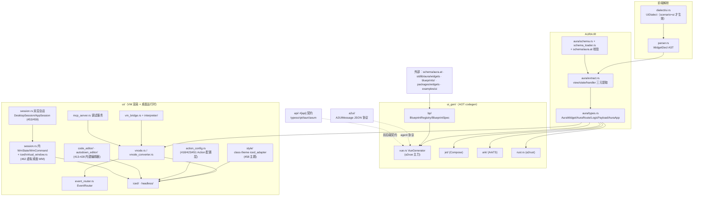

# ui 架构

## 结构图

```mermaid
graph TD
  subgraph 前端解析
    DIALECT["dialect/ui.rs<br/>UiDialect（scenario=ui 才生效）"]
    PARSER["parser.rs<br/>WidgetDecl AST"]
  end

  subgraph AURA IR
    EXTRACT["aura/extract.rs<br/>view/state/handler 三元提取"]
    TYPES["aura/types.rs<br/>AuraWidget/AuraRoute/LogicPayload/AuraApp"]
    SCHEMA["aura/schema.rs + schema_loader.rs<br/>+ schema/aura.at 校验"]
  end

  subgraph 代码生成["ui_gen/（AOT codegen）"]
    VUE["vue.rs VueGenerator<br/>(a2vue 主力)"]
    JET["jet/ (Compose)"]
    ARK["ark/ (ArkTS)"]
    RUSTG["rust.rs (a2rust)"]
    BP["bp/<br/>BlueprintRegistry/BlueprintSpec"]
  end

  subgraph VM运行时["ui/（VM 渲染 + 桌面运行时）"]
    VNODE["vnode.rs / vnode_converter.rs"]
    EVT["event_router.rs EventRouter"]
    BRIDGE["vm_bridge.rs + interpreter/"]
    HOSTS["iced/ · headless/"]
    STYLE["style/ class·theme·iced_adapter<br/>(458 主题)"]
    ACT["action_config.rs<br/>(418/423/451 Action 配置层)"]
    EDITORS["code_editor/ · autodown_editor/<br/>(413-428 内建编辑器)"]
    SESSION["session.rs 双层会话<br/>DesktopSession/AppSession (453/459)"]
    WM["session.rs 内 WmState/WmCommand<br/>+ iced/virtual_window.rs<br/>(462 虚拟桌面 WM)"]
    MCP["mcp_server.rs 调试服务"]
  end

  A2UI["a2ui/<br/>A2UIMessage JSON 协议"]
  API["api/ #[api] 契约<br/>typescript/tauri/axum"]
  EXT["外部：schema/aura.at · stdlib/aura/widgets · blueprints/ · packages/widgets · examples/ui"]

  DIALECT --> PARSER --> EXTRACT --> TYPES
  SCHEMA --> EXTRACT
  TYPES --> VUE & JET & ARK & RUSTG
  BP --> VUE
  TYPES --> VNODE --> EVT
  BRIDGE --> VNODE
  VNODE --> HOSTS
  STYLE & ACT & EDITORS --> HOSTS
  SESSION --> WM --> HOSTS
  MCP --> VNODE
  A2UI -.agent 协议.-> VUE
  API -.前后端契约.-> VUE
  EXT --> BP
```

## ADR 日志

### ADR-01: AURA 作为唯一官方 UI-IR，结构与逻辑绝对解耦
- 日期 / 来源：docs/design/08-ui-systems.md §AURA（raw/aura.md）
- 决策：从 widget 声明提取三个纯元素——视图树（无逻辑）、状态定义（带类型的响应式签名）、事件处理器——组成 AURA IR，所有后端只消费 AURA。
- 备选：A. 每个后端各自解析 AST（pros：无中间层损耗；cons：N 后端 × M 语言特性，行为漂移）；B. AURA 统一 IR（pros：单一对齐点、schema 可校验；cons：IR 表达力成为天花板）。
- 后果：正面——vue/jet/ark/rust 共用 `AuraWidget`；负面——新语法须先扩展 IR。
- 状态：active（`aura/types.rs:AuraWidget` 在役）

### ADR-02: handler 保留为 LogicPayload 而非提取期转译
- 日期 / 来源：docs/design/08-ui-systems.md §Extraction pipeline；`aura/types.rs:LogicPayload`
- 决策：事件逻辑以 `AstBlock`（AOT 后端用）或 `Bytecode`（VM 动态执行用）原样保留在 IR 中。
- 备选：A. 提取期直接生成目标代码（pros：后端简单；cons：IR 与目标耦合，失去多后端）；B. 双形态载荷（pros：codegen 与 VM 渲染共用同一 IR；cons：两种载荷需保持一致）。
- 后果：正面——同一 widget 既能 `auto vue` 生成 SFC 也能 VM 直渲（plan-327/333 验证）。
- 状态：active

### ADR-03: scenario/dialect 条件关键字，UI 关键字不污染核心语言
- 日期 / 来源：docs/design/08-ui-systems.md §Scenario-Based Programming；docs/design/dialect-extension-diagnosis.md §6.1（`dialect/ui.rs` 头注引用）
- 决策：`widget`/`msg`/`model`/`view`/`on` 默认是普通标识符；`pac.at` 的 `scenario: "ui"` 激活 `UiDialect` 后才按关键字解析。实现从"parser 直接查 session"演进为 dialect 注册机制。
- 备选：A. 全局保留字（pros：实现直白；cons：core 场景 `let widget = ...` 被破坏）；B. 条件关键字（pros：零命名空间污染；cons：解析器依赖会话状态，LSP 需同步读 pac.at）。
- 后果：正面——core/shell 场景无冲突；负面——`view` 与 core 参数模式关键字复用同一 TokenKind，靠语句位置区分（dialect/ui.rs 注释）。
- 状态：active（supersede 了 08 文档描述的 parser 直查实现）

### ADR-04: 路由语法 `use module` + 懒加载（Plan 106 取代 Plan 105）
- 日期 / 来源：docs/plans/archive/106-router-use-syntax.md；docs/router.md §Plan History
- 决策：`routes { "/" => use index }` 映射 `@/pages/index.vue`，生成 `() => import(...)` 懒加载；旧语法 `"/" => HomePage {}`（组件名转小写、静态 import）保留兼容。
- 备选：A. Plan 105 组件名直引（pros：语义显式；cons：PascalCase 文件名、全量静态打包）；B. Plan 106 use 约定（pros：懒加载、文件约定小写统一；cons：隐式约定需文档化）。
- 后果：正面——首屏 bundle 减小、pages/ 约定稳定；负面——双语法并存，生成器需同时支持（`vue.rs` 内 Plan 105/106 分支）。
- 状态：active（106 为推荐路径）

### ADR-05: a2vue 双模式 API 层（Tauri IPC / Axios HTTP 运行时探测）
- 日期 / 来源：docs/design/08-ui-systems.md §Frontend-Backend Communication（raw/frontend-backend-communication.md）
- 决策：从 `#[api]` 声明生成 `api-interface.ts` + `api-tauri.ts` + `api-http.ts`，运行时 `api.ts` 探测环境选择实现。
- 备选：A. 构建期二选一（pros：产物小；cons：同一份前端无法同时发桌面与 web）；B. 双模式生成（pros：一份代码两形态；cons：三份生成文件需保持同步）。
- 后果：落地于 `src/api/targets/typescript.rs`（另有 tauri/axum 目标）；015-notes（plan-288/354）为首个真实消费者。
- 状态：active

### ADR-06: Blueprint = Skill（spec + reference 双产物，AI 生成而非预烘焙库；原 "Block = Skill"，PLAN-639 更名）
- 日期 / 来源：docs/design/blueprints/blueprints-first-class.md §2
- 决策：blueprint 不是预烘焙组件库，而是"自然语言 spec + 结构化 frontmatter + 每 variant 一份 reference `.at` + gotchas"；`auto bp add` 由 AI 按 spec 现场生成定制 `.at`，消费者拥有输出源码、可改可 eject。
- 备选：A. 黑盒高配置组件（pros：复用即所得；cons：变体空间高维，props 爆炸——低代码地狱）；B. 纯示例代码（pros：零维护；cons：不算复用）；C. Skill 模型（pros：订制走 NL、验收靠 acceptance 清单；cons：生成可复现性需 reference 锚定 + 编译回路收敛）。
- 后果：`ui_gen/bp/registry.rs:BlueprintRegistry` + 顶层 `blueprints/`（form/data-display/editor/navigation）已按包格式落地；Phase B 生成器 CLI 已落地（plan-343）；PLAN-639 升级三通道分级消费（L1 import/bind 主通道）+ 契约六问（docs/specs/blueprint/contract.md）。
- 状态：active

### ADR-07: blueprint kind 词汇表圈住订制自由，eject 为天花板
- 日期 / 来源：docs/design/blueprints/blueprints-first-class.md §4、§7
- 决策：不定"万能 blueprint"，而定 kind 分类法（Form/Data-display/Feedback/Layout/Composite），每类固定扩展点词汇表；订制超出词汇表 → eject 接管源码。配色/间距归 design token，不进 blueprint。
- 备选：A. 无限 props（cons：不可枚举、AI 无稳定目标）；B. kind 词汇表 + eject（pros：灵活且可文档化；cons：eject 后 spec 改进无法回流——开放问题）。
- 后果：loading/error/empty 成为数据型 blueprint 的强制槽（对接 Rung 2 数据生命周期）。
- 状态：active

### ADR-08: app 生成走"能力阶梯 × 基准阶梯"，拒绝一键生成与反向转译
- 日期 / 来源：docs/design/16-app-generation-and-ai-authoring.md §3、§4、§7
- 决策：AI 生成完整 app 按 Rung 0-5 能力阶梯推进，每阶配 (编译器特性 + gallery 示例 + skill 条目 + 基准 app 评测) 四件套；基准 M1-M6 各覆盖一个互不重叠的能力簇，以"修复轮次 N"为度量。
- 备选：A. 一键生成整个 app（cons：错误无信号、不可迭代）；B. Vue→Auto 反向转译（cons：lossy，背离"AI 直写 Auto"初衷）；C. 阶梯式（pros：失败模式可定位；cons：周期长）。
- 后果：M1=015-notes 扩展（plan-338→354/357/360 系列）；widget 库扩容（plan-337 TODO-A）与 app 生成是同一攀登的两条腿。
- 状态：active

### ADR-09: 组件契约单源 schema/aura.at，数据流翻转
- 日期 / 来源：plan-435（2026-08）
- 决策：散落 8 处的组件定义收敛为一份 `.at` schema（扩展 aliases/tier/backends/deprecated 字段）+ 统一注册表；schema 管契约、Rust 管行为，render_support/vue import 映射从 schema 派生，CI 拦截漂移。canonical=kebab-case，变体进 aliases。
- 备选：A. Rust 硬编码为源（cons：漂移实证 8 处）；B. schema 单源派生（pros：一处改处处生效；cons：派生链需维护）。
- 后果：`schema/aura.at` 成为 widget/chart 契约唯一源；462 要求 virtual_window 经此登记（I4，随桌面线收尾合入）。
- 状态：active

### ADR-10: DSL 现代化——widget 单轨 + setup 三相位 + msg 简写
- 日期 / 来源：plan-425/426/436/448（2026-08）
- 决策：component fn 降为 AST 级语法糖（parse 期产出等价 WidgetDecl，删 fragment 双轨）；widget 生命周期定版三相位 setup/.Init/.Destroy（setup 为每实例、首渲染前语句槽；vue 置于 script setup 顶层、解释器 L1 单实例、a2r 显式报错而非静默丢弃）；msg 声明去名 + 事件内联 lambda 简写（铸名提前到 parser，修复 decl 路径静默吞 HandlerNotFound）。
- 备选：双轨保留（cons：199 行重复与行为漂移实证）；a2r 静默丢 setup（cons：违背显式报错哲学）。
- 后果：`.at` 渲染路径唯一（Element+known_sub_widgets）；`use.web` composable 降为糖。
- 状态：active

### ADR-11: Action = 声明/绑定层，Event = 执行层
- 日期 / 来源：plan-418/423/451（2026-08）
- 决策：Action 定位为可寻址/可配置/可多路触发的语义事件（id 点分形式为 OS 键位层跨版本契约），最终仍派发为 on{} handler 事件，VM 分发零改动；actions{} 并入 widget DSL（外挂 .at 配置保留兼容），配置层支持热重载（Arc<RwLock<Arc<UiActionConfig>>> 零锁读、坏配置降级保旧值）、分层 keymap（app 内置→OS 用户层覆盖）、表达式条件（enabled_if/checked_if 走 Expr 求值）。
- 备选：Action 直连执行（cons：不可配置/不可多路）；外挂配置文件（cons：双源、LSP 不可见）。
- 后果：vue 侧补全链路（全局 keydown 回退层 + menubar/toolbar 组件树合成）；rfd 对话框/剪贴板/undo 等 natives 落 catalog。
- 状态：active

### ADR-12: VM 组件写法边界——无 props 读 store
- 日期 / 来源：plan-449 实测（2026-08）
- 决策：VM 后端组件回调 props 退化（on_xxx: msg 使组件整体 fallback）、快照组件子树不可见、片段参数化条件不求值三缺口登记后，确立 VM 组件一律无 props、经共享 store 通信、handler 留根视图的写法（"013 式"）。
- 备选：等待三缺口根治（cons：阻塞 041 组件化与后续桌面 App 拆分）。
- 后果：041-auto-edit 拆 app+store+三组件零回归；根治后可解除约束（债务簿在案）。
- 状态：active（约束式，待三缺口修复解除）

### ADR-13: 会话化运行时与 iced daemon 多窗口
- 日期 / 来源：plan-453/459（2026-08，蓝图 reports/453-t4c、459-t1）
- 决策：run_dynamic_iced 拆双层会话——进程级 DesktopSession + 每 App AppSession（运行循环 State 即 DesktopSession，renderer DynamicState 溶解拆借）；iced 入口迁 `iced::daemon`（view 带 window::Id、按 app_of_window 路由），开窗经 Event::Window(Opened) 自捕获；修饰键唯一源载荷化入 DesktopState；update 包 catch_unwind panic 边界；一窗一 App 不变式，全窗关闭显式 exit。
- 备选：application 单窗口 + PENDING_WINDOW_OPENS 通道（cons：多窗口非一等公民、通道竞态）。
- 后果：为 462 虚拟桌面（窗口内再分层）与多 OS 窗口形态同时铺路；Subscription map 受 const 检查约束改 fn 指针 + 自定义 Recipe。
- 状态：active（supersede 了 453 前的单会话形态）

### ADR-14: 虚拟桌面路线 A——单 OS 窗口 VirtualWindow z-stack
- 日期 / 来源：Design 23（docs/design/autoui/virtual-desktop.md R1–R7，2026-08-26 转正）+ plan-452/462
- 决策：一个 OS 窗口内 N 个 App：VirtualWindow widget（候选 B 定案：Stack/clip/mouse_area 组合 + 全局事件状态机）承载裁剪/事件路由/焦点分区；WmState/Wid 窗口注册表；DM::Wm 第四消息变体（Focus/Close/Move/Resize/Raise）；键盘路由改桌面层前置段（独立模式零回归=配置差异非分支）。**翻转** plan-365 的"Windows 非 compositor"裁定（R2：DWM 下虚拟窗口组合可行）。路线 B（386 分离渲染）后置，接缝已预留。
- 备选：A. 每 App 一 OS 窗口（459 已支持，但非"桌面"形态）；B. 分离渲染进程（386，内存优势但复杂度高、复活条件未满足）。
- 后果：463/464/465 全部构建于此；MCP 寻址 (AppId,widget) v1 指向焦点窗（T8 冻结）；组合中失焦 discard/preedit 两项遗留。
- 状态：active

### ADR-15: 桌面 shell 即普通 AutoUI App（启动=挂载）
- 日期 / 来源：Design 24/25（docs/design/autoui/desktop-shell-and-launcher.md R8–R12、25-autoshell-dsl-unified-shell.md）+ plan-463/464
- 决策：桌面 shell（全屏 borderless 宿主 + 任务栏 overlay 槽 + 排布）与 launcher 都是普通 AutoUI App：排布为纯函数（free/grid/master-stack，单测锁定）；应用注册表=扫描 apps 目录 pac.at（补 icon/category 字段）；DesktopBus v0 生命周期命令（LaunchApp 等）；launcher 经 Ctrl+Space 召唤进 overlay、`desktop.launch(name)` 真启动（R11：启动=挂载新虚拟窗，launcher 自隐匿）；内核/用户态分界与 workspace 驱动模型见 Design 25。
- 备选：shell 特权内建（cons：违背"shell 是 AutoUI"统一层初衷，双端不一致）。
- 后果：shell 可用 vue/vm 双端同一套声明；examples App 默认 render:"vue" 需注册表按 render 过滤 + 失败占位页。
- 状态：active（463 落地；464 设计待实施）

### ADR-16: vue 宿主 = 页面级虚拟桌面（设计裁定，待实施）
- 日期 / 来源：Design 23 R4/R5 + plan-465（2026-08，已立项未开工）
- 决策：一个 vue 页=一个虚拟桌面：每虚拟窗一个 `createApp().mount(container)` 实例级隔离；virtual_window 的 a2vue/DOM 实现为 absolute+clip+pointer 路由（WM 的第四叶）；registry 必须构建期生成（vite 动态 import 需静态可分析）；Web 永远是 A 形态（不搞 iframe/多进程/BroadcastChannel）。
- 备选：iframe 隔离（cons：样式/主题/通信割裂，出界）。
- 后果：vue codegen 的 modal fixed/teleport-to-body 页面级假设需改造（vue.rs:6310/3599/4057 已定位）；tauri 壳全屏打包。
- 状态：proposed（465 施工后转正）

### ADR-17: 双端 parity 与主题下沉为引擎规范
- 日期 / 来源：plan-455/458 + 450/451-image/452-login 系列（2026-08）
- 决策：parity 不再是逐例修复，而是引擎级标准：Status::Focused 2px ring、text 标签盒模型、全 margin 语义、按钮 14px/font-medium 等；theme/accent 成为一等配置（优先级=运行时切换>CLI/pac.at 播种>内置默认 dark+indigo），经 env（AUTO_UI_THEME/ACCENT）横切三 crate，不进 DesktopSession 字段；视觉差异报告必须经 vtree/snapshot/插桩结构数据交叉验证才立项（411 方法论）。Plan 503 校准：coral 预设 = stella 玫瑰粉 #c4706a（HSL 4,43%,59%），桌面视觉体系（dock/弹层 glass/壁纸 scrim/窗口 chrome/launcher 品牌色）确立「无 blur/scale/keyframes」降格 parity 条款，见 [design/desktop-shell.md](design/desktop-shell.md)。
- 备选：parity 逐例修（cons：标准漂移、回归无锚）；主题进会话状态（cons：三 crate 横切复杂化）。
- 后果：455 跟踪器矩阵为验收基准（~9 绿/8+ 待审计）；"auto 跟随系统"显式非目标。
- 状态：active

### ADR-18: chart 族发射 = schema 声明驱动（契约单源）
- 日期 / 来源：plan-437 Phase 1（2026-08-28，435 统一声明体系首批示范）
- 决策：chart 族（area/bar/line/donut/chart/charttooltip/chartlegend 七元素）的 props 契约全量落库 schema/aura.at（唯一契约源），registry overlay（apply_schema_vue_mappings）把声明填进 vue BackendMapping.props，vue.rs 四个硬编码 match 臂（~130 行）退役，收敛为 emit_chart_family_attrs 遍历声明发射（按声明名排序保序）；值级转换保留为转换层特例（curve-type 字符串→CurveType 枚举、custom-tooltip 组件引用恒绑定）。
- 备选：继续硬编码臂 + 契约注释（cons：435 审计的"实现比声明多"典型样本，声明与发射漂移无围栏）。
- 后果：契约测试锁声明→发射全链（cap_chart_family_props_contract_in_registry）；奇偶校验证明新旧臂输出仅属性序差异；后续 chart 属性扩展只改 schema。
- 状态：active

### ADR-19: VM 轨子组件 Init 渲染期补发（props 播种 → Init → build）
- 日期 / 来源：plan-437 Phase 2（2026-08-28，组件化的真阻塞）
- 决策：VM 轨视图中实例化的子组件（组件包/本地 widget），在 prepare_child_render_state 播种 props（含 prop 声明默认值）后由渲染器补发一次 Init（call_handler_for 放宽 &self，AutoVM 全链 interior-mutable）；每渲染帧重放，纯派生 Init 幂等；tracked 双胎同步。配套五项解析臂补全：Expr::Array props、svg 子树 ForLoop 展开（445 Conditional 修复同族）、Index 属性求值、prop 默认值播种、VM 包装载路径基准对齐（pages/ 候选）。
- 备选：computed 求值器扩展块体/循环（cons：view-build 快速路径复杂化，与 VM 字节码执行语义重复）；子组件独立 VM（cons：破坏单 VM 合成架构）。
- 后果：vue 轨 onMounted 与 VM 轨语义对齐，chart 等派生计算型组件双轨可用；**副作用型子组件 Init 随脏重建重放**（v1 近似，组件 Init 应保持纯派生）；vue-tsc/结构同源已证，视觉并排未重做。
- 状态：active（重放语义收敛留后续：dirty-prop 比对后重放）

### ADR-20: 内嵌 demo 模块组件桥接——use.web 适配器链与根 use 环同权装载
- 日期 / 来源：plan-632（2026-09-15，ui-gallery VM 保真度核查会话裁定）
- 决策：模块组件（`use <mod>: Component`）在 VM 渲染目标与 `use.web` 组件同保真——实例展开视图子树、按实例 props 桥接参数；store 型组件（模块含 store 声明）的状态注入消费方作用域。四项装载不变量：①use.web 适配器链（Demo*.at）携带的 StoreDecl 与根 use 环同权进 store→child 转换（ext 装载后补转换位，按名去重，`store_decl_as_widget_decl` 公共转换体）；②dep 目录 item 命名文件（`deps/{dep}/{item_snake}.at`）为 `use <dep>: Component` 的合法解析目标（resolve_use_module 走 dotted-module 探测，snake_case 优先）；③已装载模块自身 use 链上的 widget 按显式 items/通配注册进 registry+child_decls（扫 visited 全集；P545 语义——bare use 不触发）；④模块 use 的符号别名（裸名→模块限定名，or_insert 根环优先）覆盖全部已装载文件（视图 computed 内模块 fn 调用可达）。
- 备选：store 命名分支泛化（T-01 实测证伪——`use <mod>: Store` 经邻接文件 Module 分支本就工作，standalone 016 全通）；发射器侧实例化清单（cons：组件状态桥接是运行时职责，发射器只保证源可达）。
- 后果：画廊内嵌 006 SettingsPopover 开合可用、016 CalendarStore 网格/选中全保真（实机 MCP 10/10 双轮：实现期+复审期）；装配顺序缺陷类（ext 装载晚于转换位的声明）由补转换位兜底。App.Init 兜底告警为宿主根件无 Init 的既有形态（KNOWN-DEBT P632-D1）。
- 状态：active

### ADR-21: 多命名视图（`view mini`）与第二渲染面——桌面常驻小组件层的语言/会话支撑
- 日期 / 来源：PLAN-024（2026-09-17/18，auto-os dashboard-widgets；用户裁定走查 R1–R21 收敛）
- 决策：①语言层 widget 支持多命名视图（`view mini { … }`，`WidgetDecl.named_views`；widget 体 `view` 臂 peek 分派——`{` 主视图 / Ident 命名视图 / `fn` 顶层片段不扰；duplicate 主视图与命名视图均报错，主视图静默覆盖旧疾顺带修复）；②提取全链（aura/动态轨 `named_templates` BTreeMap + `view_named()`/vue `named_view_codes` 克隆换根复用整条 SFC 管线）；③会话层 `SessionViewRef.view_name` 选择器 + `DynamicComponent.view_named`（与主视图共享同一 VM 桥=活渲染面）；④无窗孵化会话（`hatch_mini_app`：文本探测 + 无 daemon/back_root/exe 门 + `named_views()` 精确确认；face_fields 垫片 + split_mut 第八路拆借——无窗会话 update 通路由此打通）；⑤**升格开窗原语** `open_window_for_session`（为既有 AppSession 建虚拟窗，face/窗同会话零分家）。
- 备选：截图/缩放（否——字不可读，Design 24 早已否决）；shell 重画（否——双份维护违反所有权）；主窗会话开窗（否——同 app 双会话状态分裂）。
- 后果：`.as(int)` 对 float 产出垃圾值（CPU 44% 整条红实证）——浮点阈值判定一律累加比较绕行；styled text 节点宽度行为使 items-center 对其失效——`text-center` 显式声明；.at 对象键 `on` 撞关键字（seg 表键名 `lit`）；vue 轨需 API-client-glue 的 app（013-todo）被宿主门跳过（iced 轨正常）。**float→int 转换在 VM 内不可靠**升格为通用教训。
- 状态：active（vue 轨 autoui-verifier 真跑对拍延后——F-02，unblock=pnpm install + 浏览器）

### ADR-22: 浮层投递语义单源化——opaque 捕获边界=内容矩形,几何 spacer 留在边界外
- 日期 / 来源：PLAN-023 T-01 判决工件(auto-term `docs/plans/evidence/023/t01-verdict.md`,2026-09-19;根修 plan-023-dev fc6ccc810)
- 决策：absolute/Overlay → iced Stack + opaque 的浮层映射中,`opaque` 只包浮层内容元素(捕获边界=内容矩形,CSS absolute 命中语义),几何 spacer/padding 留在边界外;top 偏移一律 Column padding(零宽 Space 主轴高度被 flex 吞,R8 实录),left 偏移行内非零宽 Space;交互测试断言面一律消息流(`on_click` 闭包构建期调用一次,计数副作用不可用)。细则篇:`design/overlay-interaction.md`。
- 备选：iced 上游 vendored patch(否——T-01 判本仓映射误用,Stack/opaque/capture 语义自洽,Shell 每事件新建即复位);每浮层自绘命中检测(否——重复发明 Stack 逆序投递)。
- 后果：分屏双浮层"首轮交互后全灭"终结(实车三动作探针全活:双槽 TERM_PRESS/FOCUS/KEY + pane-2 WHEEL + 拖拽几何随动);PLAN-022 T-05"移除 opaque 轨迹不变"实验确认为测量伪影致盲(on_click 伪影),opaque 边界过宽即元凶;022 T-06 门由本 ADR 解锁。
- 状态：active

### ADR-23: 窗口缩略快照末帧保留（冻结集）+ 图片负缓存重试 + fit 双轴自然测量
- 日期 / 来源：PLAN-040（2026-09-22，auto-os desktop-ux-fit-and-taskbar；用户实机走查三连修的 lang 侧语义收口；代码 @5dd8bf8fd/1f8cc66b5）
- 决策：①**窗口缩略快照末帧保留**：任务栏 hover 预览 / pager 分区缩略对**最小化/隐藏/被更高 z 序遮挡/不在当前分区**的窗进入冻结集（`snapshot.rs` frozen 集——`request_capture` 冻结 no-op、`cache_put` 拒收、`snapshot_window_stale` 冻结恒 fresh），预览画保留的最后一帧；冻结判据 `sync_snapshot_frozen` 每 tick 全量校正 + `wm_minimize` 即时冻结 + `SnapshotShot` 裁剪回调裁决前现算（双保险封死在途截图污染）。Plan 497「裁剪式整窗快照」对不可见窗裁到壁纸/他窗像素的根修——Windows DWM redirection surface / macOS NSWindow backing store 同款 OS 惯例；Plan 497 待澄清③（子树离线栅格化）在本 iced 版本不可行的替代语义。②**图片负缓存重试**：`load_image_bytes` 本地文件读取失败不永久缓存，改 1s 负缓存后重试——壁纸/缩略重启丢失的根修（PLAN-035 T-17 家族姊妹语义）。③**fit 双轴自然测量**：`fit_aware_root` 对 `window: "fit"` app 双轴（Direction::Both 隐藏滚动条）+ 锚点 Shrink×Shrink——P679-D1 宽度 Fill 视口钳制退役（Fill 根链"测量值"=当前窗口尺寸→fit 恒等号永不收缩），Plan 512 v1 单轴语义修订为双轴自然；后代 bbox 方案因桌面复合场景同坐标系污染（他窗/图标网格节点落入锚点矩形）弃用。
- 备选：①逐帧重渲染缩略（否——最小化窗无在屏 framebuffer，Plan 497 待澄清③已裁定离线栅格化不可行）；③锚点后代 bbox 并集（否——同坐标系污染，见决策③）。
- 后果：最小化/遮挡窗预览恒正确（用户实机确认"hover 的预览确实是正确的末帧了"）；冻结窗恢复可见即解冻重抓。已知观察面：主题热切换时 dashboard face 渲染滞留（PLAN-040 F-R1 待澄清，暂规避=重启）。
- 状态：active
