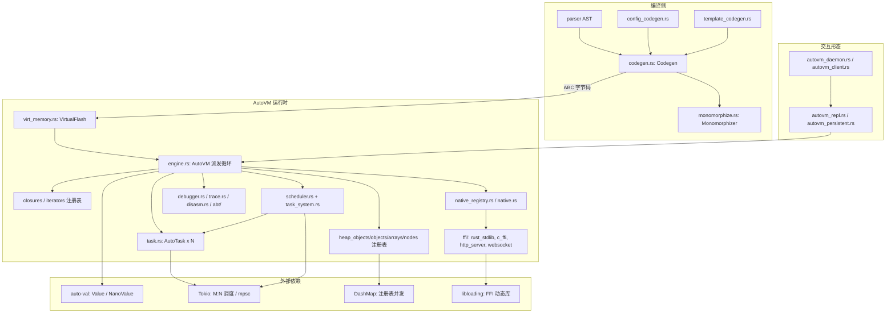

# vm 架构

## 结构图

## ADR 日志

### ADR-01: 栈式虚拟机 + 变长 ABC 指令编码
- 日期 / 来源：2025-02-06 / plan-068、docs/design/05-vm-runtime.md §ABC
- 决策：ABC 为栈式指令集，1 字节 opcode + 变长小端操作数；RET 采用 callee-cleanup（携带参数个数清栈）；跳转用 16 位有符号相对偏移，保证位置无关。
- 备选：寄存器式 VM（pros：指令数少、便于优化；cons：编码宽、与 XIP flash 模型不匹配）。
- 后果：编码紧凑、解码简单；变长解码使 disasm/调试器必须走 `OpCode::from_u8` 表驱动。栈槽位宽部分后被 ADR-06 取代。
- 状态：active

### ADR-02: AutoVM 取代 tree-walking evaluator 成为默认执行后端
- 日期 / 来源：2025-02 / plan-073、plan-081；plan-091 移除 evaluator 选项（见 `execution_engine.rs` 注释）
- 决策：编译到字节码执行，而非解释 AST；`ExecutionEngine` 恒为 AutoVM，`evaluator` 枚举值标记 deprecated 并重定向。
- 备选：双后端长期并存（pros：对照调试方便；cons：双份语义维护、特性漂移）。
- 后果：plan-report 07 记录平均 23.77x 加速、97.4% 特性对齐（1254/1288）。注意 plan-indices 07 "Key Achievements" 写 1.00-1.10x，两处数字矛盾，未在代码中考证出可复现基准，以报告原文为准存疑。
- 状态：active

### ADR-03: 闭包直接捕获（direct capture），不用 upvalue
- 日期 / 来源：2025-02-03 / plan-071
- 决策：`Closure { func_addr, env: HashMap<String, Value>, n_args }`，捕获值在创建时拷贝进 env；编译器拒绝 `.view`/`.mut` 借用捕获并给出报错引导。
- 备选：Lua 式 upvalue 共享引用（pros：语义贴近引用捕获；cons：逃逸闭包悬垂引用风险，需额外逃逸分析）。
- 后果：逃逸闭包天然安全；嵌套闭包靠 `current_closure_id`/`saved_closure_id` 在 CALL_CLOSURE/RET 间保存恢复；放开借用捕获需数据流分析（report 07 Open Questions；plan-310 已交付 ownership/escape 分析，2026-06-16）。
- 状态：active

### ADR-04: 泛型单态化 + 类型擦除存储
- 日期 / 来源：2026-02-06 / plan-076、plan-087
- 决策：编译期 `GenericTable` 记录实例化，`Monomorphizer` 为每种类型参数生成特化字节码；内置集合特化存储（`List<int>` → `ListData<i32>`），用户泛型（`Pair<K,V>`）走类型擦除 `Vec<Value>` 字段。
- 备选：全 `Value` 装箱（pros：实现统一；cons：原始类型内存放大约 6 倍，缓存不友好）。
- 后果：原始类型零开销访问；残留限制——命名参数构造调用语法 `Pair(key: 1, val: "a")` 与泛型实例类型标注不支持（report 07 §Generics）。
- 状态：active

### ADR-05: 统一堆对象注册表（HeapObject trait + DashMap）
- 日期 / 来源：2026-02-06 / plan-077
- 决策：`DashMap<u64, Arc<RwLock<dyn HeapObject>>>` 单一注册表取代每类型注册表；trait 提供 `type_tag()` + `as_any()` 下转；`try_downcast_checked()` 合并 tag 检查与下转。
- 备选：保留每类型注册表（pros：无下转开销；cons： opcode 处理分散、新增类型要动多处）。
- 后果：plan 记录单次下转约 +15ns，但原始 list 内存降 6 倍，实际负载净 1.43x 加速。代码中旧 list 注册表已移除（`engine.rs` "Plan 077 Phase 6" 注释），plan 文件自述 50% 属滞后。
- 状态：active

### ADR-06: NaN-boxing 值表示（NanoValue）
- 日期 / 来源：2026（plan-221，无日期行）；清理完成 2026-06-12 / plan-298
- 决策：栈与堆值统一为 u64 NaN-boxed `NanoValue`（`auto-val/src/nano_value.rs`）；f64 直存零开销，其余类型用 4-bit tag + 32-bit payload；string payload 存负 i32 tag，使 `decode_i32` 往返保持字符串身份。
- 备选：保留 `Vec<i32>` 槽 + 旁路 f64 双槽（pros：改动小；cons：类型标签带外传递、EQ/NE 需特判）。
- 后果：bool 用 i32::MIN / MIN+1 哨兵；`VirtualRAM.raw: Vec<i32>` 为迁移残留，实际栈走 `raw_nv`；supersedes ADR-01 中"32 位栈槽"。
- 状态：active

### ADR-07: VM 执行模式无关，CONFIG/TEMPLATE 由独立 codegen 实现
- 日期 / 来源：2026-02-05 / plan-075
- 决策：新增 `ConfigCodegen`/`TemplateCodegen` 把配置/模板文件编译为普通字节码，VM 不加任何 mode 分支；配套 TO_STR/IS_NIL/STR_CAT 三个 opcode。
- 备选：VM 内建 mode 感知（pros：复用主 codegen；cons：执行引擎语义分裂）。
- 后果：三种执行模式共享同一引擎与调试器。
- 状态：active

### ADR-08: Tokio M:N 调度 + actor 消息并发
- 日期 / 来源：docs/design/05 §Concurrency；2026-03-15 / plan-121；plan-127（Phase 1-3）
- 决策：`AutoVM`（共享运行时）与 `AutoTask`（每任务栈/帧/IP）分离；任务经 `tokio::spawn` 调度，`DashMap<TaskId, Arc<Mutex<AutoTask>>>` 管理；消息经类型化 mailbox + `TaskHandlerTable` 模式路由。
- 备选：共享状态 + 锁（cons：违背 actor 私有状态原则）；每任务 OS 线程（cons：数量受限、无 M:N 优势）。
- 后果：SPAWN/SEND/RECV 等 9 个并发 opcode；SEND/RECV 目前 busy-wait + yield，真异步 await 待做（report 07 Open Questions；plan-317 Phase 2-4 待实施）。
- 状态：active

### ADR-09: 单一 native 注册表 + QualifiedName 命名空间
- 日期 / 来源：2026-04-21 / plan-203；plan-249
- 决策：`AutoVMNativeRegistry` 单一注册入口（惰性注册 + catalog 宏），函数以 `QualifiedName` + `resolve_qualified` + import scope 解析；消除约 137 个短名别名。
- 备选：双注册表并存（BIGVM_NATIVES + shim registry）（pros：兼容历史；cons：重复注册、名冲突、dispatch 不一致）。
- 后果：泛型方法的单态派发随之重构；plan-203 Phase 5f 仍 deferred。
- 状态：active

### ADR-10: 一致性驱动开发（VM ↔ a2r 语义对齐）
- 日期 / 来源：2026-05-25 / plan-266；docs/conformance/README.md
- 决策：新语言特性先写 conformance 规范（语义、AutoVM opcode、a2r 映射、边界），再写对偶测试，最后实现；发现不一致时以测试结果为准回改规范。
- 备选：实现先行、事后对齐（cons：漂移发现晚、返工大）。
- 后果：`docs/conformance/` 规划 10 章（01/02/03/04/10 为 Draft，余 Planned）；对偶测试在 `test/a2r/conformance/`，差分测试用随机程序生成器。
- 状态：active
