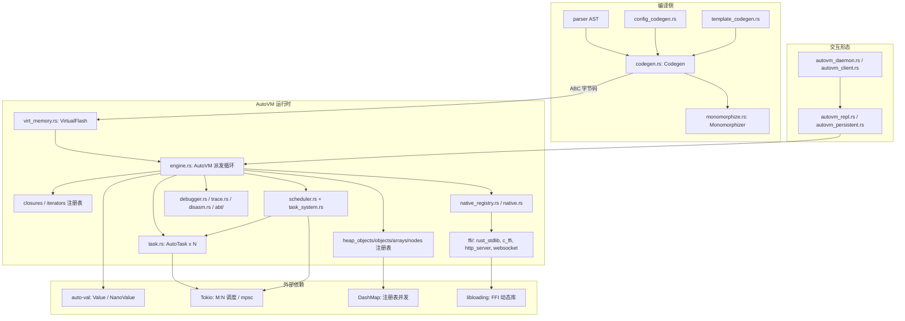

# vm 架构

## 结构图

```mermaid
graph TD
  subgraph 编译侧
    AST[parser AST] --> Codegen[codegen.rs: Codegen]
    Codegen --> Mono[monomorphize.rs: Monomorphizer]
    Cfg[config_codegen.rs] --> Codegen
    Tpl[template_codegen.rs] --> Codegen
  end

  subgraph AutoVM 运行时
    Codegen -->|ABC 字节码| Flash[virt_memory.rs: VirtualFlash]
    Flash --> Engine[engine.rs: AutoVM 派发循环]
    Engine --> Tasks[task.rs: AutoTask x N]
    Engine --> Heap[heap_objects/objects/arrays/nodes 注册表]
    Engine --> Cls[closures / iterators 注册表]
    Engine --> Sched[scheduler.rs + task_system.rs]
    Sched --> Tasks
    Engine --> Nat[native_registry.rs / native.rs]
    Nat --> FFI[ffi/: rust_stdlib, c_ffi, http_server, websocket]
    Engine --> Dbg[debugger.rs / trace.rs / disasm.rs / abt/]
  end

  subgraph 交互形态
    Repl[autovm_repl.rs / autovm_persistent.rs]
    Daemon[autovm_daemon.rs / autovm_client.rs]
    Repl --> Engine
    Daemon --> Repl
  end

  subgraph 外部依赖
    AV[auto-val: Value / NanoValue]
    TK[Tokio: M:N 调度 / mpsc]
    DM[DashMap: 注册表并发]
    LL[libloading: FFI 动态库]
  end

  Engine --> AV
  Tasks --> TK
  Sched --> TK
  Heap --> DM
  FFI --> LL
```

## ADR 日志

### ADR-01: 栈式虚拟机 + 变长 ABC 指令编码
- 日期 / 来源：2025-02-06 / plan-068、docs/design/05-vm-runtime.md §ABC
- 决策：ABC 为栈式指令集，1 字节 opcode + 变长小端操作数；RET 采用 callee-cleanup（携带参数个数清栈）；跳转用 16 位有符号相对偏移，保证位置无关。
- 备选：寄存器式 VM（pros：指令数少、便于优化；cons：编码宽、与 XIP flash 模型不匹配）。
- 后果：编码紧凑、解码简单；变长解码使 disasm/调试器必须走 `OpCode::from_u8` 表驱动。栈槽位宽部分后被 ADR-06 取代。
- 状态：active

### ADR-02: AutoVM 取代 tree-walking evaluator 成为默认执行后端
- 日期 / 来源：2025-02 / plan-073、plan-081；plan-091 移除 evaluator 选项（见 `execution_engine.rs` 注释）
- 决策：编译到字节码执行，而非解释 AST；`ExecutionEngine` 恒为 AutoVM，`evaluator` 枚举值标记 deprecated 并重定向。
- 备选：双后端长期并存（pros：对照调试方便；cons：双份语义维护、特性漂移）。
- 后果：plan-report 07 记录平均 23.77x 加速、97.4% 特性对齐（1254/1288）。注意 plan-indices 07 "Key Achievements" 写 1.00-1.10x，两处数字矛盾，未在代码中考证出可复现基准，以报告原文为准存疑。
- 状态：active

### ADR-03: 闭包直接捕获（direct capture），不用 upvalue
- 日期 / 来源：2025-02-03 / plan-071；PLAN-385/454/667 修订
- 决策：`Closure { func_addr, env, n_args, capture_slots, param_abs, creator_frame }`。
  **当前实际捕获形态（PLAN-667 钉定）**：局部/参数捕获是 **by-reference**——
  `capture_slots: HashMap<name, (creator_bp, slot_offset)>` / `param_abs`（绝对槽），
  LOAD/STORE_CAPTURED 直接读写创建者帧；env 只承载 by-value 副本
  （0xFFFF 槽位/不可解析名/合成闭包）。编译器仍拒绝 `.view`/`.mut` 借用捕获。
- **捕获有效期（PLAN-667 F-01 守卫）**：`creator_frame = (task_id, frame_uid)`；
  帧相对捕获在任何槽位读写前校验——创建者帧已返回（含同 bp 复用）或跨任务
  即 RuntimeError 拒绝（不静默读陈旧槽/跨帧写）。创建者存活期内（含
  call_closure 同步谓词、嵌套闭包传递继承祖父帧锚、生成器挂起）为已验证
  支持面；TimerCallback 等异步回调只支持 by-value env 捕获。完整支持矩阵见
  `docs/specs/auto-lang/vm/design/memory-safety-boundary.md`。
- 备选：Lua 式 upvalue 共享引用（pros：语义贴近引用捕获；cons：逃逸闭包悬垂引用风险，需额外逃逸分析）。
- 后果：by-ref 捕获有效期=创建帧存活期（运行期受检错误，非编译期保证）；
  嵌套闭包靠 `current_closure_id`/`saved_closure_id` 在 CALL_CLOSURE/RET 间保存恢复。
- 状态：active

### ADR-04: 泛型单态化 + 类型擦除存储
- 日期 / 来源：2026-02-06 / plan-076、plan-087
- 决策：编译期 `GenericTable` 记录实例化，`Monomorphizer` 为每种类型参数生成特化字节码；内置集合特化存储（`List<int>` → `ListData<i32>`），用户泛型（`Pair<K,V>`）走类型擦除 `Vec<Value>` 字段。
- 备选：全 `Value` 装箱（pros：实现统一；cons：原始类型内存放大约 6 倍，缓存不友好）。
- 后果：原始类型零开销访问；残留限制——命名参数构造调用语法 `Pair(key: 1, val: "a")` 与泛型实例类型标注不支持（report 07 §Generics）。
- 状态：active

### ADR-05: 统一堆对象注册表（HeapObject trait + DashMap）
- 日期 / 来源：2026-02-06 / plan-077
- 决策：`DashMap<u64, Arc<RwLock<dyn HeapObject>>>` 单一注册表取代每类型注册表；trait 提供 `type_tag()` + `as_any()` 下转；`try_downcast_checked()` 合并 tag 检查与下转。
- 备选：保留每类型注册表（pros：无下转开销；cons： opcode 处理分散、新增类型要动多处）。
- 后果：plan 记录单次下转约 +15ns，但原始 list 内存降 6 倍，实际负载净 1.43x 加速。代码中旧 list 注册表已移除（`engine.rs` "Plan 077 Phase 6" 注释），plan 文件自述 50% 属滞后。
- 状态：active

### ADR-06: NaN-boxing 值表示（NanoValue）
- 日期 / 来源：2026（plan-221，无日期行）；清理完成 2026-06-12 / plan-298
- 决策：栈与堆值统一为 u64 NaN-boxed `NanoValue`（`auto-val/src/nano_value.rs`）；f64 直存零开销，其余类型用 4-bit tag + 32-bit payload；string payload 存负 i32 tag，使 `decode_i32` 往返保持字符串身份。
- 备选：保留 `Vec<i32>` 槽 + 旁路 f64 双槽（pros：改动小；cons：类型标签带外传递、EQ/NE 需特判）。
- 后果：bool 用 i32::MIN / MIN+1 哨兵；`VirtualRAM.raw: Vec<i32>` 为迁移残留，实际栈走 `raw_nv`；supersedes ADR-01 中"32 位栈槽"。
- 状态：active

### ADR-07: VM 执行模式无关，CONFIG/TEMPLATE 由独立 codegen 实现
- 日期 / 来源：2026-02-05 / plan-075
- 决策：新增 `ConfigCodegen`/`TemplateCodegen` 把配置/模板文件编译为普通字节码，VM 不加任何 mode 分支；配套 TO_STR/IS_NIL/STR_CAT 三个 opcode。
- 备选：VM 内建 mode 感知（pros：复用主 codegen；cons：执行引擎语义分裂）。
- 后果：三种执行模式共享同一引擎与调试器。
- 状态：active

### ADR-08: Tokio M:N 调度 + actor 消息并发
- 日期 / 来源：docs/design/05 §Concurrency；2026-03-15 / plan-121；plan-127（Phase 1-3）
- 决策：`AutoVM`（共享运行时）与 `AutoTask`（每任务栈/帧/IP）分离；任务经 `tokio::spawn` 调度，`DashMap<TaskId, Arc<Mutex<AutoTask>>>` 管理；消息经类型化 mailbox + `TaskHandlerTable` 模式路由。
- 备选：共享状态 + 锁（cons：违背 actor 私有状态原则）；每任务 OS 线程（cons：数量受限、无 M:N 优势）。
- 后果：SPAWN/SEND/RECV 等 9 个并发 opcode；SEND/RECV 目前 busy-wait + yield，真异步 await 待做（report 07 Open Questions；plan-317 Phase 2-4 待实施）。
- 状态：active

### ADR-09: 单一 native 注册表 + QualifiedName 命名空间
- 日期 / 来源：2026-04-21 / plan-203；plan-249
- 决策：`AutoVMNativeRegistry` 单一注册入口（惰性注册 + catalog 宏），函数以 `QualifiedName` + `resolve_qualified` + import scope 解析；消除约 137 个短名别名。
- 备选：双注册表并存（BIGVM_NATIVES + shim registry）（pros：兼容历史；cons：重复注册、名冲突、dispatch 不一致）。
- 后果：泛型方法的单态派发随之重构；plan-203 Phase 5f 仍 deferred。
- 状态：active

### ADR-10: 一致性驱动开发（VM ↔ a2r 语义对齐）
- 日期 / 来源：2026-05-25 / plan-266；docs/conformance/README.md
- 决策：新语言特性先写 conformance 规范（语义、AutoVM opcode、a2r 映射、边界），再写对偶测试，最后实现；发现不一致时以测试结果为准回改规范。
- 备选：实现先行、事后对齐（cons：漂移发现晚、返工大）。
- 后果：`docs/conformance/` 规划 10 章（01/02/03/04/10 为 Draft，余 Planned）；对偶测试在 `test/a2r/conformance/`，差分测试用随机程序生成器。
- 状态：active

### ADR-21: 内嵌全栈 demo 的命名空间隔离——发射器唯一 stem，运行时零特判
- 日期 / 来源：2026-09-17 / plan-633（ui-gallery 画廊内嵌 013/015 实证）
- 决策：画廊宿主（单一 VM 编译单元）内嵌含 `src/back` 的全栈 demo 时，back 链模块由发射器级联为 `<ns>_<mod>` 唯一 stem（`<ns>`=demo id 消毒；种子形式 `back.X` 规范化裸名，同文件单 stem），demo 源与链内互引 `use` 同步改写。fn 符号按 stem 限定（Plan 339）、模块级 var 按 current_module=stem 前缀隔离（Plan 345）、StoreDecl 按店名去重——唯一 stem 即完全隔离，宿主运行时零特判。裸 `#[api]` 调用若实现体已随扁平编译进本模块（导出存在）则不落 merged no-op 桩，直落常规解析直调编译体。
- 备选：宿主侧 per-demo 后端注册表 + api 调用重写（cons：VM merged 臂无 HTTP 拦截层，且 stem 隔离机制已在，属重复机制）；运行时 native-opaque 路由依赖（cons：`use auto.X` 原生根注册会劫持全库 `auto.*` native 调用为交叉模块 reloc，codegen 对原生根 "auto" 不注册 auto_modules）。
- 后果：多全栈 demo 同名 endpoint/同型 db var 天然隔离（白盒 plan633_fullstack_embed_tests 锁定）；`use auto.*` 后端（031 族）与 `~Stream`/`~Promise` 签名后端（017 族）VM 臂无内嵌等价物，发射器严格降级回静态面板；视图侧 store 字段读取需真名别名泛化（`.TodoStore.X` 与 `.store.X` 同读根态，view_store_alias_real_name 渲染期快照）。
- 状态：active

### ADR-22: split 形态 api.* 忙等预算观测 + 冷启 ready 门(Plan 026)
- 日期 / 来源：2026-09-21 / plan-026(VM 前端挂起根修:025 域 split 形态 api.* 主线程同步忙等 × 每拍 20-68 次调用,判定了义见 auto-term docs/plans/026 §0)
- 决策：①**忙等预算观测**——`AutoVM::call_fn_by_name` 的 `StepResult::Yield` 忙等段(5ms-sleep 轮询 ASYNC_RESULTS)与 RequestBuilder.send 同构段包 thread_local 预算计(waits/busy 累计),handler 退出位输出 `[VM-API-BUDGET] fn=<n> waits=<n> busy_ms=<t>`(`AUTO_VM_API_BUDGET=1` 门控);busy_ms 超阈(`AUTO_VM_API_BUDGET_MS`,缺省 100)无条件 warn(不受门控)。**不改调度语义**(真异步化另档)。②**冷启 ready 门**——`rust_ui::start_api_server/start_vm_server` 的 back ready 等待从 60s 一次性+"continuing anyway" 吞错改为 **120s 有界重试门**(冷构建实录 98s 覆盖);超限 kill 子进程 + 显式 Err 中止(不进组件构建/Init——无监听端口撞 Init 的卡死坑收口);`run_rust_ui`/`run_vm_ui`/vue 三调用方接线。
- 备选：VM api.* 真异步化(handler yield 出 iced update,结果经 IcedMessage 回流;cons:改动面大,Plan 026 §10.1 另档);保留 60s 继续跑(cons:Init 撞无监听端口 ~2s/次失败且不重试,lab-premerge2 实证卡死)。
- 后果：AutoTerm VM split 每拍 HTTP 22-68 次 → 4 次(双端点聚合,终端侧契约见 terminal-mux-model.md),Tick busy 115-295ms → ~20ms,Windows 全程 Responsive=True(修前恒 False);配套修复随本 ADR 落地:VM i64 数值语义链六处(GET_ELEM i64 下标/str 串化分支/TYPE_CAST_I64 宽整 sign-extend/算术与序比较宽整臂)、`api_gen` []int 数组端点模板(Vec<i64>)、ui_gen handler 局部 List<int> 索引 as i32 窄化(db 层 Vec<i64> 惯例与 i32 模型语境对齐)。
- 状态：active

### ADR-23: UI 驱动路径段执行——call_fn_by_name_segment park/resume，忙等退役为 legacy 非 UI 语义（PLAN-702）
- 日期 / 来源：2026-09-25 / plan-702（E3/E7 实证：UI handler 内异步等待期间 5ms 忙等占住 iced update，30s deadline 超时 RuntimeError 且 .at catch 接不住——musk PickFolder rfd 人在环模态事故）
- 决策：`AutoVM` 新增段执行驱动 `call_fn_by_name_segment` / `resume_fn_by_name_segment`（共享核 `drive_handler_segment`，`allow_busy_wait` 开关）：Yield 且 `waiting_http_request_id`/`waiting_future_id` 就位时**不进入忙等**，返回 `SegmentOutcome::Parked{wait, seg}`（task 持 ip/bp/栈/闭包上下文天然可续）；恢复入口镜像 wake source 6（外部 future 推结果）+ `resume_suspended_body`（async_frames 续体）后续跑同一 step 核。**PLAN-027 缺陷 A 边界**：`drop_async_result` 回收只属"真正放弃等待"的超时路径，parked 不回收、恢复时 shim 重入臂按 req_id 消费。**忙等语义退役为 legacy**：`call_fn_by_name` 原样保留给非 UI 调用方（back_proxy/http_server/run_module_init 前 bootstrap 等自带线程阻塞可接受面），UI 桥（vm_bridge）全派发点禁用（ui/ 下门禁测试封顶 view 侧求值两保留位）。等待上限契约变更：从"30s 忙等硬超时→RuntimeError"变为"reqwest 客户端超时以错误体数据形态落账（.at 可捕获）"。
- 备选：iced `Command::perform`+channel 精准唤醒（cons：改动面大，19ms AppTick 轮询族已满足）；handler 改造为 actor task（cons：差分过大，PLAN-702 只借 scheduler 的段状态返回语义）。
- 后果：从不 yield 的 handler 与同步驱动逐字节同（同 step 核/预算/try-catch 拦截）；会 yield 的 handler 迁移爆炸半径=缺陷面本身；单 VM 串行一致性保持（全部 VM 执行仍在 iced update 内串行，parked 中途态可见性同级于顺序写）。`call_closure` 的 Yield=hot-continue 属另一族驱动，不在本裁定面。
- 状态：active
