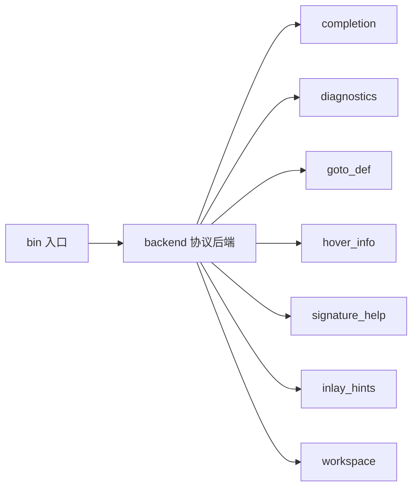

# auto-lsp

> **Status**: active
> 路径：`crates/auto-lsp`  | 技术栈：Rust（tower-lsp-server / lsp-types / tokio）

AutoLang 的 LSP server：为编辑器提供 completion / hover / diagnostics / goto definition 等语言能力。

## 目标与范围

- 实现 LSP 协议后端（tower-lsp-server），以 stdio 方式与编辑器通信。
- 语义来源复用 auto-lang 的 parser/compiler，不另写一套解析器。
- 覆盖：补全、诊断、跳转定义、悬停、签名帮助、inlay hints、工作区管理。
- 不做：不做编辑器插件本体（VSCode 扩展生成在 auto-man/vscode）；不做重构类高级功能（重命名/代码动作暂未覆盖）。

## 模块架构

## 模块清单

| 模块 | 职责 | 状态 |
|---|---|---|
| bin / lib | 二进制入口与库导出 | active |
| backend | LSP 协议后端：请求分发、文档生命周期 | active |
| completion | 自动补全 | active |
| diagnostics | 诊断发布 | active |
| goto_def | 跳转定义 | active |
| hover_info | 悬停信息 | active |
| signature_help | 函数签名帮助 | active |
| inlay_hints | 内联提示 | active |
| workspace | 工作区/多文件管理 | active |
