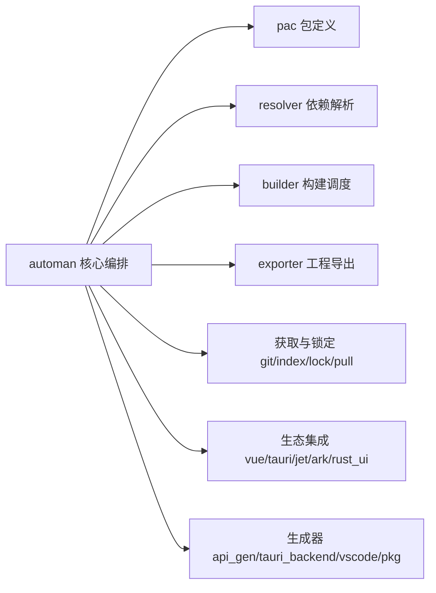

# auto-man

> **Status**: active
> 路径：`crates/auto-man`  | 技术栈：Rust（clap / serde / reqwest / rust-embed）

AutoMan 构建器/包管理器：AutoLang 工程的构建调度、依赖解析与多生态（Tauri/Vue/VSCode 等）项目集成。

## 目标与范围

- 解析 pac.at 包定义，执行构建（cargo/ninja）、导出 IDE 工程、管理依赖获取与锁定。
- 为 Vue / Tauri / Jetpack Compose / ArkTS(HarmonyOS) / Rust UI(ICED/GPUI) 等前端生态生成或集成工程代码。
- 提供 API 代码生成、Tauri 后端生成、VSCode 扩展生成等代码生成器。
- 不做：不实现语言编译（auto-lang）；不实现通用代码模板引擎（auto-gen）；缓存存储在 auto-cache。

## 模块架构

## 模块清单

| 模块 | 职责 | 状态 |
|---|---|---|
| automan | 核心编排：命令分发、工程上下文 | active |
| pac | pac.at 包定义解析与模型 | active |
| resolver | 依赖解析（ModuleResolver trait 实现） | active |
| builder | 构建调度：cargo / ninja / tool / vue 后端 | active |
| exporter | IDE 工程导出：cmake / ghs / iar | active |
| git / index / lock / pull | 依赖获取、注册索引、锁文件 | active |
| scanner / target / dir / cache | 工程扫描、target 目录管理、本地缓存 | active |
| vue / tauri / jet / ark / rust_ui | 各前端生态的工程集成 | active |
| api_gen / tauri_backend / vscode / pkg | API/后端/扩展代码生成器，包管理器抽象（bun/npm） | active |
| asset / fs / util / version / error 等 | 基础设施与公共类型 | active |
| up | 升级功能 | disabled（zip 依赖已移除，模块注释停用） |
