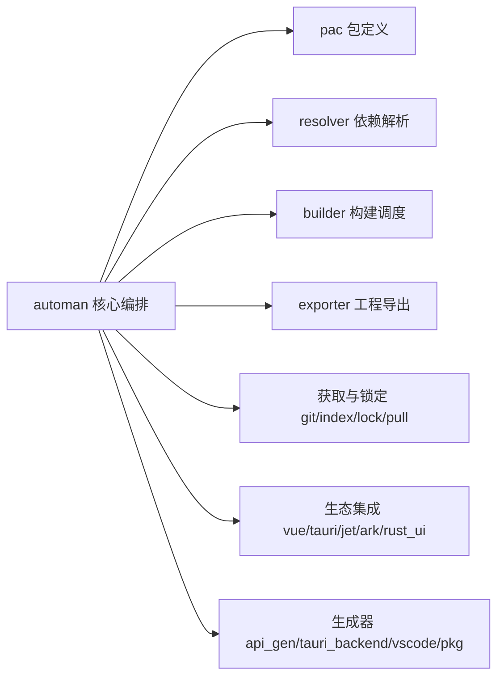

# auto-man

> **Status**: active
> 路径：`crates/auto-man`  | 技术栈：Rust（clap / serde / reqwest / rust-embed）

AutoMan 构建器/包管理器：AutoLang 工程的构建调度、依赖解析与多生态（Tauri/Vue/VSCode 等）项目集成。

## 目标与范围

- 解析 pac.at 包定义，执行构建（cargo/ninja）、导出 IDE 工程、管理依赖获取与锁定。
- 为 Vue / Tauri / Jetpack Compose / ArkTS(HarmonyOS) / Rust UI(ICED/GPUI) 等前端生态生成或集成工程代码。
- 提供 API 代码生成、Tauri 后端生成、VSCode 扩展生成等代码生成器。
- 不做：不实现语言编译（auto-lang）；不实现通用代码模板引擎（auto-gen）；缓存存储在 auto-cache。

## 依赖解析声明门控（PLAN-635，pnpm 式严格隔离）

`.at` 语言层 `use <dep>.<module>` 的跨包模块解析（`auto-lang` 侧
`resolve_module_path` walk-up 探测）实行**声明门控**：

- `deps/<name>` 目录仅在工程（或祖先目录）pac.at 中声明了同名 `dep` 时可达
  （`dep "<name>" { path: ... }` 引号形态与 `dep <name> { path: ... }` 裸名
  形态均认，词边界检查防 `settings` 误匹配 `settings_v2`）。
- `scene: "workspace"` 工程的 `members: [...]` 成员目录与 `deps/<name>` 同权
  解析（member 表项末路径段匹配依赖名）。
- 物化但未声明的 `deps/<name>`（幽灵依赖）阻断解析，stderr 输出修复指引
  （声明 dep 或加入 members）；junction 失效残留因此惰性化，无需清理。
- pac.at 本地 path 依赖（`dep "<name>" { path: ... }`）按声明天然过门控，
  解析候选序列与 deps/ 一致（src/front → src → 根）。
- pac.lock：本地 path 依赖入锁（记录 resolved path，git commit 可选——path
  即复现锚）；`verify()` 对无 commit 条目校验物化路径存在性。锁文件保持
  TOML 文本可 diff。

**标准多包消费样例（PLAN-637）**：`examples/ui/stylekit` 为声明门控的
canonical 消费示范——消费方 pac.at 声明 `dep stylekit { path: "../../ui/stylekit" }`
（相对路径形态）后即可 `use stylekit.styles: <name>` 导入 pub 配方；截至
plan-637 共 16 个 demo 以此形态消费（capability-tests/style-import 为最小
完整样例）。新建跨包消费工程照此结构起模板。

**边界**：auto-lang 不依赖 auto-man crate——pac.at 声明读取为文本扫描
（auto-lang 内实现）；auto-man 物化（junction/symlink/worktree，Plan 475）
与该门控正交互补。

## pac.at 四名称契约（PLAN-015）

每个 AutoUI app 在 pac.at 声明四个名称，展示名与工程标识解绑：

| 字段 | 语义 | 约束与消费 |
|---|---|---|
| `name` | 工程标识（kebab-case），永不承担展示职责 | rust 轨包名/exe 缺省名（snake_case）；os-config 配置查找键 `apps/<name>/config.at`（Plan 504 S7）；注册表条目 `name`。改名即破坏配置/查找键——不轻易动 |
| `exe_name` | rust 轨（a2r）exe 产物名 | 唯一消费点 `rust_ui::generate_cargo_toml`：写显式 `[[bin]]`；合法字符 `[A-Za-z0-9_-]`，非法告警忽略；缺省 = 包名；regen 按 pac 现值重写（Plan 014，auto-term 样板）。vue/VM 轨无 exe，字段无操作 |
| `title` | **英文展示名** | 桌面注册表/窗口标题/document.title 的 en 链事实源；兜底链 `title → name → 目录名` |
| `title_zh` | **中文展示名**（自由文本） | zh locale 优先取用；缺席/空白回落 `title`（两 locale 输出一致，零配置零回归） |

**展示名解析链（locale 臂）**：`AUTO_LOCALE` env（缺省 zh；zh 前缀命中 =
中文链，装载期定 locale、进程内不热切）。zh = `title_zh → title → name →
目录名`；en = `title → name → 目录名`。消费点：注册表
`AppRegistryEntry::display_title`（auto-lang `ui/app_registry`，launcher/
桌面格/LaunchSpec 填充）、VM 窗标题 `Automan::pac_display_title`（→
`AUTO_VM_TITLE`）、vue document.title（`vue::parse_pac_display_title`）。

**边界**：apps.manifest 不承载展示名（条目 = id/repo/kind/ports/status/
daemon；PLAN-015 起 `name` 键退役）——同一 app 的名称只在 pac.at 一处声明。
i18n/{lang}.json 是应用内内容文案机制，与 app 元数据名称无关；展示名不走
嵌套对象/外部文件（注册表保持平铺 `key: value` 行读解析）。

## pac.at opens 文件关联键（PLAN-016）

桌面互操作动词 `open_with`（协议 v1.7，schema/projection-protocol-v1.md
§6）的关联声明面。app 在 pac.at 平铺声明可打开的扩展名集合：

```
opens: ".txt,.md,.at,.json"
```

- 值 = 逗号分隔扩展名列表；规范化为小写、带点前缀、剥空白
  （`normalize_opens`）；未声明 = 空集 = 不参与关联校验（`open_with`
  对其放行）。
- 注册表解析：`parse_pac_fields` → `AppRegistryEntry.opens: Vec<String>`
  （crates/auto-lang/src/ui/app_registry.rs），投影与 LaunchSpec 同源。
- 宿主消费：`execute_open_with` 执行臂校验——目标扩展名非空且不在
  声明集 → 拒绝并 toast；未声明 app id → 未知应用拒绝。
- 与 PLAN-015 四名称契约正交：同为平铺 `key: value` 行读键，互不依赖。

## 模块架构


```mermaid
graph LR
  automan[automan 核心编排] --> pac[pac 包定义]
  automan --> resolver[resolver 依赖解析]
  automan --> builder[builder 构建调度]
  automan --> exporter[exporter 工程导出]
  automan --> fetch[获取与锁定 git/index/lock/pull]
  automan --> eco[生态集成 vue/tauri/jet/ark/rust_ui]
  automan --> gen[生成器 api_gen/tauri_backend/vscode/pkg]
  click automan "./automan/" "automan"
  click pac "./pac/" "pac"
  click resolver "./resolver/" "resolver"
  click builder "./builder/" "builder"
  click exporter "./exporter/" "exporter"
  click fetch "./fetch/" "fetch"
  click eco "./ecosystem/" "生态集成"
  click gen "./generators/" "生成器"
```

## 模块清单

| 模块 | 职责 | 状态 |
|---|---|---|
| automan | 核心编排：命令分发、工程上下文 | active |
| pac | pac.at 包定义解析与模型 | active |
| resolver | 依赖解析（ModuleResolver trait 实现） | active |
| builder | 构建调度：cargo / ninja / tool / vue 后端；ninja 后端 `finish()` 经 `builder/ninja/runner.rs` 探测链解析宿主（Plan 580：`AUTO_NINJA` env 覆盖 → PATH `ninja(.exe)` → PATH `n2(.exe)`（ninja 原作者 Rust 重实现，兜底 `cargo install --locked --git` 钉 rev `b1fead52`）→ 全无返回含两条手动安装路径的 Err），构建非零退出上抛 Err（不再吞状态/spawn panic）；resolver 对 MSVC Linker/Archiver 同目录优先（编译器定位目录下 link.exe/lib.exe 先于 PATH，避免 Git coreutils link.exe 抢先），`setup()` 四工具路径含空格加引号 | active |
| exporter | IDE 工程导出：cmake / ghs / iar | active |
| git / index / lock / pull | 依赖获取、注册索引、锁文件 | active |
| scanner / target / dir / cache | 工程扫描、target 目录管理、本地缓存 | active |
| vue / tauri / jet / ark / rust_ui | 各前端生态的工程集成；vue 侧含 desktop 宿主 scaffold（Plan 465：`generate_desktop_host` + `assets/wm/` WM 运行时资产 rust_embed + `apps-registry.ts` 注册表生成；`auto run --desktop/--apps`；Plan 515：`assets/wm/Wallpaper.vue` 桌面壁纸层三档组件 + host App.vue 生成期配置注入 `shell.desktop.wallpaper`）；**PLAN-038 Phase B（P038-3）**：`generate_tailwind_config`（auto-man/cmd_vue/cmd_tauri）补 `success/warning/info/error → hsl(var(--*))`；`regenerate_source_files` 与 scaffold 同源重写 `tailwind.config.cjs`（磁盘残留旧模板会漏映射）；codegen 全路径（scaffold / write_project_files / regenerate / prepare_vue_sources）写 `src/vite-env.d.ts` + `src/auto-select/overlay.ts` + `src/auto-sources.ts`（缺失时空 map，消除 P657-D2 phase-ordering 对手工 stub 的依赖）；画廊 VM demo 级联发射 `emit_gallery_vm_demos`（Plan 625 T-10/632：loadable 单 widget 示例改名 `Demo*` 相邻拷贝自有模块 + `AppViewport.vm.at` 条件实例化——发射器保证模块组件源可达，组件状态桥接为运行时职责，见 auto-lang docs/specs/auto-lang/ui/architecture.md ADR-20；Plan 633：fullstack 内嵌档——back 语料不再一票否决，back 链传递闭包级联为 `<ns>_<mod>` 唯一 stem（use 行/链内互引/item 调用点限定仅 back 链三层改写，组件调用不动），发射前 core 场景解析探针，back 缺失/native-ns(use auto.*)/~Stream 签名严格降级静态面板，见 auto-lang docs/specs/auto-lang/vm/architecture.md ADR-21） | active |

| api_gen / tauri_backend / vscode / pkg | API/后端/扩展代码生成器，包管理器抽象（bun/npm） | active |
| asset / fs / util / version / error 等 | 基础设施与公共类型 | active |
| up | 升级功能 | disabled（zip 依赖已移除，模块注释停用） |
