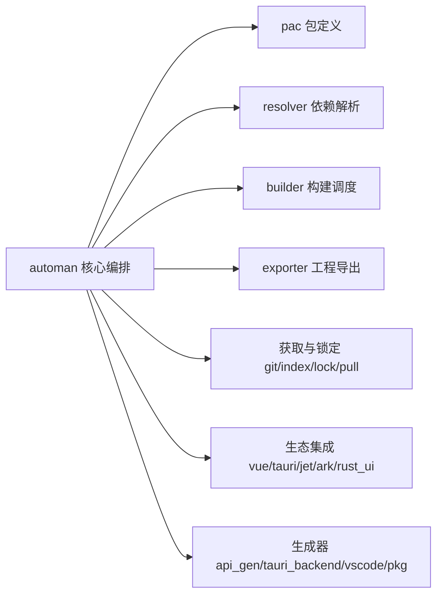

# auto-man

> **Status**: active
> 路径：`crates/auto-man`  | 技术栈：Rust（clap / serde / reqwest / rust-embed）

AutoMan 构建器/包管理器：AutoLang 工程的构建调度、依赖解析与多生态（Tauri/Vue/VSCode 等）项目集成。

## 目标与范围

- 解析 pac.at 包定义，执行构建（cargo/ninja）、导出 IDE 工程、管理依赖获取与锁定。
- 为 Vue / Tauri / Jetpack Compose / ArkTS(HarmonyOS) / Rust UI(ICED/GPUI) 等前端生态生成或集成工程代码。
- 提供 API 代码生成、Tauri 后端生成、VSCode 扩展生成等代码生成器。
- 不做：不实现语言编译（auto-lang）；不实现通用代码模板引擎（auto-gen）；缓存存储在 auto-cache。

## 依赖解析声明门控（PLAN-635，pnpm 式严格隔离）

`.at` 语言层 `use <dep>.<module>` 的跨包模块解析（`auto-lang` 侧
`resolve_module_path` walk-up 探测）实行**声明门控**：

- `deps/<name>` 目录仅在工程（或祖先目录）pac.at 中声明了同名 `dep` 时可达
  （`dep "<name>" { path: ... }` 引号形态与 `dep <name> { path: ... }` 裸名
  形态均认，词边界检查防 `settings` 误匹配 `settings_v2`）。
- `scene: "workspace"` 工程的 `members: [...]` 成员目录与 `deps/<name>` 同权
  解析（member 表项末路径段匹配依赖名）。
- 物化但未声明的 `deps/<name>`（幽灵依赖）阻断解析，stderr 输出修复指引
  （声明 dep 或加入 members）；junction 失效残留因此惰性化，无需清理。
- pac.at 本地 path 依赖（`dep "<name>" { path: ... }`）按声明天然过门控，
  解析候选序列与 deps/ 一致（src/front → src → 根）。
- pac.lock：本地 path 依赖入锁（记录 resolved path，git commit 可选——path
  即复现锚）；`verify()` 对无 commit 条目校验物化路径存在性。锁文件保持
  TOML 文本可 diff。

**标准多包消费样例（PLAN-637）**：`examples/ui/stylekit` 为声明门控的
canonical 消费示范——消费方 pac.at 声明 `dep stylekit { path: "../../ui/stylekit" }`
（相对路径形态）后即可 `use stylekit.styles: <name>` 导入 pub 配方；截至
plan-637 共 16 个 demo 以此形态消费（capability-tests/style-import 为最小
完整样例）。新建跨包消费工程照此结构起模板。

**边界**：auto-lang 不依赖 auto-man crate——pac.at 声明读取为文本扫描
（auto-lang 内实现）；auto-man 物化（junction/symlink/worktree，Plan 475）
与该门控正交互补。

## 脚手架类型面与阶段契约（PLAN-668 SD-01/SD-02）

- **SD-01（tsconfig 类型面）**：gen 模板 `tsconfig.json` 的 `compilerOptions.types`
  显式含 `"vite/client"`——`main.ts` 使用 `import.meta.env`（Vite 注入全局），
  无此类型则 `auto build` 的 vue-tsc 面全体示例 TS2339（P660-D1/P657-D2② 根修，
  vue.rs `generate_tsconfig`）。
- **SD-02（auto-sources 阶段序）**：`src/auto-sources.ts`（Select Anything 源码
  映射，PLAN-646）由 `write_auto_sources_ts` 在 **run 与 build 两阶段**产出（内容
  hash 防抖）——此前仅 `auto run` 写入，`auto build` 的 vue-tsc 面上 overlay.ts
  的 `import from '../auto-sources'` 落 TS2307（P657-D2① 根修，vue.rs
  `build_vue_project` 开头补写）。

## shadcn 脚手架传递依赖（PLAN-706 SD-03）

`vue_shadcn::materialize` 在拷贝前对请求集做**有界传递闭包（≤2 跳）**：扫描已选
组件源码内 `@/components/ui/<name>`，命中烘焙包的并入本次 materialize。典型：
`form` → `label`（FormLabel.vue 内部 import）。无闭包时 Form 页整页 TS2307/500。
Write-if-missing 与 CLI 回退语义不变。

## pac.at 四名称契约（PLAN-015）

每个 AutoUI app 在 pac.at 声明四个名称，展示名与工程标识解绑：

| 字段 | 语义 | 约束与消费 |
|---|---|---|
| `name` | 工程标识（kebab-case），永不承担展示职责 | rust 轨包名/exe 缺省名（snake_case）；os-config 配置查找键 `apps/<name>/config.at`（Plan 504 S7）；注册表条目 `name`。改名即破坏配置/查找键——不轻易动 |
| `exe_name` | rust 轨（a2r）exe 产物名 | 唯一消费点 `rust_ui::generate_cargo_toml`：写显式 `[[bin]]`；合法字符 `[A-Za-z0-9_-]`，非法告警忽略；缺省 = 包名；regen 按 pac 现值重写（Plan 014，auto-term 样板）。vue/VM 轨无 exe，字段无操作 |
| `title` | **英文展示名** | 桌面注册表/窗口标题/document.title 的 en 链事实源；兜底链 `title → name → 目录名` |
| `title_zh` | **中文展示名**（自由文本） | zh locale 优先取用；缺席/空白回落 `title`（两 locale 输出一致，零配置零回归） |

**展示名解析链（locale 臂）**：`AUTO_LOCALE` env（缺省 zh；zh 前缀命中 =
中文链，装载期定 locale、进程内不热切）。zh = `title_zh → title → name →
目录名`；en = `title → name → 目录名`。消费点：注册表
`AppRegistryEntry::display_title`（auto-lang `ui/app_registry`，launcher/
桌面格/LaunchSpec 填充）、VM 窗标题 `Automan::pac_display_title`（→
`AUTO_VM_TITLE`）、vue document.title（`vue::parse_pac_display_title`）。

**边界**：apps.manifest 不承载展示名（条目 = id/repo/kind/ports/status/
daemon；PLAN-015 起 `name` 键退役）——同一 app 的名称只在 pac.at 一处声明。
i18n/{lang}.json 是应用内内容文案机制，与 app 元数据名称无关；展示名不走
嵌套对象/外部文件（注册表保持平铺 `key: value` 行读解析）。

## pac.at opens 文件关联键（PLAN-016）

桌面互操作动词 `open_with`（协议 v1.7，schema/projection-protocol-v1.md
§6）的关联声明面。app 在 pac.at 平铺声明可打开的扩展名集合：

```
opens: ".txt,.md,.at,.json"
```

- 值 = 逗号分隔扩展名列表；规范化为小写、带点前缀、剥空白
  （`normalize_opens`）；未声明 = 空集 = 不参与关联校验（`open_with`
  对其放行）。
- 注册表解析：`parse_pac_fields` → `AppRegistryEntry.opens: Vec<String>`
  （crates/auto-lang/src/ui/app_registry.rs），投影与 LaunchSpec 同源。
- 宿主消费：`execute_open_with` 执行臂校验——目标扩展名非空且不在
  声明集 → 拒绝并 toast；未声明 app id → 未知应用拒绝。
- 与 PLAN-015 四名称契约正交：同为平铺 `key: value` 行读键，互不依赖。

## 模块架构


```mermaid
graph LR
  automan[automan 核心编排] --> pac[pac 包定义]
  automan --> resolver[resolver 依赖解析]
  automan --> builder[builder 构建调度]
  automan --> exporter[exporter 工程导出]
  automan --> fetch[获取与锁定 git/index/lock/pull]
  automan --> eco[生态集成 vue/tauri/jet/ark/rust_ui]
  automan --> gen[生成器 api_gen/tauri_backend/vscode/pkg]
  click automan "./automan/" "automan"
  click pac "./pac/" "pac"
  click resolver "./resolver/" "resolver"
  click builder "./builder/" "builder"
  click exporter "./exporter/" "exporter"
  click fetch "./fetch/" "fetch"
  click eco "./ecosystem/" "生态集成"
  click gen "./generators/" "生成器"
```

## 模块清单

| 模块 | 职责 | 状态 |
|---|---|---|
| automan | 核心编排：命令分发、工程上下文 | active |
| pac | pac.at 包定义解析与模型 | active |
| resolver | 依赖解析（ModuleResolver trait 实现） | active |
| builder | 构建调度：cargo / ninja / tool / vue 后端；ninja 后端 `finish()` 经 `builder/ninja/runner.rs` 探测链解析宿主（Plan 580：`AUTO_NINJA` env 覆盖 → PATH `ninja(.exe)` → PATH `n2(.exe)`（ninja 原作者 Rust 重实现，兜底 `cargo install --locked --git` 钉 rev `b1fead52`）→ 全无返回含两条手动安装路径的 Err），构建非零退出上抛 Err（不再吞状态/spawn panic）；resolver 对 MSVC Linker/Archiver 同目录优先（编译器定位目录下 link.exe/lib.exe 先于 PATH，避免 Git coreutils link.exe 抢先），`setup()` 四工具路径含空格加引号 | active |
| exporter | IDE 工程导出：cmake / ghs / iar | active |
| git / index / lock / pull | 依赖获取、注册索引、锁文件 | active |
| scanner / target / dir / cache | 工程扫描、target 目录管理、本地缓存 | active |
| vue / tauri / jet / ark / rust_ui | 各前端生态的工程集成；vue 侧含 desktop 宿主 scaffold（Plan 465：`generate_desktop_host` + `assets/wm/` WM 运行时资产 rust_embed + `apps-registry.ts` 注册表生成；`auto run --desktop/--apps`；Plan 515：`assets/wm/Wallpaper.vue` 桌面壁纸层三档组件 + host App.vue 生成期配置注入 `shell.desktop.wallpaper`）；**PLAN-038 Phase B（P038-3）**：`generate_tailwind_config`（auto-man/cmd_vue/cmd_tauri）补 `success/warning/info/error → hsl(var(--*))`；`regenerate_source_files` 与 scaffold 同源重写 `tailwind.config.cjs`（磁盘残留旧模板会漏映射）；codegen 全路径（scaffold / write_project_files / regenerate / prepare_vue_sources）写 `src/vite-env.d.ts` + `src/auto-select/overlay.ts` + `src/auto-sources.ts`（缺失时空 map，消除 P657-D2 phase-ordering 对手工 stub 的依赖）；画廊 VM demo 级联发射 `emit_gallery_vm_demos`（Plan 625 T-10/632：loadable 单 widget 示例改名 `Demo*` 相邻拷贝自有模块 + `AppViewport.vm.at` 条件实例化——发射器保证模块组件源可达，组件状态桥接为运行时职责，见 auto-lang docs/specs/auto-lang/ui/architecture.md ADR-20；Plan 633：fullstack 内嵌档——back 语料不再一票否决，back 链传递闭包级联为 `<ns>_<mod>` 唯一 stem（use 行/链内互引/item 调用点限定仅 back 链三层改写，组件调用不动），发射前 core 场景解析探针，back 缺失/native-ns(use auto.*)/~Stream 签名严格降级静态面板，见 auto-lang docs/specs/auto-lang/vm/architecture.md ADR-21） | active |

| api_gen / tauri_backend / vscode / pkg | API/后端/扩展代码生成器，包管理器抽象（bun/npm）；api_gen server 生成器状态种子契约（**Plan 670 F-R1-A**）：`use api::Db`/`State<Db>` 种子仅当契约实际定义 Db（primary 类型存在，api.rs 才发 `pub type Db`）时发射，无 Db 标量契约走无状态退化路径（镜像 db_full_cover 分支形态）——生成物必须可编译（E0432 契约）；端点 fn 体降体（route A）仍未建，无 db 覆盖的端点生成为空体桩（P670-D1 在册） | active |
| asset / fs / util / version / error 等 | 基础设施与公共类型 | active |
| up | 升级功能 | disabled（zip 依赖已移除，模块注释停用） |

## 画廊 host 内嵌四档与 routable 档（PLAN-675 SD-01）

`gallery_demo_row` 判四内嵌档，web 臂消费。`loadable`/`fullstack`
（PLAN-633/672）与 `route_stub`（PLAN-642 T-14a，VM 臂专属）语义不变
（routes 一票否决照旧）；**routable（PLAN-675）** = `vp.has_routes` 且除
routes 外无其余内嵌否决（vm-only/ext/locales/i18n；`vp` None → false）。

- **routable 发射**：fullstack 管线全复用（App/lib_api/api 三级瀑布解析
  `resolve_demo_api_client_ts`/组件与 store 共享池/shadcn/npm_merge）+
  per-demo 路由面 `emit_demo_route_face`——`pages/`（per-demo 命名空间，
  防 pages/home 异容撞）、`router.ts`（**createMemoryHistory 工厂**，每
  挂载 fresh 路由态，含参路由 props:true）、`main.ts`（mount/unmount
  入口契约）。无 api 消费不阻断内嵌；消费 api 而无源 → 诚实回退（翻
  routable=false 维持独立提示）。VM 臂不消费本档（仍 route_stub）；
  registry.at 不序列化。
- **注册表与视口契约**：demos-registry routable 行发
  `load: import('./apps/<id>/main')` + `routed: true` + `loadable: true`
  （视口门）；`DemoModule` 接口（mount/unmount 可选，default App 兼容旧
  createApp 路径）。AppViewport：mod.mount/unmount 在册走 entry 工厂
  （os scaffold 源副本与 auto-lang rust_embed 资产字节对齐纪律）。
- **嵌入态改写闭包**（rewrite_api_import，三档通用）：`@/lib/api` 导入改
  指 per-demo lib_api、EventSource 前缀化（672 条目4/5）+ 裸
  `fetch('/api/`、`fetch("/api/` 字面量前缀化（020 媒体面；幂等）。
- **会话准入**：`start_gallery_back_proxy` 对 `needs_session ||
  fullstack || routable` 且有 back/api.at 者建 back_proxy 会话（routable
  臂为 675 补——缺则路由 demo API 404 unknown app）。
- **依赖注入**：任一 routable 行 → npm_merge 通道注入 vue-router ^4.2.0。


## strict 生成门现状（PLAN-095 复验，2026-10-01）

- 历史"静默 abort"（e2deb4f87/gc8f86ef 时代，stderr 恒 5 条 S001 后无消息
  退出）在 3b3014e3→e0fb4e4e 区间已解除——旧→新收据：musk 消费工程
  `auto build --gen-only --strict` EXIT=0（65 组件，CLI 89c22af15c048019）。
- 非法输入口径：未知组件引用 → 非零退出 + 可定位诊断
  （"App.vue 引用的组件 SFC 未编译落盘（dep 源未解析？）：X"）。
- S001 schema drift 维持 Severity::Info；升级/删除逐条判断，不批量改级。

- api_gen 文件分支（PLAN-729）：声明 `FileResponse` 返回的端点生成真实文件 adapter
  （method/headers 提取器 + 委托/内联体 + 共享宿主 serve，`-> axum::response::Response`，
  不包 JsonResponse）；转译失败 = 位置诊断 500 handler，**不落 CRUD 模板**；GET 文件
  路由自动 `.head()`；非 GET/HEAD → 405。TS HTTP 文件方法返回原生 `Response`；Tauri
  IPC 明确 Unsupported。见 stdlib [http-server-files §6](../stdlib/design/http-server-files.md)。

## 上传端点生成（PLAN-730）

- 参数含 `UploadRequest` 的 `#[api]` 端点：Request 提取器置最后（不预读）、
  转译体 await 直发（`try_transpile_body` 对 `Future<T>` 端点置位 async 上下文）、
  收据映射真实 status + JSON（不落 CRUD 模板；非 POST/PUT 405）；main 安装宿主
  executor；TS 客户端 FormData 直传。契约见
  [auto-lang/trans/design/http-upload-lowering.md](../auto-lang/trans/design/http-upload-lowering.md)
  与 [stdlib/design/http-server-uploads.md](../stdlib/design/http-server-uploads.md)。

## checked generation 与错误传播（PLAN-734）

- route A（endpoint body → a2r 内联转译）已是生产实现源（733 期文档"未建/
  空桩"描述过时）。PLAN-734 起：strict 解析门（失败=Err，lenient 显式
  opt-in）；真实实现优先（转译失败不落 CRUD 模板）；`AUTO_A2R_BODY=0` 重语义
  = SCAFFOLD 标注；`generation.json` ready 记录 + `AUTO_REUSE_BACKEND=1`
  复用新鲜度门；全部 8 个生成入口 Err 硬传播（vue/tauri/rust_ui 的 warn/
  静默丢弃清零）。契约见 [design/api-generation-integrity.md](design/api-generation-integrity.md)。

## 服务进程托管与 ready 身份（PLAN-736）

- `crates/auto-man/src/http_service.rs` 是 `auto service` 的进程托管面：VM 轨 =
  进程内大栈 VM 线程（32MB，同 start_vm_server）+ `bound_addr_snapshot()` 等待真实
  bind（port=0 解析内核分配地址）；rust 轨 = 734 strict 门重新生成 → `cargo run
  --release` 子进程 + service JSON 经 `AUTO_HTTP_SERVICE_JSON` env 注入 re-resolve。
- **ready 探针**：legacy 的纯 TCP-connect 判 ready 已废弃——`probe_service_ready`
  走 `GET /__auto/health/ready`：503=未 ready（不再误判），404=legacy 无控制面按
  可继续处理；`start_api_server`/`start_vm_server`（UI split 消费方）共用该探针。
- 占口/生成失败/初始化失败不得 ready：rust 轨子进程 bind/配置失败 exit(1)/exit(2)
  → parent 非零；VM 轨 serve fatal → Err 非零。父进程当前以退出码 + 状态码探针承载
  rust 轨判定，不消费 health 身份体做核对（P736-R1 增强候选）；734 新鲜度门
  （`AUTO_REUSE_BACKEND=1` 复用臂）维持不动。
- 关闭：shutdown 端点与 Ctrl+C/SIGTERM 同 watch（VM 网络线程 join / rust 子进程
  有界排空后 parent 退出），端口与子进程零残留。部署/配置/策略合同见
  [stdlib/design/http-service-deployment.md](../stdlib/design/http-service-deployment.md)。
