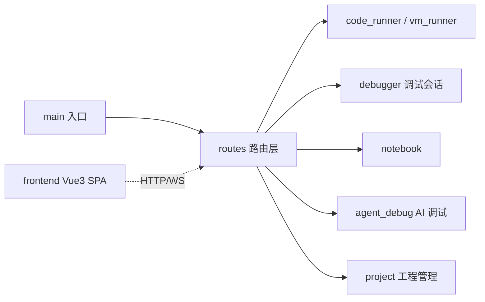

# auto-playground

> **Status**: active
> 路径：`crates/auto-playground`  | 技术栈：Rust（axum + ws / tokio）；frontend：Vue3 + Vite + TS

Playground Web API server（axum + WebSocket）及配套前端 SPA：在线运行/调试 Auto 代码。

## 目标与范围

- 提供 HTTP/WS API：运行代码（run/run_code/run_abt）、转译（trans）、示例列表（examples）。
- 提供调试会话（debugger）与 AI agent 调试会话（agent_debug）的 WS 控制通道。
- notebook：单元格式交互执行。
- frontend/：Vue3 + Vite SPA，消费上述 API。
- 不做：不实现编译器/VM（auto-lang）；可复用前端组件库在 packages/auto-playground-vue。

## 模块架构

## 模块清单

| 模块 | 职责 | 状态 |
|---|---|---|
| main | axum server 启动、CORS/静态资源、路由挂载 | active |
| routes | HTTP/WS 路由：run / run_code / run_abt / trans / examples / notebook / agent_debug | active |
| code_runner / vm_runner | 代码执行与 VM 运行封装 | active |
| debugger | 调试会话：controller + session | active |
| agent_debug | AI agent 调试会话：controller + session | active |
| notebook | 单元格交互执行 | active |
| project | playground 工程/文件管理 | active |
| frontend | Vue3 + Vite SPA（playwright e2e） | active |
