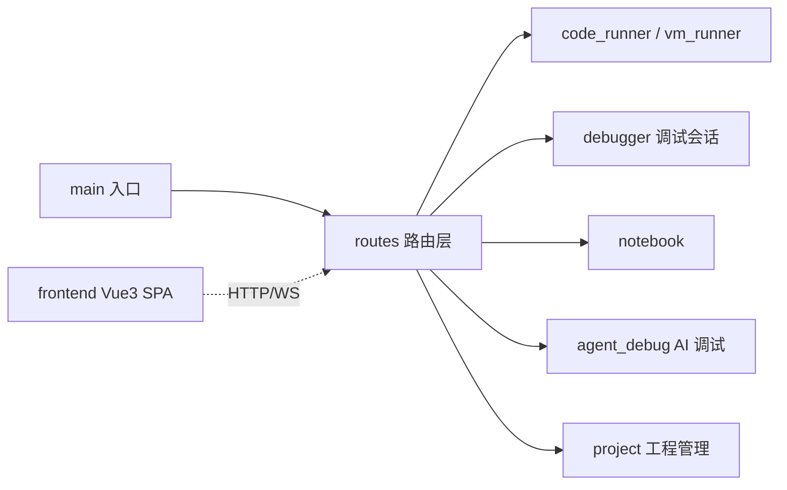

# auto-playground

> **Status**: active
> 路径：`crates/auto-playground`  | 技术栈：Rust（axum + ws / tokio）；frontend：Vue3 + Vite + TS

Playground Web API server（axum + WebSocket）及配套前端 SPA：在线运行/调试 Auto 代码。

## 目标与范围

- 提供 HTTP/WS API：运行代码（run/run_code/run_abt）、转译（trans）、示例列表（examples）。
- 提供调试会话（debugger）与 AI agent 调试会话（agent_debug）的 WS 控制通道。
- notebook：单元格式交互执行。
- frontend/：Vue3 + Vite SPA，消费上述 API。
- 不做：不实现编译器/VM（auto-lang）；可复用前端组件库在 packages/auto-playground-vue。

## 模块架构

```mermaid
graph LR
  main[main 入口] --> routes[routes 路由层]
  routes --> runner[code_runner / vm_runner]
  routes --> dbg[debugger 调试会话]
  routes --> nb[notebook]
  routes --> adbg[agent_debug AI 调试]
  routes --> proj[project 工程管理]
  fe[frontend Vue3 SPA] -.HTTP/WS.-> routes
  click routes "./routes/" "routes"
  click runner "./runner/" "runner"
  click dbg "./debugger/" "debugger"
  click nb "./notebook/" "notebook"
  click adbg "./agent-debug/" "agent_debug"
  click proj "./project/" "project"
  click fe "./frontend/" "frontend"
```

## 模块清单

| 模块 | 职责 | 状态 |
|---|---|---|
| main | axum server 启动、CORS/静态资源、路由挂载 | active |
| routes | HTTP/WS 路由：run / run_code / run_abt / trans / examples / notebook / agent_debug | active |
| code_runner / vm_runner | 代码执行与 VM 运行封装 | active |
| debugger | 调试会话：controller + session | active |
| agent_debug | AI agent 调试会话：controller + session | active |
| notebook | 单元格交互执行 | active |
| project | playground 工程/文件管理 | active |
| frontend | Vue3 + Vite SPA（playwright e2e） | active |

> **Plan 582（2026-09-07，archived）**：/api/examples 读 notes.json 单一事实源（三路回退；entry files[0] 回退保 api=manifest=1332 不变量）；frontend 壳单模式化（侧栏导航+直嵌 IDE，noteMeta 入标题栏）；files-only 物化运行（parity 多文件可 Run，base64·Decode 10 ok 实证）；宿主 e2e 19 条。

> **PLAN-746（2026-10-09，executing）**：/api/run 执行时限——`timeout_secs`
> （默认 10s，clamp 1..=60）映射 VM 协作式截止（auto-vm spec ExecutionBudget），
> 超时响应 stdout 携 `Error: ExecutionTimeout: execution deadline exceeded`，
> 服务端不留失控执行线程/内存（PG-MEM-1 根治：走查 16MB→1434MB/20GB+ 实录）。
> **宿主行为**：官方前端宿主（usePlayground/usePlaygroundFull）显式发
> `timeout_secs=60`——合法慢示例（parity C/sync-http 族实测 ~10.5s）不被默认
> 10s 截断，失控程序仍被截止兜住（复审 F-746-R1 定谳）。
> 执行 panic（执行线程内部）返回干净 Err 不再 unwrap 噪音 500（SD-04）。
> print 内建 kwargs 形态（`print(x, end=..)`）编译期拒绝（SD-02，见 auto-vm spec）。

> **PLAN-752（2026-10-09，executing）**：`prepend_lib: bool`（默认 false）——
> 为真时裸 source 路径按 AUTO_LIB_FILES（lib-legacy 12 文件，依赖序）前置拼接
> AAvm v1 自举 lib（golden is_bootstrap 同款清单，单一事实源 pub(crate) 常量），
> 使 vm-bootstrap 组笔记（note.id 前缀 `vm-bootstrap/`）在 playground 可运行
> （官方宿主自动开启；走查 105 条 104 成功/80 条 golden 逐字节一致，余为仓库
> 既有 #[ignore] 隔离态）。project/files 路径不受影响。
