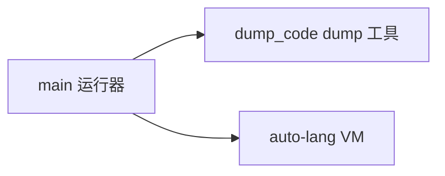

# auto-vm

> **Status**: active
> 路径：`crates/auto-vm`  | 技术栈：Rust（clap / tokio / auto-lang）

AutoVM 独立运行器/dump 工具：薄 CLI 壳，编译执行 .at 脚本，全部语言逻辑依赖 auto-lang。

## 目标与范围

- `auto-vm <file.at>`：parse → codegen → 链接 → 在 AutoVM 中执行（8MB 大栈线程避免递归解析爆栈）。
- `dump_code`：字节码/反汇编 dump，用于调试 codegen 输出。
- 不做：不实现 parser/VM/codegen 本身（auto-lang）；不做包管理/多文件工程（auto build 的职责）。

## 模块架构

## 模块清单

| 模块 | 职责 | 状态 |
|---|---|---|
| main | CLI 参数、单文件编译链接执行流程 | active |
| dump_code | 字节码 dump/反汇编辅助 | active |
