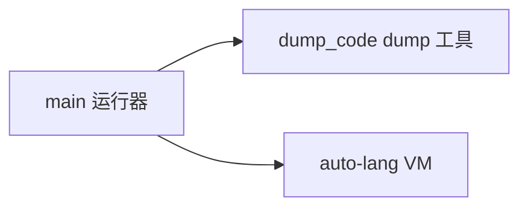

# auto-vm

> **Status**: active
> 路径：`crates/auto-vm`  | 技术栈：Rust（clap / tokio / auto-lang）

AutoVM 独立运行器/dump 工具：薄 CLI 壳，编译执行 .at 脚本，全部语言逻辑依赖 auto-lang。

## 目标与范围

- `auto-vm <file.at>`：parse → codegen → 链接 → 在 AutoVM 中执行（8MB 大栈线程避免递归解析爆栈）。
- `dump_code`：字节码/反汇编 dump，用于调试 codegen 输出。
- 不做：不实现 parser/VM/codegen 本身（auto-lang）；不做包管理/多文件工程（auto build 的职责）。

## 模块架构

```mermaid
graph LR
  main[main 运行器] --> dump[dump_code dump 工具]
  main --> lang[auto-lang VM]
  click main "./main/" "main"
  click dump "./dump-code/" "dump_code"
```

## 模块清单

| 模块 | 职责 | 状态 |
|---|---|---|
| main | CLI 参数、单文件编译链接执行流程 | active |
| dump_code | 字节码 dump/反汇编辅助 | active |

> **PLAN-746（2026-10-09，executing）**：执行预算（SD-03）——`AutoVM.deadline:
> Option<Instant>` + `set_deadline`；run_task_loop 每轮清扫检查，超时终止全部
> 任务并置 `ExecutionTimeout` last_error；默认 None 零行为变化。lib.rs
> `run_with_capture_and_bytecode_with_deadline` / `_path_and_bytecode_with_deadline`
> 为带截止公开面；`join_execution` 使执行线程 panic 返回 Err（SD-04）。
> print 族（print/println/write/say/assert*）kwargs/赋值形态实参编译期拒绝
> （SD-02：parser 产出 Bina(Asn) 实参，原静默编译致栈泄漏+失控膨胀）。
