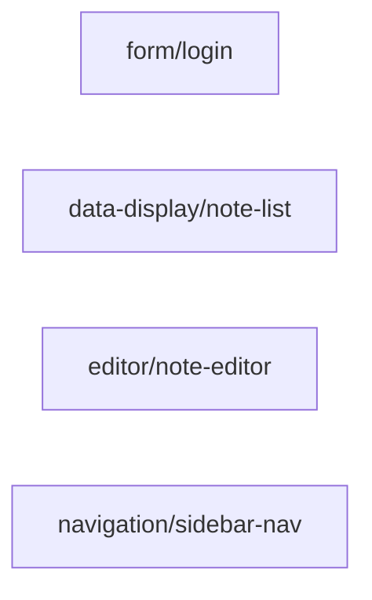

# blocks

> **Status**: active
> 路径：`blocks/`  | 技术栈：Markdown spec（TOML frontmatter）+ .at 参考实现

AutoUI "Skill 级" UI 单元包（Design 17）：自然语言 spec + 参考实现 + gotchas，供 agent 组装 widgets。

## 目标与范围

- 每个 block 是一个包：`spec.md`（TOML frontmatter + NL 正文）+ `reference/<v>.at`（每变体一个参考实现）+ `gotchas.md`（反例 {wrong, why, right}）。
- 两种消费路径：`auto block add` 拷贝参考实现；agent 读 spec 生成并用 `auto block check` + `auto build` 循环校验。
- 不做：不实现 `auto block` 命令本身（在 auto-cli/cmd_block）；组件原语在 packages/widgets。

## 模块架构

## 模块清单

| 模块 | 职责 | 状态 |
|---|---|---|
| form/login | 登录表单 block | active |
| data-display/note-list | 笔记列表展示 block | active |
| editor/note-editor | 笔记编辑器 block | active |
| navigation/sidebar-nav | 侧边导航 block | active |
