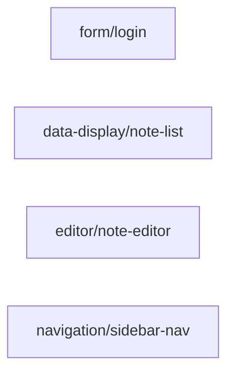

# blueprint

> **Status**: active
> 路径：`blueprints/`  | 技术栈：Markdown spec（TOML frontmatter）+ .at 参考实现

AutoUI **Blueprint**（原 Block，PLAN-639 更名；代码缩写 `bp`）——三层
Widget / Blueprint / App 的中间层（Design 17）："Skill 级" UI 单元包：自然语言
spec + 参考实现 + gotchas，供 agent 组装 widgets。契约六问见
[contract.md](contract.md)。

## 目标与范围

- 每个 blueprint 是一个包：`blueprints/<kind>/<name>/` 下 `spec.md`（TOML
  frontmatter + NL 正文）+ `reference/<v>.at`（每变体一个参考实现）+ `gotchas.md`
  （反例 {wrong, why, right}）。
- **三通道分级消费**（PLAN-639 SD-02）：
  - **L1 import/bind**（平台化主通道）：应用 pac.at 声明依赖 + `use` 跨包导入 +
    声明式绑定工件（`src/front/bps/<name>.bind.at`，GENERATED）——零副本，无漂移；
  - **L2 copy reference**：`auto bp add --reference` 拷贝参考实现，落地归应用
    （eject 语义保留，头注登记来源）；
  - **L3 agent generation**：agent 读 spec 生成，`auto bp check` + `auto build`
    循环校验；结构性变体走提升评审（`promotions:`）。
- 不做：`auto bp` 命令实现本体在 auto-cli（cmd_bp）；组件原语在 packages/widgets；
  运行时动态插件/manifest 加载（终态另议）。

## 模块架构

## 模块清单

| 模块 | 职责 | 状态 |
|---|---|---|
| contract | Blueprint 六问契约（输入/输出/状态归属/变体/打包解析/双形态） | active |
| form/login | 登录表单 blueprint | active |
| data-display/note-list | 笔记列表展示 blueprint | active |
| editor/note-editor | 笔记编辑器 blueprint | active |
| navigation/sidebar-nav | 侧边导航 blueprint | active |
