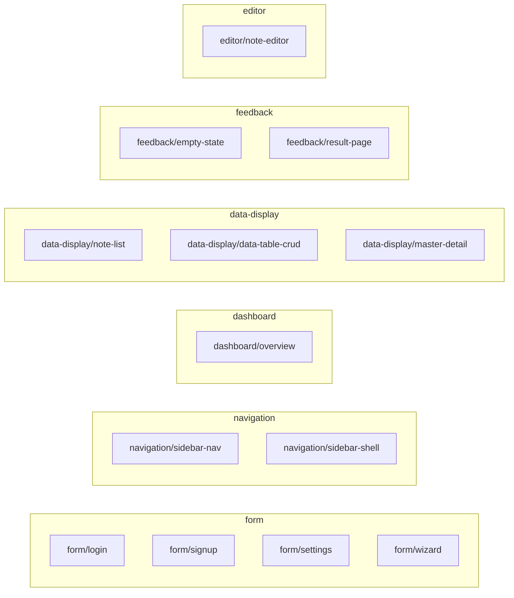

# blueprint

> **Status**: active
> 路径：`blueprints/`  | 技术栈：Markdown spec（TOML frontmatter）+ .at 参考实现

AutoUI **Blueprint**（原 Block，PLAN-639 更名；代码缩写 `bp`）——三层
Widget / Blueprint / App 的中间层（Design 17）："Skill 级" UI 单元包：自然语言
spec + 参考实现 + gotchas，供 agent 组装 widgets。契约六问见
[contract.md](contract.md)。

## 目标与范围

- 每个 blueprint 是一个包：`blueprints/<kind>/<name>/` 下 `spec.md`（TOML
  frontmatter + NL 正文）+ `reference/<v>.at`（每变体一个参考实现）+ `gotchas.md`
  （反例 {wrong, why, right}）。
- **三通道分级消费**（PLAN-639 SD-02）：
  - **L1 import/bind**（平台化主通道）：应用 pac.at 声明依赖 + `use` 跨包导入 +
    声明式绑定工件（`src/front/bps/<name>.bind.at`，GENERATED）——零副本，无漂移；
  - **L2 copy reference**：`auto bp add --reference` 拷贝参考实现，落地归应用
    （eject 语义保留，头注登记来源）；
  - **L3 agent generation**：agent 读 spec 生成，`auto bp check` + `auto build`
    循环校验；结构性变体走提升评审（`promotions:`）。
- **版本面（PLAN-647 终版裁定，P639-D3 核销）**：`blueprints/` = 单版本滚动
  权威源（升版=全体消费方下次构建重构建；跨仓对齐走 git 层，bp 层禁自造
  pin/lock，锁面触发条件见 contract Q5⑤）；pac.at `version` 仅展示元数据
  非约束面；spec frontmatter 顶层与 pac.at `dep` 声明的版本类键均显式报错
  （双护栏，contract Q5 五项）。
- **蓝图级双端 gate 与骨架 bp（PLAN-075，design 30 §2 L2 门首证）**：
  `examples/bp-gate/` = bp 包库的自动化双臂门（vue 臂沙箱构建+playwright
  截图基线 × VM 臂 MCP boot 断言；`auto build` 物化 deps junction → 一律
  仓库外沙箱构建，纪律见 KNOWN-DEBT P075-D1）；首批三单元 =
  `layout/status-bar` + `data-display/row-list` 两件**骨架 bp**（fn-free
  纯布局+slot）+ filetree 组合形态（跨文件 fn 携带件）。抽取判定记录
  （design 30 §6 四通道，9 单元首批判定）= auto-down
  `docs/plans/attachments/075-bp-extraction-record.md`。
- 不做：`auto bp` 命令实现本体在 auto-cli（cmd_bp）；组件原语在 packages/widgets；
  运行时动态插件/manifest 加载（终态另议）。

## 官方默认集判定标准（PLAN-640）

官方默认集（Tier 0，`blueprints/` 磁盘目录）是策展集不是杂物间——新包入集
须**五条全过**，防止官方集膨胀退化：

1. **跨 app 出现频率**：该区块在 ≥2 个真实应用形态中出现，或为业界 Block
   策展共识收录的模式（shadcn/ui Blocks、Ant Design Pro、PatternFly、SAP
   Fiori pattern 库可引用锚点）。
2. **契约可成文且非平凡**：`props` / `actions` / `dataSource` 至少一类有真实
   数据接口（纯静态装饰组合不入选——那是 recipe/主题的事）。
3. **palette ⊆ AURA registry ∪ schema package-origin tags 且双端可发射**：palette 每项过
   `palette_drift` 零漂移门禁——合法集 = `WidgetRegistry` ∪ schema `package_origin` tags
   （PLAN-643：official 组件包供给名经词汇面入列，chart 四 tag 首批；词表外未知名仍拒绝），
   且 vue 发射轨与 VM 解释轨均可产出产物。
4. **状态机含量 ≥ 三态**：包内至少承载三态行为（如 loading/empty/error、
   step 分步、success/error）——防"静态摆件"混入 blueprint 层。
   **骨架 bp 例外（PLAN-075 和解注记）**：design 30 §6 通道③"同名不同物
   → 骨架+内容 slot"裁定的**骨架 bp**（如 layout/status-bar）以布局骨架+
   slot 为契约本体，不适用本条与第 2 条的 dataSource 门槛——准入依据 =
   判定记录的使用位证据与 slot 契约（075 判定记录 §1），状态语义归消费方
   slot 变体。
5. **NL spec 可描述、可被 agent 组装**：六问可答（contract.md），L3 通道
   （agent 读 spec → 组装 `.at` → `auto bp check`）可走通。

## 模块架构

## 模块清单

| 模块 | 职责 | 状态 |
|---|---|---|
| contract | Blueprint 六问契约（输入/输出/状态归属/变体/打包解析/双形态） | active |
| form/login | 登录表单 blueprint（minimal / with_sso / two_column） | active |
| form/signup | 注册表单 blueprint | active |
| form/settings | 设置页 blueprint（分区 + 危险区确认） | active |
| form/wizard | 分步向导 blueprint | active |
| navigation/sidebar-nav | 侧边导航（三段式内容）blueprint | active |
| navigation/sidebar-shell | 应用壳 blueprint（header + sidebar + 内容槽 + user menu） | active |
| dashboard/overview | 仪表盘总览 blueprint | active |
| data-display/note-list | 笔记列表展示 blueprint | active |
| data-display/data-table-crud | 查询表格 CRUD blueprint | active |
| data-display/master-detail | 主从视图 blueprint | active |
| feedback/empty-state | 空态三分法 blueprint | active |
| feedback/result-page | 结果页 blueprint | active |
| editor/note-editor | 笔记编辑器 blueprint | active |

## 消费面与组装样板（PLAN-657）

**L1 组装样板**：`examples/ui/047-bp-admin` 是 L1 主通道的首次**多包**直连
实证——`navigation/sidebar-shell`(default) + `data-display/data-table-crud`
(with_dialog) + `form/settings`(default) + `feedback/empty-state`
(first_use/no_result) 四包五变体全部经 `use bps.<kind>.<name>.reference.<variant>`
导入（连字符 key 走 PLAN-649 变体探测），零副本、无 bind 工件；Design 16 的
"app = shell + route→blueprint selection + blueprint data wiring" 形态落地：
sidebar 壳承载导航（content slot 注入主区）、主区按 app model `active_nav`
状态机切换、四包 props/actions/dataSource 契约由 app 侧 mock `#[api]` 全接线。

**消费接线形态（本次实注定式，后续包参照）**：

- **props** → widget 参数直供（app model 数据面，Init 经 `use back.api` 取数播种）；
- **actions**（契约 Q2 action 点）→ `on_*: msg` 回调参数上抛（k2/k3 回调契约：
  子件配 Pascal 载体变体承载 emit 载荷声明，parent 绑 `.Msg`）；
- **dataSource** → L1 无 bp→app 逆向调用通道，**app 取数经 props 回填物化**
  （counts 烘焙进 nav_tree badge、query 受控 rows/total、load 平铺 cfg 参数）。

**参数化修整先例（PLAN-657，frontmatter 契约面零改动）**：被消费的 5 个
reference 变体参数化对齐各自 frontmatter 已声明契约（`FileTree(nodes, …)`
filetree 先例的推广）；官方集 14 包其余 reference 仍为无参脚手架——
**参数化规范成文是 Tier 1 扩容前置项**。

**组装摩擦结论（Tier 1 / vm-component-parity 排期输入，完整清单与分级见
PLAN-657 §5.3 与 KNOWN-DEBT P657-D1..D5）**：P0 = VM 轨跨 widget 回调
载荷字面量化（vue 全绿、VM `active_nav: "id"` 实证——639-D1 族第四实证，
vm-component-parity 第一优先）；P1 = reference 参数化缺位、a2r back 转译
方言窄面；P2 = examples npm 阶段共享基建双预存红（auto-sources phase
ordering + main.ts env types）、跨包结构体类型无通道（契约退化为平铺原子
参数）；P3 = view 表现面小摩擦、capability-tests 生成面 CI 缺口。
