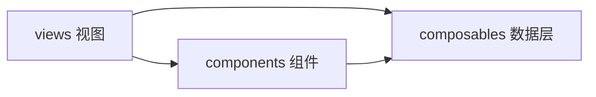

# forge-ui

> **Status**: active
> 路径：`packages/auto-forge-ui`  | 技术栈：Vue 3 + Vite + TypeScript（mermaid / markdown 渲染）

Forge 应用 UI：面向 spec/gate 工作流的 Vue3 前端，含 markdown 与流式文档渲染。

## 目标与范围

- 视图层：Agents / Chats / Specs / StreamingDemo 等视图。
- 组件层：Gate 面板、Spec 条目、Markdown/Streaming 渲染器、状态徽章等。
- composables 封装 Forge 数据源（useForge/useSpecs/useRelay/useStreamingDocument 等）。
- 不做：不实现 Forge 后端服务；不是通用组件库（通用原语在 packages/widgets）。

## 模块架构

## 模块清单

| 模块 | 职责 | 状态 |
|---|---|---|
| views | 页面视图（Agents/Chats/Specs/StreamingDemo） | active |
| components | UI 组件（Gate/Spec/Markdown/Streaming 渲染等，含 category/detail/editors 子目录） | active |
| composables | 数据与状态逻辑（useForge/useSpecs/useRelay/useStreamingDocument 等） | active |
| utils / types / styles | 工具函数、类型定义、样式 | active |
