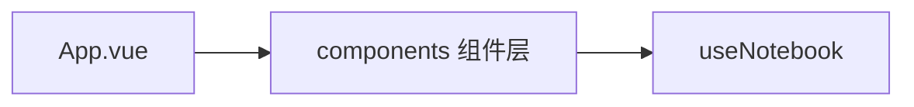

# lab-ui

> **Status**: active
> 路径：`packages/auto-lab-ui`  | 技术栈：Vue 3 + Vite + TypeScript（vitest）

Lab 应用 UI：notebook 风格的实验前端（单元格/布局组件 + useNotebook 状态）。

## 目标与范围

- 提供 notebook 交互界面：atoms / cells / layout / notebook 四层组件。
- useNotebook composable 管理 notebook 文档状态（含测试）。
- 不做：不实现执行内核（执行在后端/auto-playground）；不做通用组件库。

## 模块架构

## 模块清单

| 模块 | 职责 | 状态 |
|---|---|---|
| components/atoms | 基础原子组件 | active |
| components/cells | 单元格组件 | active |
| components/layout | 布局组件 | active |
| components/notebook | notebook 容器组件 | active |
| composables/useNotebook | notebook 状态逻辑（含 __tests__） | active |
