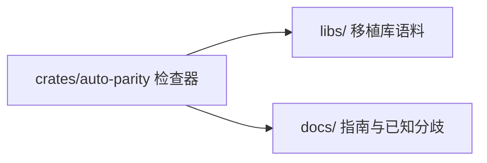

# parity

> **Status**: active
> 路径：`parity/`  | 技术栈：Rust（独立 cargo workspace）

三方一致性检查器（AutoVM vs a2r vs 原生 Rust）+ 20+ 个三方库移植样例，独立 cargo workspace。

## 目标与范围

- crates/auto-parity：运行同一测试于三个后端（runner），比对输出（compare），产出报告（report）与 TAP 输出（tap）。
- libs/：20+ 个三方库移植样例（base64/regex/rusqlite/serde_json/sha2/tokio/url 等）作为一致性语料。
- docs/：parity-guide、known-divergences、parity-dashboard。
- 不做：不修复编译器分歧本身（修复在 auto-lang）；不纳入主 workspace（独立 Cargo.toml/lock）。

## 模块架构

## 模块清单

| 模块 | 职责 | 状态 |
|---|---|---|
| auto-parity/main | CLI 入口 | active |
| auto-parity/runner | 三后端运行器 | active |
| auto-parity/compare | 输出比对 | active |
| auto-parity/report / tap | 报告与 TAP 格式输出 | active |
| libs | 20+ 三方库移植样例（一致性语料） | active |
| docs | parity-guide / known-divergences / dashboard | active |
