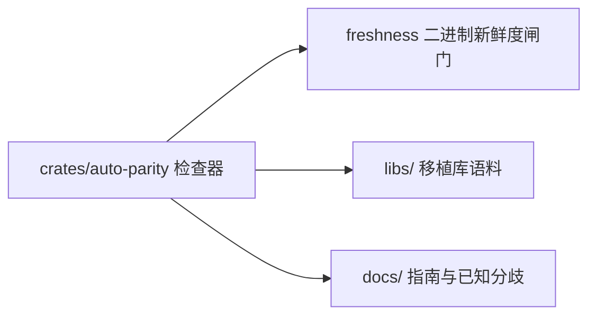

# parity

> **Status**: active
> 路径：`parity/`  | 技术栈：Rust（独立 cargo workspace）

三方一致性检查器（AutoVM vs a2r vs 原生 Rust）+ 20+ 个三方库移植样例，独立 cargo workspace。

## 目标与范围

- crates/auto-parity：运行同一测试于三个后端（runner），比对输出（compare），产出报告（report）与 TAP 输出（tap）。
- **`--auto-binary` 新鲜度闸门（Plan 524，P517-2 清偿）**：启动时对
  `--auto-binary` 统一解析为绝对路径（相对路径按运行 cwd，缺档报错含绝对
  路径与 cwd）+ mtime 对账 `crates/` 树最新 `.rs`——陈旧**硬失败**（防陈旧
  产物伪装回归假红，P511-5/P517-2 实证），`--allow-stale` 逃生降级为警告。
  实现在 `auto-parity/src/freshness.rs`（三态单测 5 例）。
- libs/：20+ 个三方库移植样例（base64/regex/rusqlite/serde_json/sha2/tokio/url 等）作为一致性语料。
- docs/：parity-guide、known-divergences、parity-dashboard。
- **Python parity 线（Plans 369/461/539）**：py_* 三方套件（AutoVM vs
  a2py vs 原生 Python，tests/python/ 自动识别）+ phase p5-p7（stdlib）
  p8（sci-compute）p9（torch 惯用法——py_torch_infer 16 例 +
  py_torch_train 10 例 seed 化收敛，Plan 539）。py_list 去规避示范
  （`py_call(lst,"__len__")` ×4 → `lst.len()` 直发，PLAN-569 P539-D2
  根治起可用；其余套件 README 惯用法行已统一注记，去规避留待自然触碰）。
- **真三方 dep 对拍线（PLAN-594）**：`libs/dep/<crate>_real/` 动态加载**真实
  crates.io 库**（`dep crate(version: "x.y.z") + use.rs`）三轨对拍——
  serde_json 1.0.145 / regex 1.11.3 / url 2.5.4 / semver 1.0.26 绿面语料
  + base64 0.22.1（594 全红样本，**PLAN-596 T-09 翻绿解禁**：D13 常量
  接收者点调用修复后 `STANDARD.encode`/decode 往返三轨绿，tests/ 2/2 入
  p10）。绿面范式：构造器/自由函数后 `.unwrap()` + Auto 类型标注解
  泛型推断（`let data Value = from_str(json).unwrap()`）+ let 绑定比较断言。
  **PLAN-596 T-07 增量**：DIV-DEP-8 双半边 fixed（a2r rust 导入类型
  `.to(str)`/print 发 Display；VM `format_rust_stdlib_obj` 补 url::Url 臂），
  url/semver 语料各增 `display_to_str` 三轨断言（p10 4/4×2）；登记面
  扩至 DIV-DEP-8..19（18=212 wrapper CString 兜底假绿、19=a2r 回调实参
  不装箱豁免）。phase p10
  （`AUTO_LANG_PARITY_NET=1` 门控，parity-ci 独立 job + 产物缓存）；
  命中率数据（25 面/绿 8/32%，591 T2 最高杠杆/T3 次之/by-value-self 零命中）
  回填 591（reports/p594-dep-skip-hit-rate.md，文末 P596 回填节为复测实测行：
  base64 0%→50%、url 50%→67%、semver 40%→60%）。
- **非白名单 pack 面勘测（PLAN-591）**：`libs/dep/uuid_real/`——uuid 1.24.0
  **不在 BUILTIN_OPAQUE_CRATES**，类型面全走真编译 methods pack（594 五库
  类型面皆 native_catalog，本库补 pack 面首个样本）。三绿：parse_str Option
  nullable（591 T2）+ get_version_num 数值（DIV-DEP-16 修复后）+ print
  Display（591 D2）。phase p11（`AUTO_LANG_PARITY_NET=1` 门控）。
  **`=x.y.z` 精确 pin 纪律**（DIV-DEP-17：caret 漂移至 1.26 → API 移除 →
  wrapper 整包失败）。红面 DIV-DEP-15（a2r parse*/nil 启发式劫持）登记不进
  TAP；DIV-DEP-16（VM EQ 漏 TAG_I64）当场修复。
- **py 类派生工厂（PLAN-602）**：`libs/python/py_torch_subclass/`——
  自定义 nn.Module/Dataset 子类 + Auto 回调方法（`py_subclass(481)` exec
  工厂 + n 参回调 ABI），三方 parity 四案全绿：Module forward 标量
  （seed0 钉值）/Dataset `__len__`+`__getitem__`/Auto 驱动训练环收敛/
  重入 ≥3 层探针。**phase p12**（torch 环境门控，同 p8/p9 无网络需求；
  `use.py` 导入绑 callable——base 类走模块 getattr 惯用法）。
- 不做：不修复编译器分歧本身（修复在 auto-lang）；不纳入主 workspace（独立 Cargo.toml/lock）。

## 模块架构

```mermaid
graph LR
  ap[crates/auto-parity 检查器] --> fresh[freshness 二进制新鲜度闸门]
  ap --> libs[libs/ 移植库语料]
  ap --> docs[docs/ 指南与已知分歧]
  click ap "./auto-parity/" "auto-parity"
  click libs "./libs/" "libs"
  click docs "./docs/" "docs"
```

## 模块清单

| 模块 | 职责 | 状态 |
|---|---|---|
| auto-parity/main | CLI 入口 + 启动闸门接线 | active |
| auto-parity/freshness | `--auto-binary` 绝对路径解析 + mtime 陈旧对账 + `--allow-stale` 逃生（Plan 524） | active |
| auto-parity/runner | 三后端运行器 | active |
| auto-parity/deps | a2r 腿 dep 语料透传：crates.io 版本 pin 解析（bare/path/git 报错明示）+ 生成 Cargo.toml 渲染（PLAN-594） | active |
| auto-parity/compare | 输出比对 | active |
| auto-parity/report / tap | 报告与 TAP 格式输出 | active |
| auto-parity/aavm | AAVM 五向对比矩阵（①ref ②aavm_rust ③aavm_vm ④golden ⑤aa2r） | active |
| libs | 20+ 三方库移植样例（一致性语料） | active |
| docs | parity-guide / known-divergences / dashboard | active |
