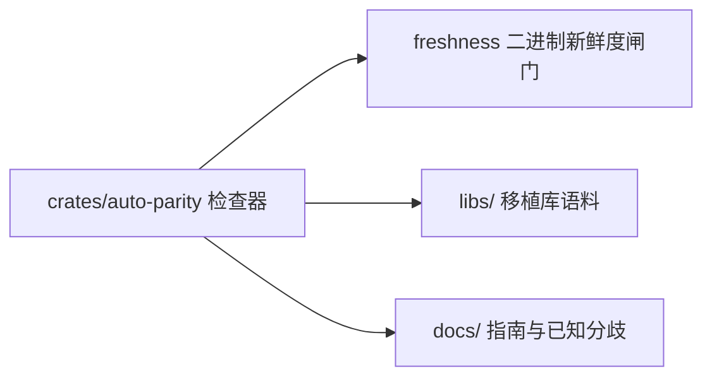

# parity

> **Status**: active
> 路径：`parity/`  | 技术栈：Rust（独立 cargo workspace）

三方一致性检查器（AutoVM vs a2r vs 原生 Rust）+ 20+ 个三方库移植样例，独立 cargo workspace。

## 目标与范围

- crates/auto-parity：运行同一测试于三个后端（runner），比对输出（compare），产出报告（report）与 TAP 输出（tap）。
- **`--auto-binary` 新鲜度闸门（Plan 524，P517-2 清偿）**：启动时对
  `--auto-binary` 统一解析为绝对路径（相对路径按运行 cwd，缺档报错含绝对
  路径与 cwd）+ mtime 对账 `crates/` 树最新 `.rs`——陈旧**硬失败**（防陈旧
  产物伪装回归假红，P511-5/P517-2 实证），`--allow-stale` 逃生降级为警告。
  实现在 `auto-parity/src/freshness.rs`（三态单测 5 例）。
- libs/：20+ 个三方库移植样例（base64/regex/rusqlite/serde_json/sha2/tokio/url 等）作为一致性语料。
- docs/：parity-guide、known-divergences、parity-dashboard。
- **Python parity 线（Plans 369/461/539）**：py_* 三方套件（AutoVM vs
  a2py vs 原生 Python，tests/python/ 自动识别）+ phase p5-p7（stdlib）
  p8（sci-compute）p9（torch 惯用法——py_torch_infer 16 例 +
  py_torch_train 10 例 seed 化收敛，Plan 539）。
- 不做：不修复编译器分歧本身（修复在 auto-lang）；不纳入主 workspace（独立 Cargo.toml/lock）。

## 模块架构

```mermaid
graph LR
  ap[crates/auto-parity 检查器] --> fresh[freshness 二进制新鲜度闸门]
  ap --> libs[libs/ 移植库语料]
  ap --> docs[docs/ 指南与已知分歧]
  click ap "./auto-parity/" "auto-parity"
  click libs "./libs/" "libs"
  click docs "./docs/" "docs"
```

## 模块清单

| 模块 | 职责 | 状态 |
|---|---|---|
| auto-parity/main | CLI 入口 + 启动闸门接线 | active |
| auto-parity/freshness | `--auto-binary` 绝对路径解析 + mtime 陈旧对账 + `--allow-stale` 逃生（Plan 524） | active |
| auto-parity/runner | 三后端运行器 | active |
| auto-parity/compare | 输出比对 | active |
| auto-parity/report / tap | 报告与 TAP 格式输出 | active |
| auto-parity/aavm | AAVM 五向对比矩阵（①ref ②aavm_rust ③aavm_vm ④golden ⑤aa2r） | active |
| libs | 20+ 三方库移植样例（一致性语料） | active |
| docs | parity-guide / known-divergences / dashboard | active |
