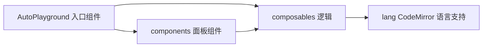

# playground-vue

> **Status**: active
> 路径：`packages/auto-playground-vue`  | 技术栈：Vue 3 + CodeMirror 6 + Vite + TypeScript

Playground 可复用 Vue 组件库：CodeMirror 6 编辑器封装 + 运行/调试面板，供 playground 前端与站点内嵌使用。

## 目标与范围

- 入口组件：AutoPlayground（精简）/ AutoPlaygroundFull（完整，含文件树/调试）。
- 组件：CodeEditor、ConsoleOutput、BytecodePanel、Debug 工具条、Replay 回放、ExampleSelector 等。
- composables 封装 playground/调试/回放逻辑；lang/ 提供 Auto 与 ABT 的 CodeMirror 语言支持。
- 不做：不实现后端 API（crates/auto-playground）；不做站点文档（website/）。

## 模块架构

## 模块清单

| 模块 | 职责 | 状态 |
|---|---|---|
| AutoPlayground / AutoPlaygroundFull | 入口组件（index.ts 导出） | active |
| components | 编辑器/控制台/字节码/调试/回放/文件树等面板 | active |
| composables | usePlayground / useDebugger / useReplayPlayer 等 | active |
| lang | CodeMirror 6 语言支持（auto / abt）、暗色模式 | active |
