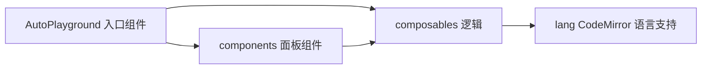

# playground-vue

> **Status**: active
> 路径：`packages/auto-playground-vue`  | 技术栈：Vue 3 + CodeMirror 6 + Vite + TypeScript

Playground 可复用 Vue 组件库：CodeMirror 6 编辑器封装 + 运行/调试面板，供 playground 前端与站点内嵌使用。

## 目标与范围

- 组件三层（Plan 581，Playground 设计 §4）：`SnippetRunner`（拼图层——单 snippet 无工具栏，电子书嵌入单元）/ `PlaygroundCard`（卡片层——可配置工具栏 + `exampleSelector` 默认关 + `noteId` 预留，真嵌套 Runner）/ `AutoPlaygroundFull`（IDE 层——文件树/多文件/调试/回放，不动）。
- `AutoPlayground` 为向后兼容别名（@deprecated，过渡期后移除；`api-url`→`api-base` 透传映射；行为变化仅一处——工具栏不再默认显示 ExampleSelector）。
- 组件：CodeEditor、ConsoleOutput、BytecodePanel、Debug 工具条、Replay 回放、ExampleSelector 等。
- composables 封装 playground/调试/回放逻辑（Card/Runner 复用同一 `usePlayground` 运行核）；lang/ 提供 Auto 与 ABT 的 CodeMirror 语言支持。
- 契约类型（types.ts 导出）：`SnippetRunnerProps` / `PlaygroundCardProps` / `NoteMeta`（notes.json schema v1 笔记元信息，582 Notes Explorer 复用）。约束：SFC `defineProps` 须用内联类型镜像契约（vitepress 宿主 compiler-sfc 不解析导入类型，P581-D2）。
- 不做：不实现后端 API（crates/auto-playground）；不做站点文档（website/）。

## 模块架构

```mermaid
graph LR
  entry[AutoPlayground 入口组件] --> comp[components 面板组件]
  entry --> cp[composables 逻辑]
  comp --> cp
  cp --> lang[lang CodeMirror 语言支持]
  click entry "./entry/" "entry"
  click comp "./components/" "components"
  click cp "./composables/" "composables"
  click lang "./lang/" "lang"
```

## 模块清单

| 模块 | 职责 | 状态 |
|---|---|---|
| SnippetRunner / PlaygroundCard | 分层入口（Plan 581）：拼图层（autorun/内联输出/单动作位）与卡片层（toolbar 四开关/输出 tabs/调试面板，#output 插槽+defineExpose 驱动内嵌 Runner） | active |
| AutoPlayground / AutoPlaygroundFull | 兼容别名（@deprecated 薄包装）/ IDE 层入口（index.ts 导出） | active |
| components | 编辑器/控制台/字节码/调试/回放/文件树等面板 | active |
| composables | usePlayground / useDebugger / useReplayPlayer 等 | active |
| lang | CodeMirror 6 语言支持（auto / abt）、暗色模式 | active |

> **Plan 582（2026-09-07，archived）**：新增 NotesExplorer/NotesSidebar/ExpectedOutputPanel 组件族与 useNotes composable；PlaygroundCard 扩展 expectedOutput（expectedKind stdout|result 分派，P581-D3 清偿）/files 文件 tab/ideMode；usePlayground 增 projectRequestBody files 形态与 backendDown/retryBackend；AutoPlaygroundFull 增 noteMeta/defineExpose(loadExample)；深链 #/notes/<id>、↑↓ Ctrl+Enter、ScrollArea 品牌行等详见 archive/582「用户裁定变更全录」。
