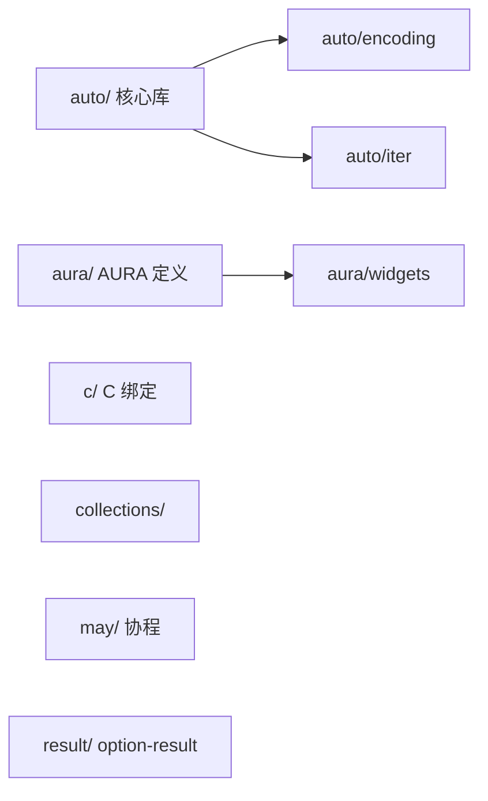

# stdlib

> **Status**: active
> 路径：`stdlib/`  | 技术栈：Auto 语言（.at）+ C/Rust 后端变体（.c.at / .rs.at / .vm.at）

Auto 标准库：auto/ 核心（多后端变体）、c/ C 绑定、aura/ UI 定义、collections/、may/、result/。

## 目标与范围

- auto/：核心标准库（str/list/math/io/fs/env/time/json/http/test 等），同一 API 提供多后端变体：`.vm.at`（AutoVM）、`.rs.at`（a2r）、`.c.at`+`.c/.h`（C）。
- c/：C 标准库绑定（stdio/stdlib）。
- aura/：AURA UI 类型定义与 widgets 定义（packages/widgets 的生成源）。
- collections/（hashmap）、may/（协程）、result/（option/result）：C 后端扩展库。
- 不做：不实现编译器（auto-lang）；后端变体之间语义需保持一致（由 parity 验证）。

## 模块架构

## 模块清单

| 模块 | 职责 | 状态 |
|---|---|---|
| auto | 核心标准库，多后端变体（.vm.at/.rs.at/.c.at） | active |
| auto/encoding | base64 / csv / hex 编解码 | active |
| auto/iter | 迭代器 | active |
| c | C 标准库绑定（stdio/stdlib） | active |
| aura | AURA 类型（Types.at）与 widgets 定义（data/display/feedback/form/layout/navigation/overlay） | active |
| collections | hashmap（C 后端） | active |
| may | 协程库绑定 | experimental（.at.skip，未启用） |
| result | option/result（C 后端） | experimental（.at.skip，未启用） |
