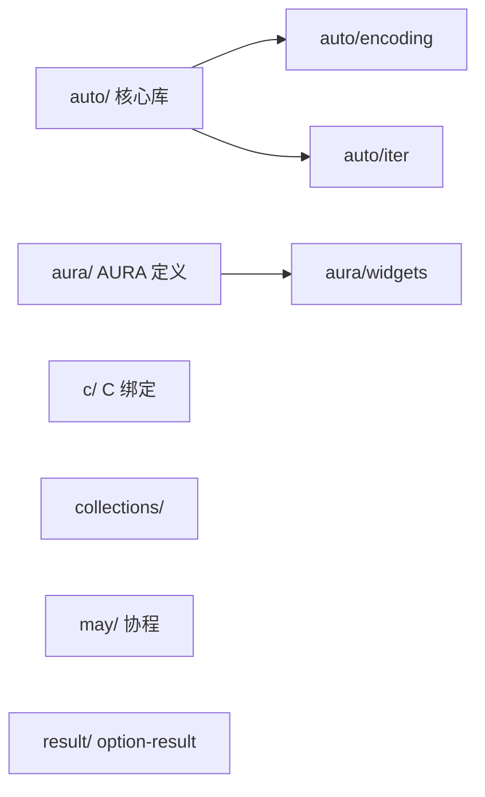

# stdlib

> **Status**: active
> 路径：`stdlib/`  | 技术栈：Auto 语言（.at）+ C/Rust 后端变体（.c.at / .rs.at / .vm.at）

Auto 标准库：auto/ 核心（多后端变体）、c/ C 绑定、aura/ UI 定义、collections/、may/、result/。

HTTP/网络模块的公共声明、目标文件、VM native、生成 Axum 服务与 AutoUI 消费路径彼此独立；
当前装配与缺口见 [后台装配与覆盖](design/backend-assembly.md) 和 [HTTP Server Spec](design/http-server.md)；handler 异步等待/请求生命周期现状见 [http-handler-async-lifecycle](design/http-handler-async-lifecycle.md)（PLAN-705），外部流生命周期现状见 [http-stream-lifecycle](design/http-stream-lifecycle.md)（PLAN-707）。

## 目标与范围

- auto/：核心标准库（str/list/math/io/fs/env/time/json/http/test 等），同一 API 提供多后端变体：`.vm.at`（AutoVM）、`.rs.at`（a2r）、`.c.at`+`.c/.h`（C）。
- c/：C 标准库绑定（stdio/stdlib）。
- aura/：AURA UI 类型定义与 widgets 定义（packages/widgets 的生成源）。
- collections/（hashmap）、may/（协程）、result/（option/result）：C 后端扩展库。
- 不做：不实现编译器（auto-lang）；后端变体之间语义需保持一致（由 parity 验证）。

## 模块架构

```mermaid
graph LR
  auto[auto/ 核心库] --> enc[auto/encoding]
  auto --> iter[auto/iter]
  aura[aura/ AURA 定义] --> aw[aura/widgets]
  c[c/ C 绑定]
  coll[collections/]
  may[may/ 协程]
  result[result/ option-result]
  click auto "./auto/" "auto"
  click aura "./aura/" "aura"
  click c "./c/" "c"
  click coll "./collections/" "collections"
  click may "./may/" "may"
  click result "./result/" "result"
```

## 模块清单

| 模块 | 职责 | 状态 |
|---|---|---|
| auto | 核心标准库，多后端变体（.vm.at/.rs.at/.c.at） | active |
| auto/encoding | base64 / csv / hex 编解码 | active |
| auto/iter | 迭代器 | active |
| c | C 标准库绑定（stdio/stdlib） | active |
| aura | AURA 类型（Types.at）与 widgets 定义（data/display/feedback/form/layout/navigation/overlay） | active |
| collections | hashmap（C 后端） | active |
| may | 协程库绑定 | experimental（.at.skip，未启用） |
| result | option/result（C 后端） | experimental（.at.skip，未启用） |

- 设计：[http-server-files](design/http-server-files.md)（PLAN-729 服务端文件响应：
- [http-server-uploads](design/http-server-uploads.md)——服务端上传接收
  （multipart/raw 流式 ingress、staging/create-only 提交、预算/期限/取消仲裁；
  PLAN-730）。
  GET/HEAD/单区间/条件请求/受限根目录/配额收口——VM 与生成 Rust 单源执行）。
- [http-service-deployment](design/http-service-deployment.md)——HTTP 服务部署基线
  （`auto service` 独立入口、profile/严格配置、连接/请求预算、CORS/Host/单层代理
  信任、健康/观测/受控关闭、代理模板与支持等级；两服务轨共用合同；PLAN-736）。

- [api-transport-contract](design/api-transport-contract.md)——API 传输契约
  （类型身份分类、参数来源、i64 全域、错误收敛、wire 兼容裁定；PLAN-734）。
