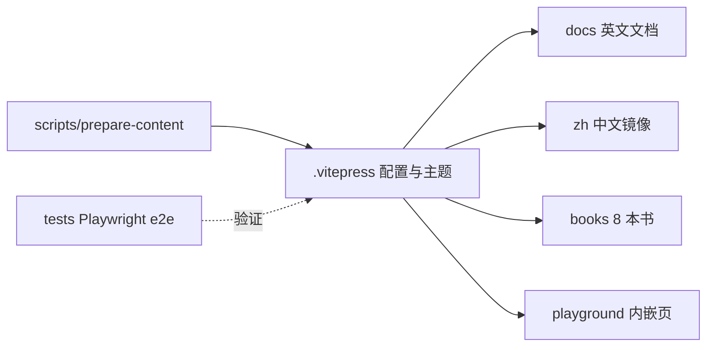

# website

> **Status**: active
> 路径：`website/`  | 技术栈：VitePress + Vue 3 + CodeMirror 6（Playwright e2e）

官方站点：中英双语文档 + 8 本译/著作书籍 + 内嵌 playground。

## 目标与范围

- 文档：语言指南、CLI、架构、特性、教程、releases（`docs/`，中文镜像 `zh/`）。
- 书籍：byte-of-python / little-c / modern-c / rust / tapl / think-python / typescript / typescript-deepdive。
- 内嵌 playground 页面（playground.md，CodeMirror 6），blocks/charts/ui/os 等专题页。
- scripts/prepare-content.js 在 dev/build 前预处理内容；tests/ 为 Playwright e2e。
- 不做：不实现 playground 后端（crates/auto-playground）与可复用组件库（packages/auto-playground-vue）。

## 模块架构

## 模块清单

| 模块 | 职责 | 状态 |
|---|---|---|
| .vitepress | VitePress 配置与自定义主题 | active |
| docs | 英文文档（architecture/cli/features/guides/language/tutorials 等） | active |
| zh | 中文文档镜像（docs/books/ui 等） | active |
| books | 8 本书籍内容 | active |
| playground.md / ui / blocks / charts 等 | 专题页与内嵌 playground | active |
| scripts | prepare-content 等内容预处理脚本 | active |
| tests | Playwright e2e | active |
