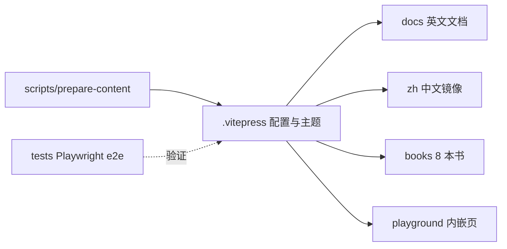

# website

> **Status**: active
> 路径：`website/`  | 技术栈：VitePress + Vue 3 + CodeMirror 6（Playwright e2e）

官方站点：中英双语文档 + 8 本译/著作书籍 + 内嵌 playground。

## 目标与范围

- 文档：语言指南、CLI、架构、特性、教程、releases（`docs/`，中文镜像 `zh/`）。
- 书籍：byte-of-python / little-c / modern-c / rust / tapl / think-python / typescript / typescript-deepdive。
- 内嵌 playground 页面（playground.md，CodeMirror 6），blocks/charts/ui/os 等专题页。
- Playground Notes manifest 管线（Plan 581）：`prepare-content.js` 末段调 `scripts/build-playground-notes.mjs`，从仓内语料（vm-golden 460 / aavm 158 / books 围栏 634 / demo 28）确定性生成 `public/playground-data/notes.json`（gitignore 生成物，0.82MB 单文件；`--check` 幂等+计数断言供 CI 防采集回归）。
- scripts/prepare-content.js 在 dev/build 前预处理内容；tests/ 为 Playwright e2e。
- 不做：不实现 playground 后端（crates/auto-playground）与可复用组件库（packages/auto-playground-vue）。

## 模块架构

```mermaid
graph LR
  vp[.vitepress 配置与主题] --> docs[docs 英文文档]
  vp --> zh[zh 中文镜像]
  vp --> books[books 8 本书]
  vp --> pg[playground 内嵌页]
  scripts[scripts/prepare-content] --> vp
  e2e[tests Playwright e2e] -.验证.-> vp
  click vp "./vitepress/" "vitepress"
  click docs "./docs/" "docs"
  click zh "./zh/" "zh"
  click books "./books/" "books"
  click pg "./playground/" "playground"
  click scripts "./scripts/" "scripts"
  click e2e "./tests/" "tests"
```

## 模块清单

| 模块 | 职责 | 状态 |
|---|---|---|
| .vitepress | VitePress 配置与自定义主题 | active |
| docs | 英文文档（architecture/cli/features/guides/language/tutorials 等） | active |
| zh | 中文文档镜像（docs/books/ui 等） | active |
| books | 8 本书籍内容 | active |
| playground.md / ui / blocks / charts 等 | 专题页与内嵌 playground | active |
| public/playground-data | Notes manifest 确定性生成物（notes.json，gitignore；Plan 581） | active |
| scripts | prepare-content 等内容预处理脚本（末段接线 manifest 生成） | active |
| tests | Playwright e2e | active |

> **Plan 582（2026-09-07，archived）**：/playground（EN/ZH）换 Notes Explorer；旧 /playground/ SPA 退役为 meta-refresh 重定向；prepare-content 裸尖括号通用转义器（P581-D1 清偿）；AutoFence 书页围栏 ▶ Run（§12 迁移路线同期入档）；playground-notes e2e + playwright.config。
