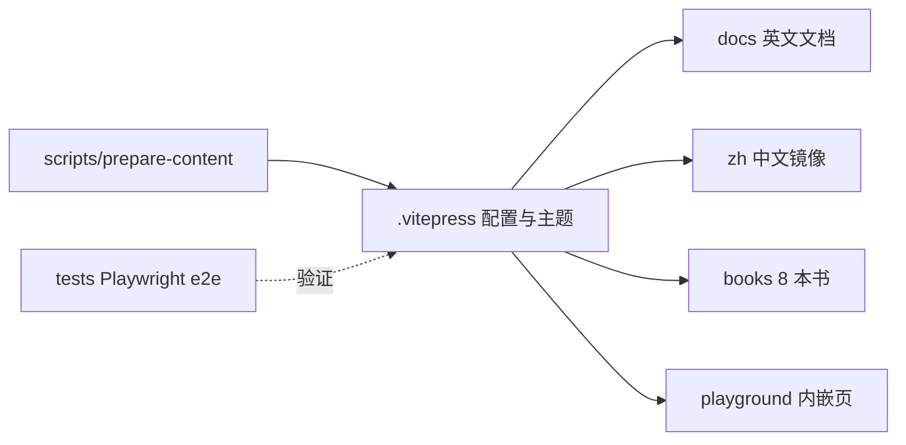

# website

> **Status**: active
> 路径：`website/`  | 技术栈：VitePress + Vue 3 + CodeMirror 6（Playwright e2e）

官方站点：中英双语文档 + 8 本译/著作书籍 + 内嵌 playground。

## 目标与范围

- 文档：语言指南、CLI、架构、特性、教程、releases（`docs/`，中文镜像 `zh/`）。
- 书籍：byte-of-python / little-c / modern-c / rust / tapl / think-python / typescript / typescript-deepdive。
- 应用实跑指南：`/apps/autoshell/guide/` 与 ZH 镜像共用 `AutoShellLanding.vue`，按日常会话、数据管道、多行脚本、自动化和快速开始组织；保留原生终端总览图与 F1/F2/F3 常见形式图示，分别说明原图和 PTY 记录重绘的来源；版本、验证平台/日期随示例标注。使用指南与 v0.5 发布的双语页面共用 `AutoShellPreview.vue`，通过 CSS 视窗展示 ash-01 原生彩色 ls 命令/表格，放大保留完整原图，禁止用模拟终端输出代替该主图。`EvidenceImage.vue` 提供可键盘操作的截图放大；脚本标签支持方向键/Home/End、代码复制及样例下载，布局适配窄屏与深浅色主题（plan-713）。
- 应用介绍（PLAN-722/723）：AppsOverview / applications.ts 双语SSR区分四主产品与系统Demo；AutoEdit/Shell获批准原生主图进入总览与阅读专题，Musk/Jade按既定准备条件保持无图文字。AutoShell guide交互/原图与v05展示保留。/apps内嵌六类28项真实图卡片，本地筛选/键盘放大，原生details就地说明操作、运行条件、内置/真实数据与版本；四主产品详情独立。demos.json单源，generate-demo-pages.mjs生成58个旧路由兼容跳转到概览锚点并校验；无iframe/业务API/本轮新增运行入口，v0.5.1网页体验独立推进。28是这批介绍集合，不是统一发布数量或端间全功能验收。规则见 [application introductions](design/application-introductions.md)、[application demos](design/application-demos.md)、[demo capture catalog](design/demo-capture-catalog.md)。
- 全站导航（plan-715）：`.vitepress/theme/data/navigation.ts` 是中英导航单一来源——UnifiedNavbar（实际可见顶栏）与 en.ts/zh.ts 的默认主题 nav 都取数于此；每项带 en/zh 链接，缺省按 `/` 前缀规则换 locale（docs/books 双语 1:1、手工专题页全镜像，未译文档在 ZH URL 下呈现 EN 内容为既定行为），共享 SPA（`/ui/gallery|blocks|charts|a2ui|demos`）双语同 URL 并在菜单标注"共享"，禁止拼造 `/zh/ui/gallery` 之类不存在的镜像路由。共享 SPA 的规范入口是 `index.html` 全路径（sirv 对目录 URL 的 extensions 解析会让 `/ui/a2ui/` 优先命中 VitePress 专题页 `a2ui.html`，为静态服务既定行为）。当前项用 `aria-current="page"`、父组触发器 `aria-current="true"`；菜单/下拉有名称与 `aria-expanded`，Esc 收起并回焦触发器，路由变更后自动收起；触控目标 ≥44px。主题态统一走 VitePress `useData().isDark`（storageKey `vitepress-theme-appearance`），组件不得自建第二主题源。
- 站内搜索（plan-715）：VitePress local provider（`themeConfig.search.provider='local'`，按 locale 分库，覆盖专题正文/docs/books；不含图片文字、独立 SPA 与 Playground 全语料）。主题层 `SiteSearch.vue` 以合成 Ctrl/Cmd+K 热键事件打开官方弹窗（同 VitePress 自用 poll 机制；弹窗 Teleport 到 body，不受 VPNav 的 `display:none` 影响）；CodeMirror 编辑器内的 Ctrl/Cmd+K 由 document 捕获相守卫拦截，不抢编辑器输入。依赖 vitepress 1.6.x 的 local search 行为，升级需回归 site-ui 搜索用例。
- 首页演示（plan-715）：`HomeDemo.vue` + `theme/data/home-demo.ts` 提供轻量三视图（Auto 源码/输出/Rust），初始为标明来源的预置示例——纯 `<pre>` 渲染，不加载 CodeMirror、不发任何请求；点击运行才发**同源** `/api/run`（dev 由 vite 代理到本地后端；静态部署下无后端时诚实报错并保留预置示例），10 秒超时可取消、离页清理，stdout/stderr 分列展示（HTTP 200 携 stderr 也是合法响应）。预置输出必须标注来源（仓内金样/实跑记录），永远不得显示为实时成功。Rust 视图仅在有真实 a2r 产物的示例上出现（如 cookbook `*.expected.rs` 金样），禁止手写假转译。
- 内嵌 playground 页面（playground.md，CodeMirror 6），blocks/charts/ui/os 等专题页。
- Playground Notes manifest 管线（Plan 581）：`prepare-content.js` 末段调 `scripts/build-playground-notes.mjs`，从仓内语料（vm-golden 460 / aavm 158 / books 围栏 634 / demo 28）确定性生成 `public/playground-data/notes.json`（gitignore 生成物，0.82MB 单文件；`--check` 幂等+计数断言供 CI 防采集回归）。
- 图片与展示骨架（plan-713 起单页规则推广，plan-715 收敛）：`EvidenceImage.vue` 统一"缩略可放大"展示——Enter/Space 打开原生 dialog、Esc/背板点击关闭、焦点返回缩略图、原图链接与说明保留；可选 `loading`（首图 eager）、`width/height` 占位防 CLS、`framed` 深色容器（缺省 true 兼容旧调用）。跨主题多帧截图用 `ScreenshotGallery.vue`（tab 选择器、键盘方向键、不自动轮播、选中态 `aria-selected`+live 区域）；应用专题 hero 共用 `AppLandingLayout.vue`（返回链接/badge/状态/标题/简介/入口/实图；后续章节由页面顶层排版——`.md` 中 Vue 组件调用必须压成单一 HTML 块且内部不留空行、插槽不放多段大块内容，否则被 markdown 块规则切断；提升到顶层的内容须去 4+ 空格缩进，防被解析成缩进代码块）。发布页截图用 `ReleaseLanding.vue` + `theme/data/release-v05.ts` 数据驱动，理念完整论述用原生 `details` 可键盘展开。禁止 TODO 占位空图、假截图与死链；AutoShell 原生主图契约（ash-01）不变。
- scripts/prepare-content.js 在 dev/build 前预处理内容；tests/ 为 Playwright e2e。
- 桌面实景展示（PLAN-720）：`DesktopShowcase.vue` 与 `theme/data/desktop-showcase.ts` 共用六张 2026-10-01 原生截图，按无展开窗口的浅/深桌面、浅/深 Launcher、三小游戏、多应用工作场景递进。v0.5 和 AutoOS 专题展示完整过程，OS 总览显示双主题预览并链接到当前语言专题。小组件来自已启动并最小化的应用；保留完整 PNG、捕获日、尺寸、可键盘放大和原图链接，不把静态演示状态当成功能证明。
- 学习与阅读（PLAN-718）：docs/books 双语根页共用作者数据与 SSR 学习卡片（静态 HTML 与本地搜索均可索引）；书籍按当前书分侧栏、章节 prev/next 不跨书，提供本书目录和正确作者源链接；AutoFence 操作栏及提示双语；运行器按需异步加载（冷访问不取编辑器 chunk、不调 `/api/run`），失败可重试且原文保持可读。规则见 [learning-reading](design/learning-reading.md)。
- 不做：不实现 playground 后端（crates/auto-playground）与可复用组件库（packages/auto-playground-vue）。
- OS/AI 介绍（PLAN-719）：LaOS 实现理念、OS over OS 当前形态与 AI + Lang + OS 长期人本方向连续说明；宿主/现有内核独立系统/自有内核分清现状。OS、AI、AutoOS、ui-desktop 双语采用默认阅读布局及同源概要/架构关系，首页与 v0.5 同步相关摘要；两篇双语独立历史文章提供总览互链、资料时点与公开来源。规则见 [os-ai-introduction](design/os-ai-introduction.md)。

## 模块架构

```mermaid
graph LR
  vp[.vitepress 配置与主题] --> docs[docs 英文文档]
  vp --> zh[zh 中文镜像]
  vp --> books[books 8 本书]
  vp --> pg[playground 内嵌页]
  scripts[scripts/prepare-content] --> vp
  e2e[tests Playwright e2e] -.验证.-> vp
  click vp "./vitepress/" "vitepress"
  click docs "./docs/" "docs"
  click zh "./zh/" "zh"
  click books "./books/" "books"
  click pg "./playground/" "playground"
  click scripts "./scripts/" "scripts"
  click e2e "./tests/" "tests"
```

## 模块清单

| 模块 | 职责 | 状态 |
|---|---|---|
| .vitepress | VitePress 配置与自定义主题（theme/data 导航与页面数据单源） | active |
| docs | 英文文档（architecture/cli/features/guides/language/tutorials 等） | active |
| zh | 中文文档镜像（docs/books/ui 等） | active |
| books | 8 本书籍内容 | active |
| playground.md / ui / blocks / charts 等 | 专题页与内嵌 playground | active |
| public/playground-data | Notes manifest 确定性生成物（notes.json，gitignore；Plan 581） | active |
| scripts | prepare-content 等内容预处理脚本（末段接线 manifest 生成） | active |
| tests | Playwright e2e（`AUTO_WEBSITE_TEST_PORT` 独占端口，baseURL/webServer 同源 strictPort；`locale:'en-US'` 钉定防宿主 OS locale 泄入触发首页自动跳转） | active |

> **Plan 582（2026-09-07，archived）**：/playground（EN/ZH）换 Notes Explorer；旧 /playground/ SPA 退役为 meta-refresh 重定向；prepare-content 裸尖括号通用转义器（P581-D1 清偿）；AutoFence 书页围栏 ▶ Run（§12 迁移路线同期入档）；playground-notes e2e + playwright.config。

> **Plan 715（2026-09-30，archived）**：全站 UI 刷新——navigation.ts 单源双语导航/当前位置/共享 SPA 例外；VitePress local search 接线（合成热键法+CodeMirror 捕获守卫）；全站设计令牌与断点矩阵（360/390/768/1024/1440 无溢出）；HomeDemo 轻量三视图（预置/实时/降级诚实契约）；v0.5 发布页 ReleaseLanding 数据驱动重建（产品前置/理念 details 展开/统计后移/launcher 实图换 TODO 占位）；EvidenceImage/ScreenshotGallery/AppLandingLayout 统一图片与骨架；e2e 64 例 + 五断点×双语×深浅截图矩阵；site-ui/home-demo 双测试族。证据：docs/reports/p715-website-ui-{baseline,review}.md。
