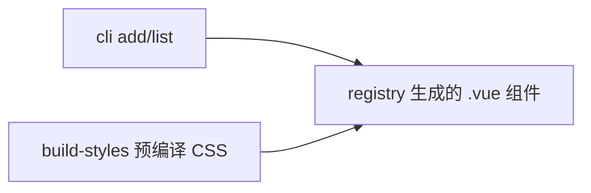

# widgets

> **Status**: active
> 路径：`packages/widgets`  | 技术栈：Vue 3 + reka-ui + Tailwind CSS；CLI 为 Node/TS

`@auto-ui/widgets`：由 AutoLang 编译器从 AURA widget 定义生成的 Vue3 组件原语（非手写），shadcn 风格拷贝分发，附 CLI。

## 目标与范围

- registry/ 下维护生成的自包含 `.vue` 组件（avatar/badge/button/card/checkbox/dialog/input/label/separator/switch）。
- CLI 提供 `add`（拷贝组件进用户工程并自动装 reka-ui）与 `list`。
- 样式二选一：Tailwind utility class 或预编译 CSS（build-styles.cjs），禁止混用。
- 不做：组件源定义在 stdlib/aura/widgets（由编译器生成，不手写）；视觉层源自 shadcn-vue（MIT，见 NOTICES）。

## 模块架构

## 模块清单

| 模块 | 职责 | 状态 |
|---|---|---|
| registry | 生成的 Vue3 组件原语（10 个 widget 目录） | active |
| cli | `npx @auto-ui/widgets add/list` 命令 | active |
| styles | Tailwind 配置与预编译 CSS 构建（build-styles.cjs / src/input.css） | active |
