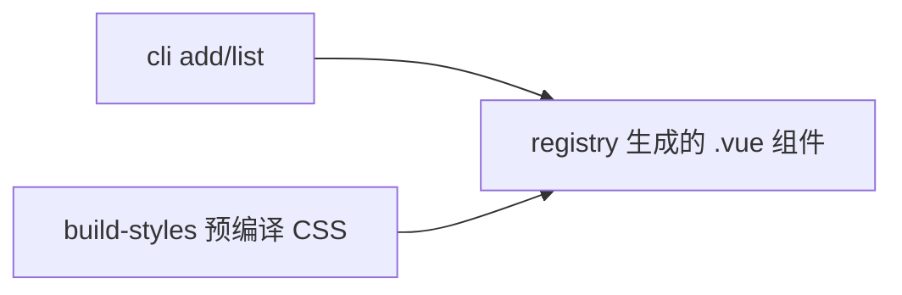

# widgets

> **Status**: active
> 路径：`packages/widgets`  | 技术栈：Vue 3 + reka-ui + Tailwind CSS；CLI 为 Node/TS

`@auto-ui/widgets`：由 AutoLang 编译器从 AURA widget 定义生成的 Vue3 组件原语（非手写），shadcn 风格拷贝分发，附 CLI。

## 目标与范围

- registry/ 下维护生成的自包含 `.vue` 组件（avatar/badge/button/card/checkbox/dialog/input/label/separator/switch）。
- CLI 提供 `add`（拷贝组件进用户工程并自动装 reka-ui）与 `list`。
- 样式二选一：Tailwind utility class 或预编译 CSS（build-styles.cjs），禁止混用。
- 不做：组件源定义在 stdlib/aura/widgets（由编译器生成，不手写）；视觉层源自 shadcn-vue（MIT，见 NOTICES）。

## 模块架构

```mermaid
graph LR
  cli[cli add/list] --> registry[registry 生成的 .vue 组件]
  styles[build-styles 预编译 CSS] --> registry
  click cli "./cli/" "cli"
  click registry "./registry/" "registry"
  click styles "./styles/" "styles"
```

## 模块清单

| 模块 | 职责 | 状态 |
|---|---|---|
| registry | 生成的 Vue3 组件原语（10 个 widget 目录） | active |
| cli | `npx @auto-ui/widgets add/list` 命令 | active |
| styles | Tailwind 配置与预编译 CSS 构建（build-styles.cjs / src/input.css） | active |
| [terminal-iced-draw](terminal-iced-draw.md) | terminal iced widget 绘制期契约（draw 段落强引用规则 + 像素金样环境契约；auto-lang 侧,Plan 634） | active |
| [scroll-pane](scroll-pane.md) | AutoUI 通用滚动架构（PLAN-656 Phase A+B+C）：ScrollState/Intent/Viewport 三通道语义层 + scroll-pane primitive + controller/on-scroll 双端契约 + managed content bridge | active |
| [command-family](command-family.md) | command 八元素组件家族（PLAN-692 W-2）：vue 臂经 assets/shadcn-ui/command 官方 Listbox 实现接入 shadcn 路径（过滤/空态/悬停/键盘/点选），registry schema-only spec 补建 + kebab 别名回填为通用机制；VM 臂 iced:none 维持 | active |
| [menubar-family](menubar-family.md) | menubar 16 元素完整组件族（PLAN-695）：vue 臂 reka 标准件全发射（radio/label/shortcut/sub 族），VM 双解释态 popover token 配色 + hover-switch + submenu 内联展开（复合键注册表）+ disabled 置灰；a2r 静态降层同构 | active |
| [viewport-boundary](viewport-boundary.md) | VM/iced 视口边界与嵌入居中契约（PLAN-663）：Screen 视口单位定高嵌入边界内重锚定（iframe 语义）+ my-auto/m-auto 垂直安全居中 | active |
